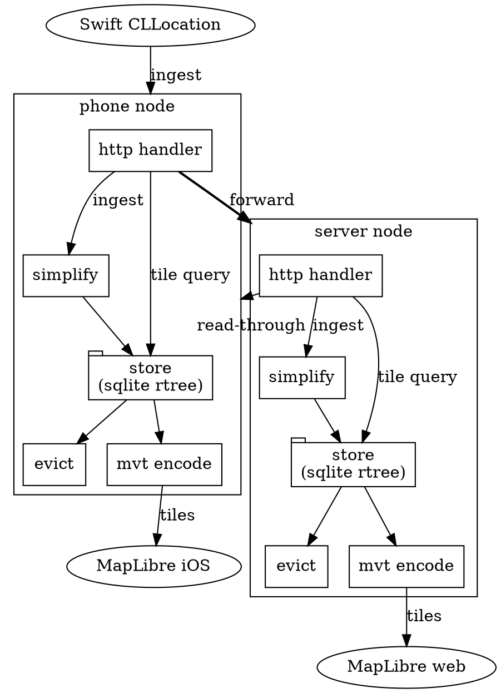

# maplog spec

## User Stories

- I record high-precision trajectory data on my phone,
  but do not need to keep all of that data on my phone's storage forever.
- When offline, I can pan and zoom the map, seeing a low-fidelity
  polyline of my full trajectory plus higher-fidelity polylines in
  areas I've subscribed to — similar to Google Maps offline map
  downloads.
- Before a trip, while online, I can add a new subscription for a
  specific area. The node immediately backfills that area from
  upstream — I don't have to pan and zoom around it to trigger
  downloads.
- When online, I can pan and zoom and may initially see a low-fidelity
  offline polyline, which is then replaced by a higher-fidelity
  polyline loaded from the server as quickly as possible (polling unacceptable, eg).
- When offline, I can pan and zoom into areas I've recently viewed
  while online and see high-fidelity data (subject to capacity limits),
  even outside my subscriptions. Tiles draw from a single unified
  store.
- Unsubscribed data does not grow beyond a configured capacity.
- Subscribed data can grow without bound, but I can change my
  subscriptions to reduce it — no-longer-wanted data is dropped when
  a subscription is removed or narrowed.
- Both the server and the phone have configurable subscriptions. For
  example, if data is ingested at inch fidelity but both the server
  and phone are configured with meter-level minimum significance,
  points below that threshold are dropped from both systems entirely.
- Many concurrent web users can pan and zoom a map hosted on the
  server without leaking information about what areas other users are
  viewing.
- The storage hierarchy supports additional layers. For example, a
  server appliance on a local network could serve queries for a
  particular area from its own store, but consult a global server for
  queries outside that area. We might have a large cascade of nodes.
- Points waiting to be forwarded upstream are never dropped. If my
  subscriptions only cover Chicago but I am traveling in Tokyo,
  the forward queue grows unbounded until a send succeeds — no data
  is lost.

## Overview

maplog is a personal location-tracking system. An iOS app continuously
records GPS fixes. A shared Go library handles storage, simplification,
and tile serving. The same library runs on the phone (via gomobile bind)
and on a remote server. Each instance is a "node."

## Node

A node is a Go process (or gomobile-bound library) that:

1. **Ingests** a stream of raw location points.
2. **Simplifies** — assigns each point a significance score using
   Visvalingam-Whyatt effective area.
3. **Stores** — writes points to a unified SQLite store. A materialized
   `subscribed` flag marks points covered by a subscription; unsubscribed
   points are subject to LRU eviction.
4. **Serves** tile queries as MVT over HTTP.
5. **Forwards** ingested points to an upstream node.
6. **Caches** — on every tile request, serves stored data immediately,
   then asynchronously fetches the same tile from upstream. If the
   upstream response differs, the node writes the new points and
   notifies connected clients via SSE so the map updates in place.

### Configuration

A node is configured with:

- A set of subscriptions, each a bounding box + minimum significance
  threshold (points with significance >= threshold are kept).
- An optional upstream node URL.
- A capacity (maximum number of unsubscribed points kept for LRU cache).
  Configuration is JSON, matching the `Config` Go struct:

```json
{
  "db_path": "/data/maplog.db",
  "listen": "127.0.0.1:8080",
  "upstream": "https://maps.example.com",
  "capacity": 100000,
  "subscriptions": [
    { "bbox": [-180, -90, 180, 90], "min_significance": 1e-4 },
    { "bbox": [-74.0, 40.7, -73.9, 40.8], "min_significance": 0 }
  ]
}
```

`bbox` is [west, south, east, north]. `min_significance: 0` keeps
all points. A server with full storage omits `upstream` and uses a
single subscription with `min_significance: 0` over the whole world.

### Topology

All communication between components is HTTP, including on-device. The
phone node listens on localhost. Swift and MapLibre talk to it the same
way the web viewer talks to the remote server.



## Point

A Point carries all fields from a GPS fix:

| Field                | Type    | Notes                        |
| -------------------- | ------- | ---------------------------- |
| timestamp            | int64   | nanoseconds since Unix epoch |
| latitude             | float64 |                              |
| longitude            | float64 |                              |
| altitude             | float64 |                              |
| ellipsoidal_altitude | float64 |                              |
| horizontal_accuracy  | float64 |                              |
| vertical_accuracy    | float64 |                              |
| speed                | float64 |                              |
| speed_accuracy       | float64 |                              |
| course               | float64 |                              |
| course_accuracy      | float64 |                              |
| floor                | int32   |                              |
| is_simulated         | bool    |                              |
| is_from_accessory    | bool    |                              |

These fields are defined once in a `.proto` file. Generated code is used
in both Swift and Go. This is the wire format for all HTTP communication
between components.

```protobuf
syntax = "proto3";
package maplog;

message Point {
    int64  timestamp            = 1;  // nanoseconds since Unix epoch
    double latitude             = 2;
    double longitude            = 3;
    double altitude             = 4;
    double ellipsoidal_altitude = 5;
    double horizontal_accuracy  = 6;
    double vertical_accuracy    = 7;
    double speed                = 8;
    double speed_accuracy       = 9;
    double course               = 10;
    double course_accuracy      = 11;
    int32  floor                = 12;
    bool   is_simulated         = 13;
    bool   is_from_accessory    = 14;
}

message Track {
    repeated Point points = 1;
}

message IngestResponse {
    int64 watermark = 1;
}

message FlushResponse {
    int64 watermark = 1;
    int32 points_forwarded = 2;
}

message TileUpdated {
    int32 z = 1;
    int32 x = 2;
    int32 y = 3;
}

message StatsResponse {
    int64 count = 1;
    Point latest_point = 2;
}
```

## Track

`Track` is a named Go type over `[]Point`. It carries methods for
protobuf serialization and MVT encoding.

## Simplification

Visvalingam-Whyatt with effective area.

Each point's significance is the area of the triangle formed by it and
its two temporal neighbors. On append, only the previous tail point's
significance is recomputed — everything older is frozen.

The first and second points in a track have no triangle. Their
significance is set to +Inf (math.MaxFloat64) so they are always
retained and visible at every zoom level.

Significance is stored as a continuous float in square degrees, not a
discrete zoom level. At query time, the significance threshold is
derived from the tile's geographic area: a tile at zoom z covers
`(360 / 2^z)^2` square degrees over `256^2` pixels, so the threshold
is `tile_area / tile_pixels`. Points whose significance triangle is
smaller than one pixel in the requested tile are excluded. No tuning
parameters — the threshold is a deterministic function of the zoom
level.

Each node runs simplification independently. The server has the complete
history so its assignments are globally optimal and authoritative. The
phone assigns provisional significance for immediate display; when
points are later received from the server (via backfill or
read-through), the server's significance replaces the phone's.

On startup, a node recovers its VW state by reading the last two points
from SQLite.

## Storage

SQLite with one R\*tree spatial index and one data table. The R\*tree
is a non-covering index — it holds only the spatial envelope and joins
to the data table for full point fields.

Each point has a materialized `subscribed` flag indicating whether it
matches any current subscription. This flag is recomputed in batch
when subscriptions change (see Subscription Changes below). Points
also carry a `touched_at` timestamp recording when the node last
wrote or updated the point, used for LRU eviction order.

```sql
CREATE VIRTUAL TABLE points_idx USING rtree(
    id,
    min_lat, max_lat,
    min_lon, max_lon,
    min_sig, max_sig
);

CREATE TABLE points (
    id INTEGER PRIMARY KEY,
    timestamp INTEGER NOT NULL UNIQUE,
    subscribed INTEGER NOT NULL DEFAULT 0,
    touched_at INTEGER NOT NULL,  -- nanoseconds; set on insert/update, used for LRU
    lat REAL NOT NULL, lon REAL NOT NULL,
    alt REAL, ellipsoidal_alt REAL,
    h_accuracy REAL, v_accuracy REAL,
    speed REAL, speed_accuracy REAL,
    course REAL, course_accuracy REAL,
    floor INTEGER,
    is_simulated INTEGER,
    is_from_accessory INTEGER
);

CREATE TABLE meta (key TEXT PRIMARY KEY, value TEXT);
-- key: 'forward_watermark', value: timestamp of last successfully forwarded point
```

### Deduplication

On ingest or backfill, if a point with the same timestamp already
exists, it is updated. If the incoming point is from the server
(backfill or read-through), its significance replaces the existing
value — the server's globally-optimal assignment is authoritative.

### Subscription Changes

When subscriptions change, the node recomputes the `subscribed` flag
for all points in a batch:

```sql
UPDATE points SET subscribed = 0;
-- for each subscription (bbox + min_significance):
UPDATE points SET subscribed = 1
  WHERE id IN (
    SELECT id FROM points_idx
    WHERE min_lat >= ?south AND max_lat <= ?north
      AND min_lon >= ?west  AND max_lon <= ?east
      AND max_sig >= ?min_significance
  );
```

This runs only when subscriptions are added, removed, or modified —
not on the insert/eviction hot path.

### Eviction

A single eviction mechanism covers all points. After any insert, if
the count of unsubscribed points exceeds `capacity`, the oldest by
`touched_at` are deleted:

```sql
DELETE FROM points WHERE id IN (
  SELECT id FROM points
  WHERE NOT subscribed AND timestamp <= ?watermark
  ORDER BY touched_at
  LIMIT ?excess
);
```

Points that are subscribed are never evicted. Points not yet forwarded
(timestamp > watermark) are never evicted — the forward queue is
sacred. Everything else is LRU by `touched_at`.

### Tile Query

A single query over the R\*tree for the bounding box and significance
threshold, joined to the data table:

```sql
SELECT p.* FROM points_idx i JOIN points p ON i.id = p.id
WHERE i.min_lat <= ?1 AND i.max_lat >= ?2
  AND i.min_lon <= ?3 AND i.max_lon >= ?4
  AND i.min_sig >= ?5;
```

## Wire Formats

There are two:

- **Protobuf** — full-precision, used for all HTTP communication between
  components. Defined in a `.proto` file that generates code for both
  Swift and Go.
- **MVT (Mapbox Vector Tiles)** — lossy, quantized to a tile-local
  4096x4096 grid, encoded on the fly from query results. This is a
  display format served to MapLibre, not a storage or sync format.

## Protocol

Every node serves the same HTTP API. On the phone, this is
`http://localhost:{port}`. On the server, it's the public URL. Swift
talks to the phone node the same way the phone node talks to the
server.

### Client ID

Each client generates a random 16-byte hex ID on startup and passes
it as a query parameter on tile and SSE requests:

- `GET /tiles/{z}/{x}/{y}?client={id}`
- `GET /events?client={id}`

The client ID is a correlation token, not a session. When a tile
request triggers a background upstream fetch, the node needs to notify
the requesting client on completion. The background goroutine captures
the client ID from the request URL and, when the fetch completes, looks
up the matching SSE connection to deliver the `tile-updated` event. The
node does not track which tiles a client has requested — it just holds
a map of client ID → open SSE connection for event delivery.

### Error Responses

All endpoints return errors as:

- `400 Bad Request` — malformed input (bad protobuf, invalid tile
  coordinates).
- `404 Not Found` — tile coordinates out of valid range.
- `500 Internal Server Error` — storage or encoding failure.

Error body is a plain text message. No protobuf encoding for errors.

### `POST /ingest`

Request body: protobuf-encoded `Track`.
Response body: protobuf-encoded `IngestResponse`.

The node simplifies, stores the points, marks them `subscribed` if
they match any subscription, and returns a watermark (timestamp of the
latest ingested point).

### `GET /tiles/{z}/{x}/{y}`

Response format depends on `Accept` header:

- `Accept: application/vnd.mapbox-vector-tile` — MVT-encoded tile
  with a single layer named `track`. This is what MapLibre requests.
- `Accept: application/protobuf` — protobuf-encoded `Track` with
  full-precision points. This is what nodes use for read-through and
  backfill.

The z/x/y path encodes both the bounding box and the significance
threshold (derived from zoom level).

The node queries the store and serves immediately. In the background,
if the node has an upstream, it fetches the same tile from upstream as
protobuf and writes the points to the store. If the data changed, it
sends an SSE event to the requesting client so the map updates in
place.

There are no "online" or "offline" modes. Every request attempts
upstream. If the network is down, the upstream fetch silently fails and
the client has whatever stored data was available.

When a subscription is added, the node backfills by fetching tiles
from upstream using the same fetch path. The subscription change
recomputes the `subscribed` flag, so backfilled points matching the
new subscription are automatically protected from eviction. The node
computes the zoom level whose significance threshold matches the
subscription's `min_significance` — since points visible at lower
zooms are a subset of points visible at higher zooms, a single zoom
level suffices. It fetches all tiles covering the subscription bbox at
that level.

### `GET /events`

SSE stream (`text/event-stream`). The server sends a `:keepalive`
comment every 30 seconds. Events:

```
event: tile-updated
data: {"z":3,"x":2,"y":1}
```

The `data` field is JSON-encoded `TileUpdated`. When a background
upstream fetch completes and the local data for a tile changed, the
node sends a `tile-updated` event to the client that originally
requested that tile. The client (Swift or web) tells MapLibre to reload
that tile, and the map updates in place.

On reconnect, the client reuses its existing ID in the query parameter.
The node matches it to the SSE connection. If a client disconnects and
reconnects, any tile-updated events generated between disconnect and
reconnect are lost — the client can do a full MapLibre source reload
on reconnect to compensate.

### `GET /stats`

Response body: protobuf-encoded `StatsResponse`.

Returns the total point count and the most recent point (by timestamp).
Used by the iOS app's status UI to confirm the node is running and
receiving data.

### `POST /flush`

Request body: empty.
Response body: protobuf-encoded `FlushResponse`.

Triggers an immediate forward of the unsent point buffer to upstream.
This is the "sync now" button.

## Ingestion Path

### Swift to phone node

Every CLLocation fix is immediately POSTed to the local node's
`/ingest` endpoint. This is not batched — each point is persisted to
SQLite (fsync'd) on arrival for crash safety.

### Phone node to server

The forward buffer is not in memory — it's everything in SQLite with
timestamp > the forwarding watermark. On crash, no unsent points are
lost because they're already persisted.

A forward is triggered by `/flush` or by a periodic timer (e.g., every
5 minutes when there are unsent points). On successful POST, the phone
advances its forwarding watermark. On failure, the same batch is
retried on the next trigger.

After a successful forward, eviction runs — any forwarded,
unsubscribed points exceeding capacity are deleted by LRU order.

### Server ingestion

The server ingests the batch, runs its own Visvalingam-Whyatt
simplification independently (it has the complete history, so its
significance assignments are globally optimal), and stores the points.

## Components

### Go library (`maplog`)

The public API:

```go
type Node struct { ... }

func NewNode(config Config) (*Node, error)
func (n *Node) Handler() http.Handler  // serves all endpoints
func (n *Node) Close() error
```

The gomobile bind surface is minimal lifecycle management:

```go
// package mobile
func Start(configJSON []byte) error  // starts node + localhost HTTP server
func Stop()
```

All interaction with the node goes through HTTP.

### Server

A Go binary that creates a Node with full-world storage and no
upstream, serves its Handler(), and also serves static assets for the
web map viewer.

### iOS app

The existing Swift app. Generates a random client ID on launch. POSTs
each CLLocation fix to the local node's `/ingest` endpoint. Renders a
MapLibre map with tile source
`http://localhost:{port}/tiles/{z}/{x}/{y}?client={id}`. Connects to
`/events?client={id}` for live tile update notifications. Calls
`POST /flush` on app foreground, network reachability changes, and a
manual sync button.

### Web viewer

Static HTML/JS. Generates a random client ID on page load. A MapLibre
GL JS map with a tile source pointed at the server's
`/tiles/{z}/{x}/{y}?client={id}` endpoint. Connects to
`/events?client={id}` for live tile updates.

## Development

All commands are run from `apps/breadcrumbs/`.

### Go tests

```sh
go test ./... -count=1
```

### Regenerate Go protobuf

```sh
go tool run generate
```

This runs `protoc --go_out` via the task defined in `tasks.toml`. Requires
`protoc` (macports: `/opt/local/bin/protoc`) and `protoc-gen-go`
(`go install google.golang.org/protobuf/cmd/protoc-gen-go@latest`).

### Regenerate Swift protobuf

```sh
protoc \
  --plugin=protoc-gen-swift=$HOME/git/apple/swift-protobuf/.build/release/protoc-gen-swift \
  --swift_out=ios/maplog \
  --swift_opt=Visibility=Internal \
  --proto_path=proto \
  breadcrumbs.proto
```

The generated file requires post-processing for the project's
`SWIFT_DEFAULT_ACTOR_ISOLATION = MainActor` setting. Apply these
replacements to `ios/maplog/breadcrumbs.pb.swift`:

- `import SwiftProtobuf` → `@preconcurrency import SwiftProtobuf`
- `fileprivate struct _Generated` → `nonisolated fileprivate struct _Generated`
- `struct Breadcrumbs_` → `nonisolated struct Breadcrumbs_` (all occurrences)
- `fileprivate let _protobuf_package` → `nonisolated fileprivate let _protobuf_package`
- `extension Breadcrumbs_` → `nonisolated extension Breadcrumbs_` (all occurrences)

### Rebuild XCFramework

```sh
rm -rf ios/Mobile.xcframework
go tool gomobile bind -target ios,iossimulator -o ios/Mobile.xcframework ./mobile
```

### Xcode build

The Xcode project is at `ios/maplog.xcodeproj`. Build with:

```sh
LIBRARY_PATH= xcodebuild build \
  -project ios/maplog.xcodeproj \
  -scheme maplog \
  -destination 'generic/platform=iOS Simulator'
```

Note: `LIBRARY_PATH=` is required to clear the macOS SDK library path
that otherwise causes the linker to find macOS `libobjc.A.tbd` instead
of the iOS SDK's copy. The Xcode IDE may need the same fix if it
inherits a `LIBRARY_PATH` from the launching shell.
