In December, I went to Tokyo for two weeks to eat food, walk around, and visit
my ol' pal Charlie. Here's a report on everything I did.

## Travel Day

I had enough credit card points saved up for a business class seat on a JAL
nonstop flight from Chicago to Haneda. Pretty swank!

I eat "the Japanese meal" (pictured), put my seat into lie-flat position, and
get 8 hours of sleep.

When I wake up, I have a beer and a "pastrami sandwich" (not pictured) on the
theory that if there is one thing on the menu which is unlike the other things
on the menu, one must always order it. The sandwich is no good at all, but
fortunately it's actually just half a sandwich.

<photo-set>

- 
- 
- 
- 
- 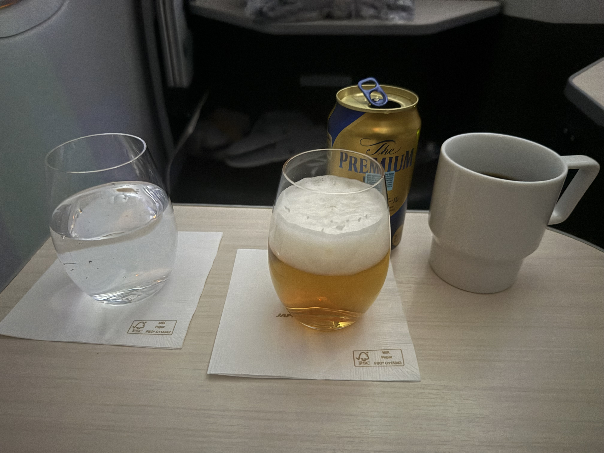

</photo-set>

The plane lands, and I go through customs. It's confusing, but not _that_
confusing. I try to find my way out of the airport.

Google Maps says there's a bus from Haneda to my hotel every hour, and from
Haneda to Shinjuku Station every 15 minutes. I've just missed the
direct-to-hotel bus, so I want the bus to Shinjuku Station. I approach the bus
ticket machine.

Charlie has previously walked me through setting up a Suica card on my phone,
which is _very helpful_--I use it to pay for the bus ticket, and subsequently
all other transportation on the trip, plus some small purchases at bars and
convenience stores.

I'm staying at the Bellustar in Kabukicho. It's very fancy! I end up getting
into the room around 6pm, and despite sleeping on the plane, I'm pretty
exhausted, so I take a melatonin and go to bed.

<photo-set>

- 
- 
- 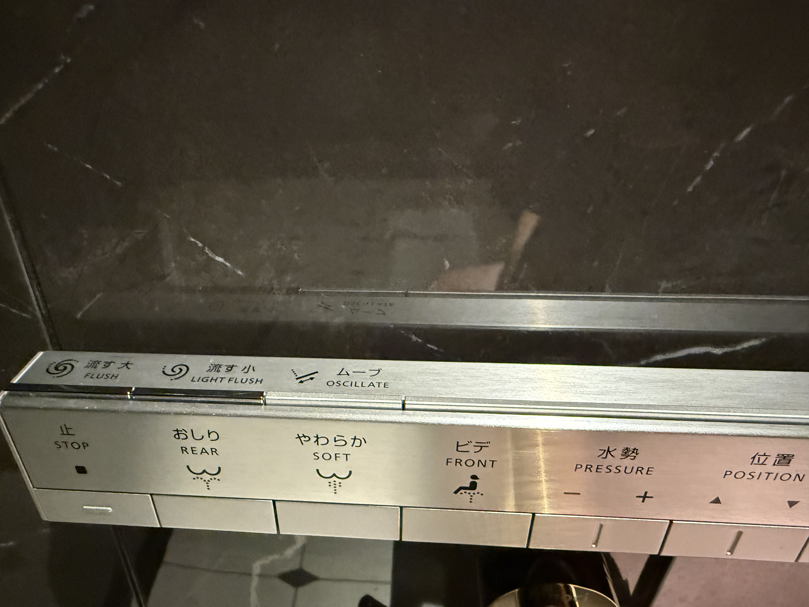

</photo-set>

## Shinjuku Day

In the morning, I set out to explore Shinjuku! What an overwhelming
neighborhood. My gosh! I basically spend the whole day walking increasingly
large concentric circles around the hotel, trying to get my bearings.

(Shinjuku Station map by Tomoyuki Tanaka).

<photo-set>

- 
- 
- 
- 
- 
- 

</photo-set>

I'm not sure who recommended it, but I see on Google Maps that I've saved a
[gyukatsu place](https://maps.app.goo.gl/knuk9jZV6LK38dUn7) in the neighborhood.
That's where I'll go for lunch. It's in a basement, which takes me a while to find.

The most striking thing about Shinjuku for me is the z-axis of it all: Google
Maps displays an extra widget for selecting what floor level to look at, and
much of the neighborhood has business from B2 through 4 or higher. A lot of the
basements are connected to the train station, and a lot aren't.

The gyukatsu is delicious. They've somehow managed to deep-fry these two thin
steaks, but keep the beef raw. You take a piece and sear it on the little fire
slab in the back, then dip it in one of the sauces. There's a soy one, a spicy
one, grated yam, herby peppers, and wasabi. It's served with rice, soup, salad
(it's just shredded cabbage; that's the salad), and cold barley tea.

<photo-set>

- 

</photo-set>

When Charlie finally gets off work, we met up at his office and head to dinner.
He has a place in mind, and then a backup place if that doesn't work out.

It's a good thing he has a plan: Shinjuku is a _very_ touristy neighborhood.
Most of the places I walk past seem kind of... not good. I think there are two
kinds of restaurant in the world:

- restaurants that focus on getting people in the door, and,
- restaurants that focus on getting people _back_ in the door.

Any restaurant with a big sign (or worse: that employs someone to accost
tourists in the street) is the first kind. It's the _other_ kind that has good
food.

Anyway, we try the first place. It's on the fourth floor, up some barely-marked
stairs. The third floor, he tells me, is a "ripe women bar". It has "no
foreigners" signs. The fourth floor is our izakaya, but they tell us they're
closing early.

We go to [the backup place](https://maps.app.goo.gl/hbJBcN9FY82B4skr9), which
Charlie heard about from some friend or another. It's _also_ up some stairs, in
an alley. There's no way in a million years I would have found it. Charlie's
impressed: it's darn good. We order,

- corn highballs (weird as hell; extremely corn)
- oden (radish, hard-boiled egg, fishcake, konnyaku, all simmered in broth)
- pickled ginger tempura
- agedashi tofu
- a bowl of fried garlic cloves
- quail eggs on a stick
- cheese bacon on a stick
- chicken gizzards on a stick
- chicken skin on a stick
- chicken nugget on a stick
- chicken livers on a stick

I love the konnyaku in particular: it has a very unfamiliar texture. Normally
when you chew food, it gradually softens and breaks down. Not so with konnyaku.
Each mastication just slices the dense slippery block into two same-textured
pieces. You repeat this until the pieces are small. Apparently for a while there
was a snack where you sucked konnyaku through a kind of straw, and a lot of
people choked on it. This is easy to believe. I've never had anything like it.

<photo-set>

- 
- 

</photo-set>

## "First Day In Japan" Tourism Day

Charlie's had some recent experience guiding visitors through Tokyo, and he's
kind enough to give me an itinerary for my first _real_ day of exploration,
which will take me from Nogizaka Station through Minamiaoyama, Kita-Aoyama, and
culminate in Harajuku.

<photo-set>

- 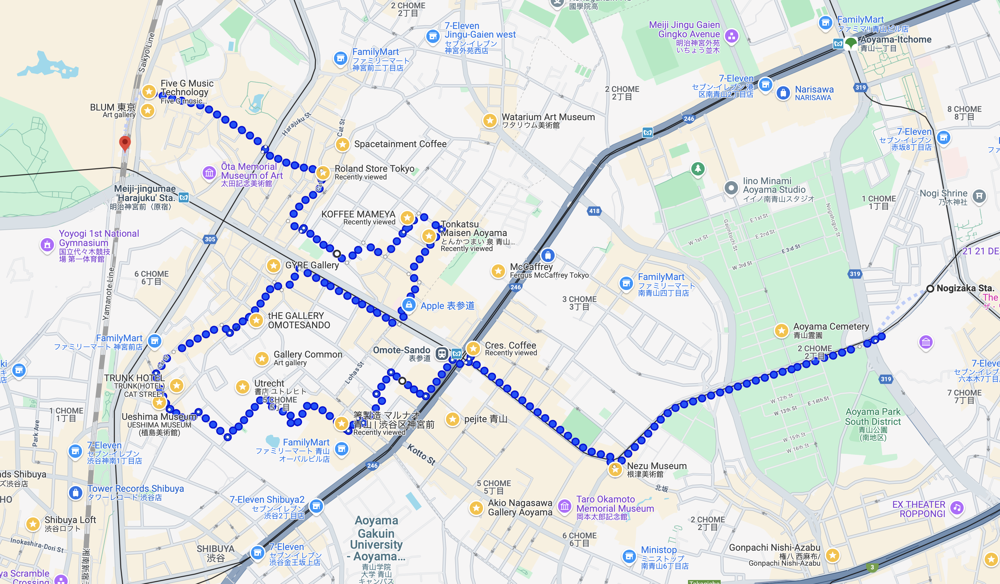

</photo-set>

I start by walking from the station through [Aoyama
Cemetery](https://maps.app.goo.gl/KREB4VCaPU4kCxNTA), which is nice: I dressed
too warm, and the meandering walk is a good way to cool off.

Temperature regulation is a pretty big issue on the trip: walking outside is
chilly, but each day also involves a lot of speedwalking through very hot train
stations. I eventually settle on ditching the coat entirely. Breathable natural
fibers, like everyone says.

<photo-set>

- 
- 
- 
- 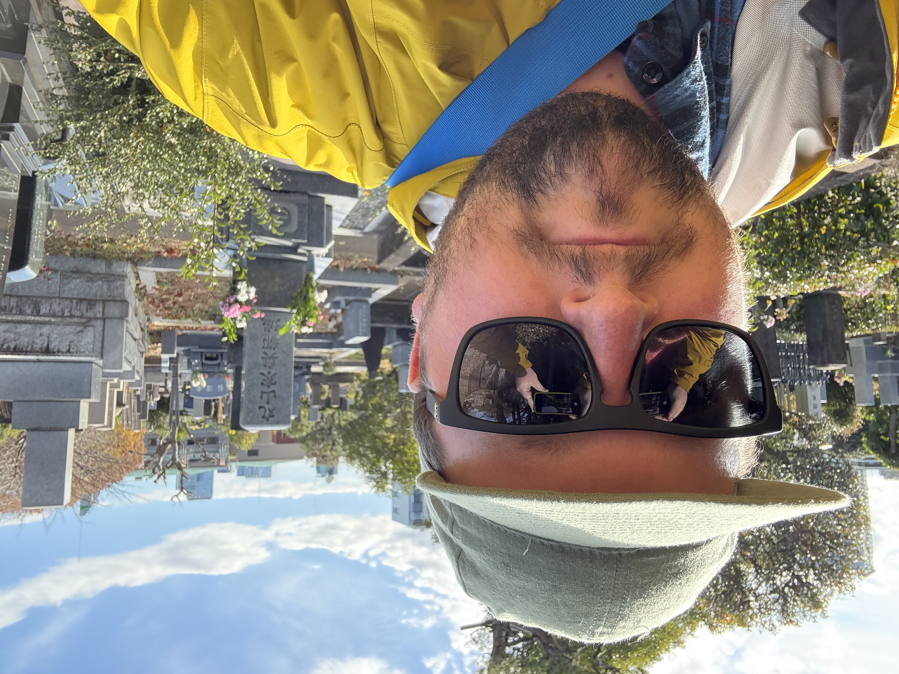
- 

</photo-set>

From the cemetery, I awlk to [Cres.
Coffee](https://maps.app.goo.gl/y9W2Lnfo3puidUs17) on Omotesandō avenue, which
Charlie has recommended. What a lovely place! It's a specialty coffee and wine
bar. I try an anaerobic-fermented Ethiopian bean, which tastes like
passionfruit. Not, like, "tastes mostly like coffee, but in a manner that,
perhaps, slightly evokes passionfruit". Not that at all. It _tastes like
passionfruit_. I have a very nice conversation with the proprietor, who studied
film in Los Angeles. Wonderful.

<photo-set>

- 

</photo-set>

I walk around the design district, browsing some fancy home goods. The highlight
is a gallery of fine woodworking, [箸製造 マルナオ青山 |
渋谷区神宮前](https://maps.app.goo.gl/wXBJfcqhJm9N22Jf6). There's a room with a
display of hand chisels. Apparently they do all their work with hand chisels.
The [oldest business in the world](https://en.wikipedia.org/wiki/Kongō_Gumi) is
a Japanese woodworking company. They build (and rebuild) Shinto shrines. Their
1500th anniversary is coming up. This isn't that company, but the woodworking is
very nice.

I get my folks a set of handmade wooden cups and some chopsticks.

<photo-set>

- 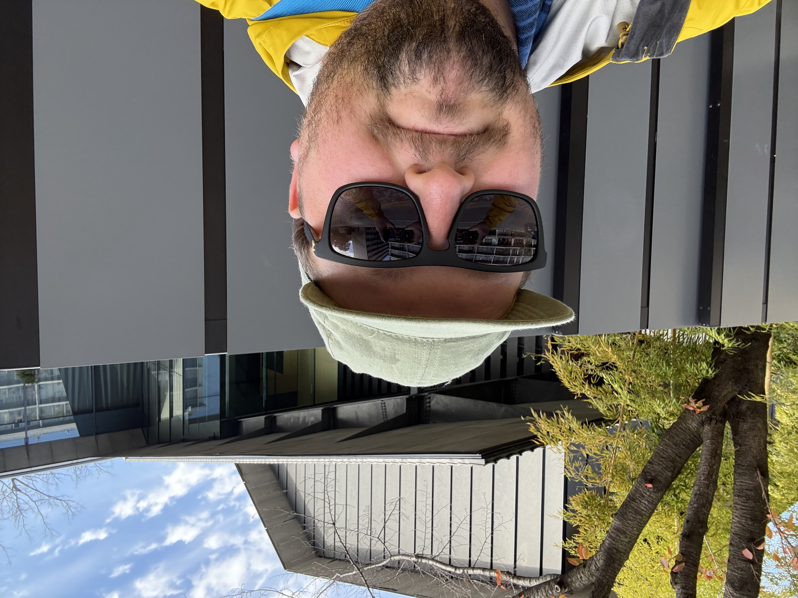
- 
- 
- 
- 

</photo-set>

For lunch, Charlie recommended [Tonkatsu Maisen
Aoyama](https://maps.app.goo.gl/HmRd9e9iCenA7XFw8), which is situated in an old
converted bathhouse. It's well-known to tourists, so I have to wait in a bit of
a line. But the pork is excellent. I order the Kagoshima Berkshire pork, which
comes with a special apple sauce, and fried oysters. It's served with rice,
soup, a bit of pickled cabbage, and a salad of only shredded cabbage. This salad
is really growing on me: who needs other ingredients, anyway?

After lunch, I see a line outside a very nondescript business on a residential
street. Lines can mean a place is touristy, _or_ it's very good, or, of course, both. I think this is both.

I queue up. It's a [coffee roaster](https://maps.app.goo.gl/dtTSMCWT7HjaTtAg9)!
They have a wide variety of beans, and take a great deal of apparent pride in
talking through each customer's palate to establish a recommendation. The man I
speak to asks where I get my coffee in Chicago, and when I say
[4LW](https://maps.app.goo.gl/MKxi9hCxZXFr9GJ68), he says, "Of course! Kevin
always comes in here when he's in Tokyo. Let me recommend some other coffee
places here that you might like." Small world!

<photo-set>

- 
- 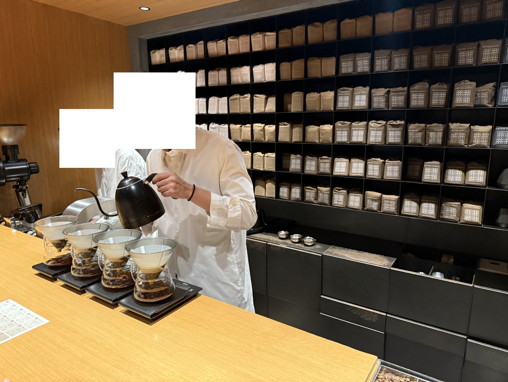
- 

</photo-set>

From there, I walk through a hilly sort of hypebeast neighborhood and pop into
the Roland store, which is on my todo list. I don't know what I was expecting,
but it's... a Roland store. They have all the Roland gear. Not much else to say
about it.

I make my way to Harajuku station, walking through a horrible disneyland tourism
hellstreet to get there. This is Harajuku. I take the train back to Shinjuku.

---

In the evening, I take the Keio New Line to Hatagaya station to meet up with
Charlie. Charlie has a Thursday routine: he gets pad Thai at
[LaLaChai](https://maps.app.goo.gl/wX1za4jdr3QPLah3A) ("I think it's the best
pad Thai in the world"), and then attends
[ideala](https://x.com/ideala_jpn?lang=en) at
[forestlimit](https://maps.app.goo.gl/GZay7RZDjdMWuweV8).

On our way to LaLaChai, we see across the street that there isn't a line to get
into [特麺コツ一丁ラーメン](https://maps.app.goo.gl/hgW6fS3PHqWi6oZf7), which
is, apparently unusual. The reason: on Thursdays, the only thing they offer is a
dish they call 交響麺, aka "symphony noodles", aka kyu kyu men. It's a dry ramen
topped with a pork backfat sauce.

At ramen places, you order with a machine. You
use the machine to buy tickets describing the foods you want, and then when you
sit down, you put the tickets on the counter in front of you. You do this in
silence. I'm not ready to use the machine, so Charlie orders for both of us:
交響麺, plus quail egg, plus several cloves each of garlic-pressed garlic to put
on top (not pictured).

Holy cow! Now this is some ramen. I don't think I've ever had noodles with this
texture. And the garlic! It's so... strong! Not like anything I've had before.
Really delicious. Wonderful.

<photo-set>

- 
- 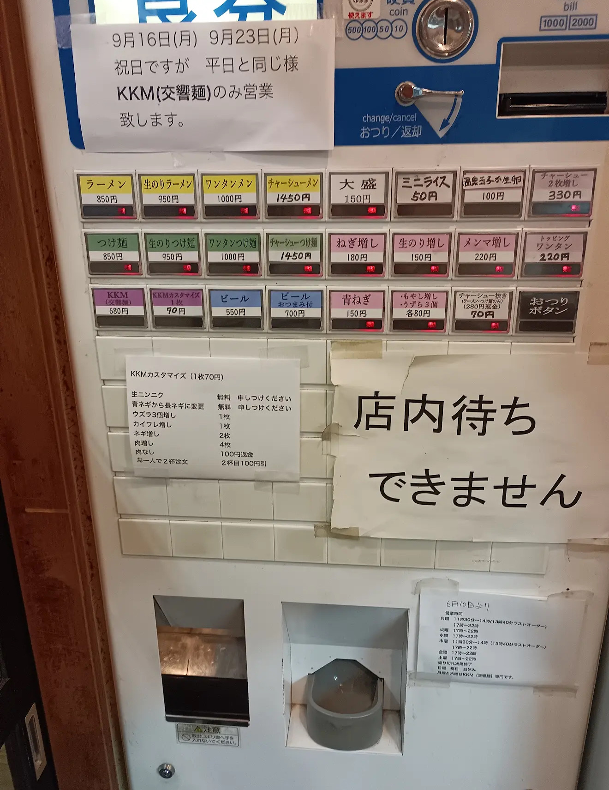

</photo-set>

We still have some time before ideala, so we walk back to Hatagaya Station to
visit [Gremlin](https://maps.app.goo.gl/L27zMkah2edRRFum9), a craft beer bar in
the basement. I love these liminal spaces! I wish Chicago's train stations had
room for small businesses: it'd be nice in the winter.

On the way, we pass an (apparently very good) cheesesteak place. The
proprietor's obsessed with American food, but has never been to America. I hope
he gets to go some time. Charlie used to come here a lot, but not as much since
they raised the prices.

<photo-set>

- 
- 

</photo-set>

We end the night at ideala. A blast. This club would be _so illegal_ in the
States. It's a small square basement room, with a bar on one side, a table with
turntables in the middle, and storage around the edges. DJs are playing Chicago
House, which isn't really my jam, but they're very good at it. Charlie
introduces me to several friends. We talk about old times.

<photo-set>

- 
- 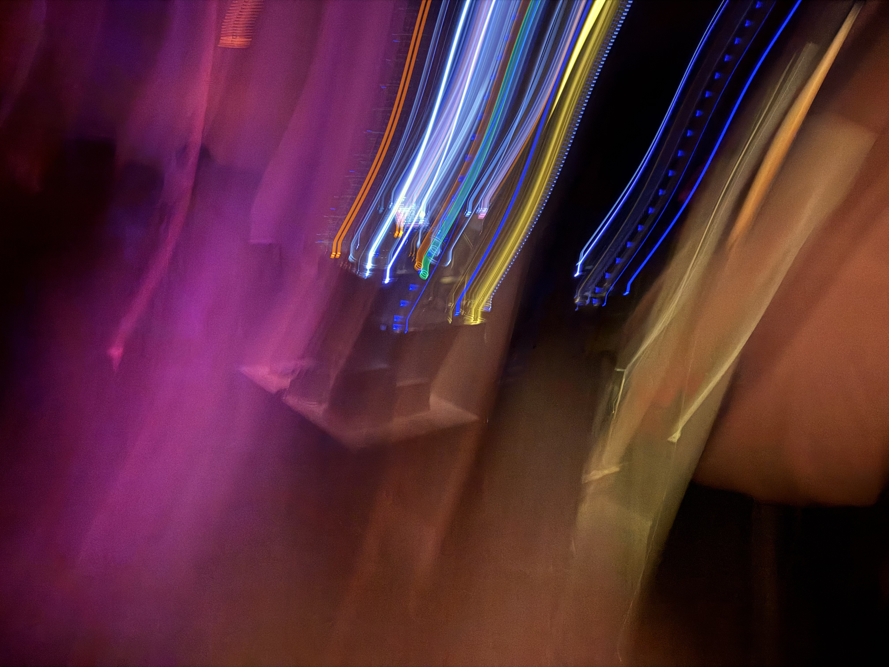

</photo-set>

## Meguro & Nakameguro day

On Friday, I wake up early to meet Charlie at Freeman Shokudo for breakfast.
Charlie goes there every Friday. They have a wonderful omelette. But their
Instagram says they're closed, so we go to LUG instead. Coincidentally, LUG has
been on my list: it's a restaurant operated by the Blue Lug, the best bike shop
in the world. They also operate a barber and a flower shop.

<photo-set>

- 

</photo-set>

During breakfast, Charlie talks me an itinerary for the day--I spent yesterday
on tourist "must-do"s, so he suggests I walk around Nakameguro for a change of
pace. A taste of something a bit more residential.

<photo-set>

- 
- 
- 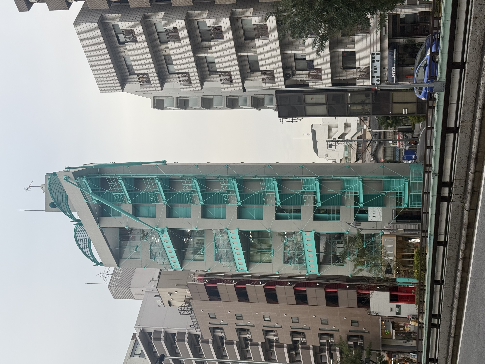

</photo-set>

The plan has me start at a [Picasso](https://maps.app.goo.gl/7NzJyXBtpLGpJfET9)
(which is a spinoff of Don Quijote, which is a popular discount store) at Meguro
Station, but I didn't really see the draw: it's just a store. I've been to
stores.

Next stop is the [Meguro Parasitological
Museum](https://maps.app.goo.gl/EbmbgjENGsvCb3nw6); a 71-year-old local museum
dedicated to the study of parasites. The signs say it started as one guy's
collection of samples and drawings, and grew from there. Later, I'm told that
for a while in the 90s, this was the most popular spot for high schoolers to go
on dates in all of Tokyo. I wonder how you'd measure that. They have the world's
largest tapeworm, which is easier to measure.

I love what this place represents: how can a free museum about such a niche
subject stay open for so long?

<photo-set>

- 
- 
- 
- 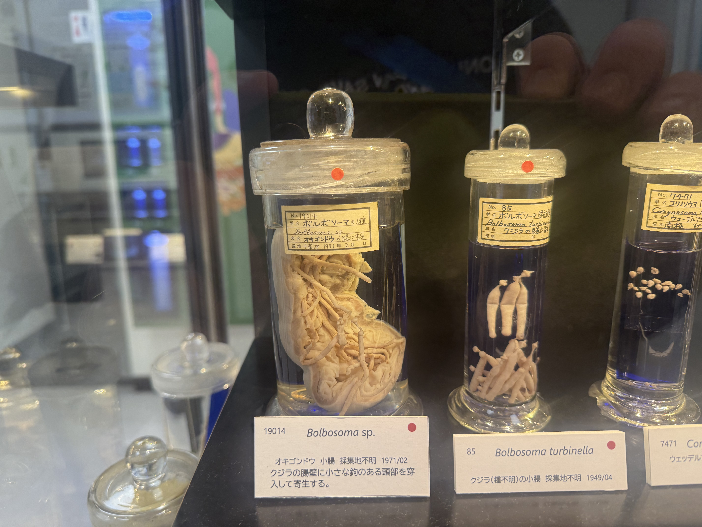
- 
- 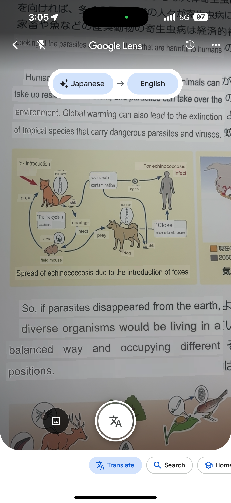
- 
- 

</photo-set>

On the way to Nakameguro, I spend a few hours at the zine shop [ONLY FREE
PAPER](https://maps.app.goo.gl/fWi6k7ounQquCABeA) looking at posters and artist
books. I buy some to take home. They'll make good gifts.

Then I spend an hour at [epulor](https://maps.app.goo.gl/3iBm1xRhPpL1dxar8)
(photo by Google Maps user ニックネーム) drinking coffee and listening to
records. It's a very vibey store: the proprietor was DJing old records, playing
a song or two from each: Rosemary Clooney, Wilton Crawley, Leon Redbone, the
Japanese group Shogun. I get the impression that he would have been doing the
same thing even if there was nobody in the store. It's a coffee bar and also a
wine bar. There are some Germans on the other side of the bar from me drinking
wine. I enjoy the music.

<photo-set>

- 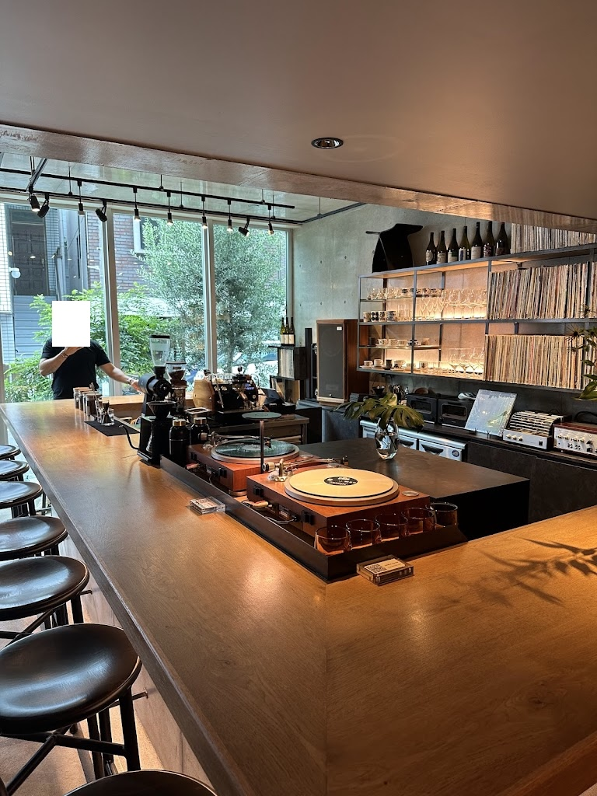

</photo-set>

From there I head to [GENERAL STORE](https://maps.app.goo.gl/KJAcheGu5hDzaWw39),
a Henry David Thoreau themed anarchist-mountaineering fashion-and-camping
brand(!). Surreal to see that in Japan, having grown up down the street from
Walden Pond. I buy a hat. The guy working is thrilled.

Finally [COW BOOKS 中目黒](https://maps.app.goo.gl/9iQ7ErMpuRiwQoyQA), a store
specializing in art and culture books from the Shōwa period (that is, the 20s
through the 80s), curated by the author [Yataro
Matsuura](https://www.muji.com/us/compactlife/column001.html). It kind of feels
like someone's personal library. All of the books are in Japanese, and a lot of
them are about American artists.

---

For dinner, I meet up with Charlie in Hatagaya. We go to the trendy restaurant
[ミクロとくじら](https://maps.app.goo.gl/jJbaKyUXXZHmmAVD6). It's a cool place
with subway tile, very low stools, edgy-looking staff, and stuffed animals in
rope bondage hanging from the ceiling. We order,

- Spice Highballs (which taste chiefly of ginger ale)
- Jiro-style ramen (which has no broth. Also no noodles. It's kind of a salad)
- Fried eggplant (delicious)
- Chicken of the Southern Barbarians (topped with "tartar sauce", which was more
  like egg salad)

The chicken is delicious. Dark meat. Perfectly fried. Charlie tells me that
"Southern Barbarians" is a Japanese term for Europeans, since the Portuguese who
came to Japan in the 1500s set up their port in the most southern part of the
Japanese archipelago.

<photo-set>

- 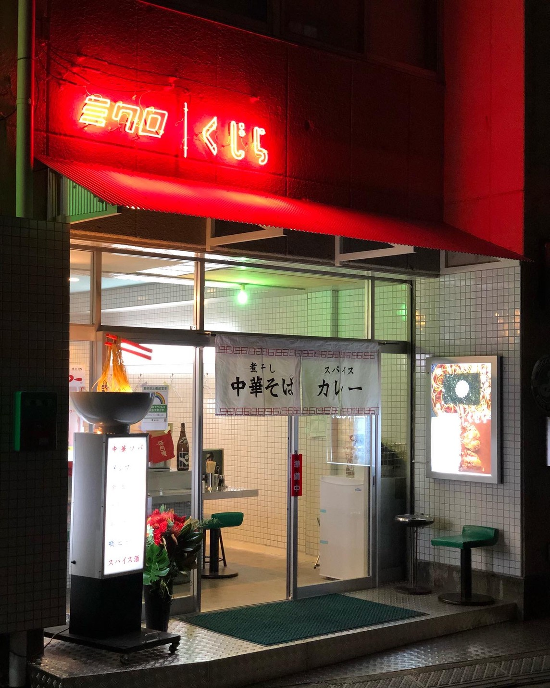
- 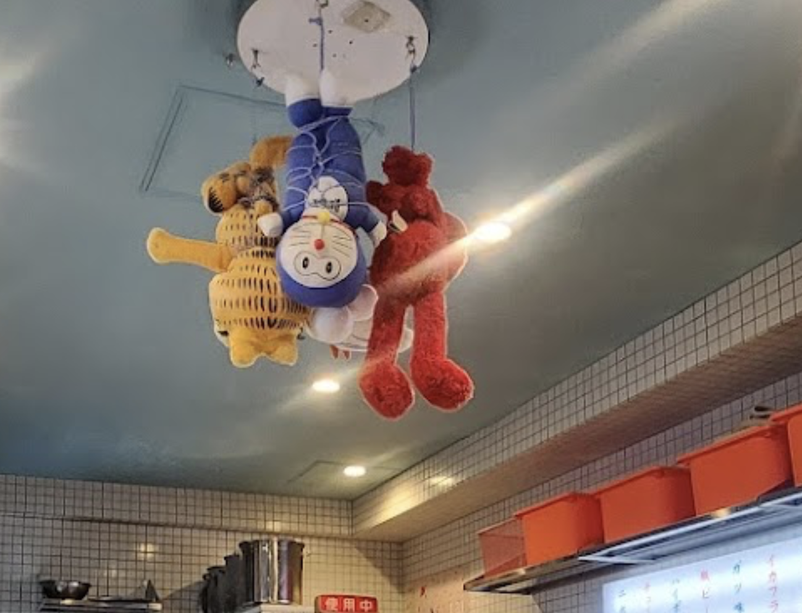
- 
- 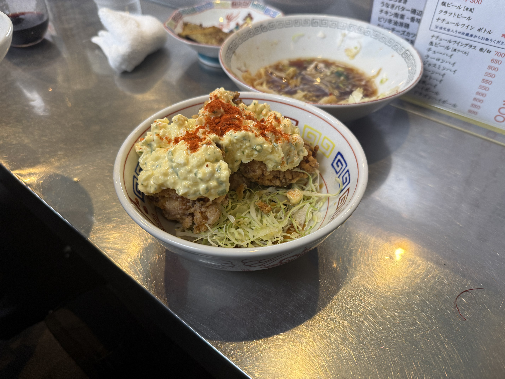

</photo-set>

Then we walk to Sasazuka's Jugo Dori Shopping Street to visit [Sasazuka Source
Stand](https://maps.app.goo.gl/2ViXzxZSjH5vZzjy8), a "stand bar" (a tiny bar
where you eat standing up at the counter) specializing in Osaka-style squid
pancakes. We drink highballs and talk about people we knew in high school.

I drink a lot of highballs on the trip. It's great: they aren't strong enough
that you get drunk, but they're large enough that you stay hydrated. And every
place has a ton of different ones. And they're cheap.

<photo-set>

- 
- 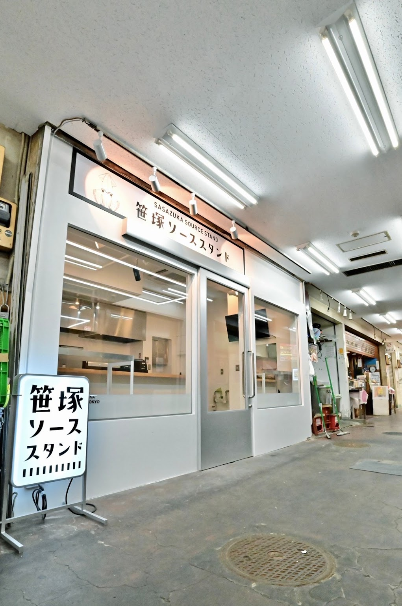
- 

</photo-set>

We end the night at [Pintology](https://maps.app.goo.gl/P3T4ruPRnUNS62xb6), a
craft beer bar run by a Japanese-and-American couple with an unusual crowd. It's
a pretty even mix of expats (like Charlie) and locals. A few things happen:

- I meet several of Charlie's friends, all captains of creative industries.
- One of them invites us to a Sofubi show at his art store the next day.
- I give another friend some professional advice.

He says, "Bring out the list!", and the bartender pulls out a piece of paper
from behind the counter with 9 names listed on it, instructing me to add my
name. I oblige, although I don't really know what's going on.

I'm informed: the friend to whom I gave advice is _best friends_ with the owner
of a _very well-liked ramen place_ where one normally has to line up at 7am for
lunch. Every month, it opens on an off-day, and this friend can bring in a group
of folks to walk right in with no line. This is the invite list. I'm honored.

## Food Tour Day

This is a _big day_.

Ever since moving to the neighborhood, Charlie has been conceptualizing the
perfect food day. The most places. The best places. The route. How to pack it
all in. My visit is an opportunity: we'll do it.

We start near Sasazuka Station with some Michelin-noted (Bib Gourmand)
_extremely inexpensive_ sushi at the stand bar [立食い鮨
鮨川](https://maps.app.goo.gl/cUvxXpMvxfYsYAe26). It's excellent. Wonderful uni.
Google translate struggles with fish kanji, so Charlie orders. The gentlemen
standing next to us were doing an all-you-can-drink thing, and they're having a
blast, which is... entertaining.

<photo-set>

- 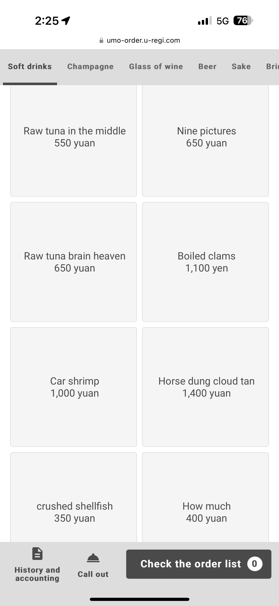

</photo-set>

From there, we go to the Sofubi show at
[Sailosaibin](https://maps.app.goo.gl/Ka5pHaL8Nh6A8qzP9), a store run by two
more of Charlie's friends, where they sell design books and _objets d'art_. I
get a hat!

We go across the street to
[Menotti's](https://maps.app.goo.gl/obsPsrw1V5fX3wcB8) for coffee. I get a
Spanish latte, since I've never heard of that. Turns out it just means "with
cinnamon". Still! A good latte.

<photo-set>

- 
- 
- 
- 

</photo-set>

Next stop: [串かつ 名代 (なしろ)](https://maps.app.goo.gl/xUF7jpM8Ha4ZaWa97)
back at Hatagaya station for their Happy Set: $2.69 gets you three
fried-things-onna-stick, a bit of cabbage, and a drink. We do two each. I
drink beni shoga highballs, which are full of red pickled ginger. We end out the
meal with "Potato Salad Of The Proprietor Here, Who Ordinarily Hates Potato
Salad", which is loaded with bacon and cucumber.

The fried sticks are,

- quail egg,
- pork,
- mushroom,
- hot dog,
- beef, and,
- onion.

The vegetable ones are the best.

<photo-set>

- 
- 
- 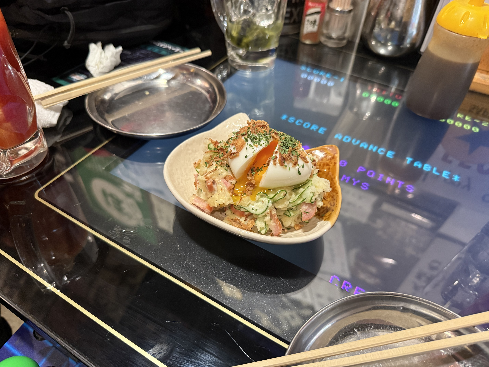
- 

</photo-set>

Following a pit-stop at a Tokyo Toilet (like in [Perfect
Days](https://letterboxd.com/film/perfect-days-2023/)!), we go to
[Kasiki](https://maps.app.goo.gl/GZ2XmEKR7cd6hF1Q9), a trendy ice-cream-and-wine
bar. I tired the pear-and-tea and the persimmon-and-tea ice cream flavors.
Personally I would have gone for a wetter texture, and I would have balanced a
bit less tea and a bit more fruit, but it isn't entirely bad. We talk about ice
cream recipes.

<photo-set>

- 
- 
- 

</photo-set>

We go into [Commune Press](https://maps.app.goo.gl/Ehe3Y6CvS63SHmqz7) to look
at some art, and I get a nice tenugui and a photo zine.

Then: [Ji Sakeya](https://maps.app.goo.gl/AVsjNN9CzWZiNiZT8) for a big Nihonshu
tasting. We talk about work stuff. In the store is just us, the owner, and two
older ladies. When Charlie's in the bathroom, one of the ladies asks me, "how
are you liking Japan?". Her companion says, "I'm too drunk and embarrassed to
speak English right now, but please talk to my friend. I'll listen", and so we
start a conversation. Turns out she used to be a COBOL mainframe programmer for
banks! She quit because it was too much work, and now they work together at a
music school.

<photo-set>

- 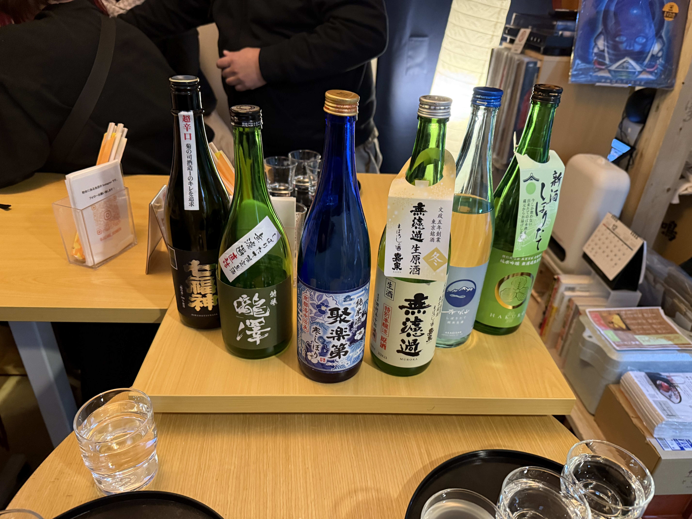
- 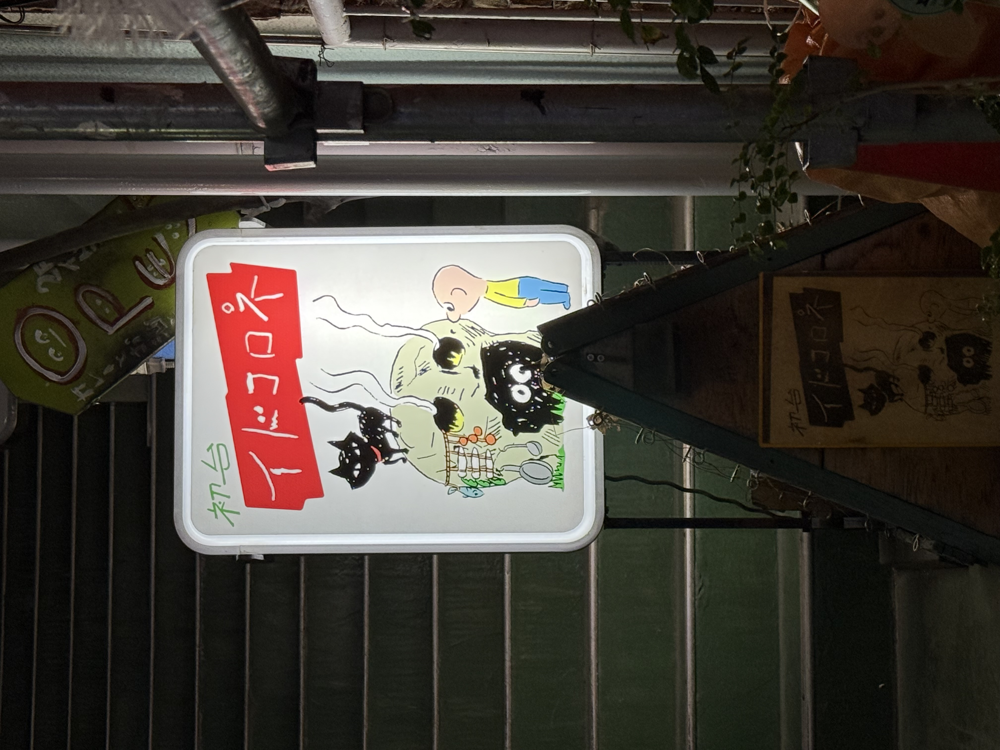

</photo-set>

After all that drinking we need to eat something, and the next stop is,
accordingly, [Raccos Bar](https://maps.app.goo.gl/ntcDN8wbTr4cZqSo7) (first
photo by Google Maps user Maria Armellin).

What an endearing place! Racco is the bassist in a significant punk band, and he
runs this little 5-seat bar on the side. The menu is comprised of little scraps
of cardboard pinned to the walls, where he's drawn, in Sharpie, cartoons of the
food. We have,

- salad,
- dashi tamago maki,
- huge sardine,
- hotaruika no shioakara,
- smoked turnip, and,
- shiso leaf tempura.

The hotaruika no shiokara is particularly fascinating: shiokara (lit.
"salty-spicy", meaning something more like "so salty that it's spicy") is a
style of salted-and-fermented seafood, and hotaruika-no is a particularly choice
variety made from the guts of firefly squid. This right here is the most
unfamiliar flavor of the trip. Delicious. I pledge to bring some home. This is
my white whale.

<photo-set>

- 
- 
- 

</photo-set>

Done eating, and a bit tired, the next stop is [MEM Coffee
Bar](https://maps.app.goo.gl/5pEQDW3ikEcY3PPS6) (first two photos by Google Maps
users Amir Dholakia and りょーたんまん). It's my favorite business of the trip.
The bar is full of metal fixtures which the proprietor welded himself, and he
has a bunch of infusions in the works, plays music only through his modular
synthesizer, and offers a menu containing only coffee-based cocktails of his own
design. I don't even like coffee cocktails, but these are excellent. I have two.

We finish the night at Gremlin—the beer bar in the train station--where I have a
tasty (and _extremely_-sour peach kölsch. The Chinese restaurant next to Gremlin
has a display of dried animal penises in their window.

<photo-set>

- 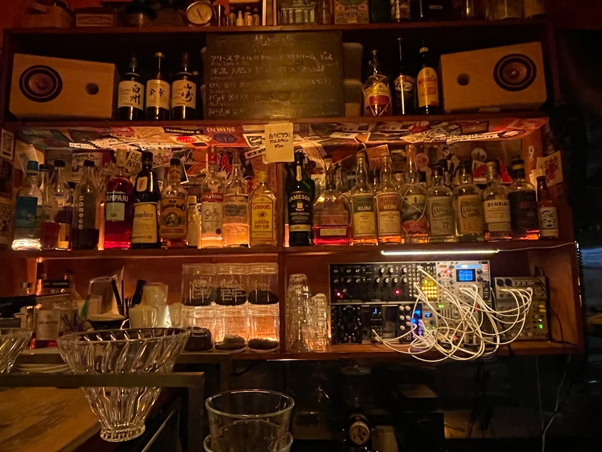
- 
- 

</photo-set>

## Violetta and Florilege Day

We get a pretty late start on Sunday. We meet up in Hatagaya to go to a [curry
place](https://maps.app.goo.gl/9uSkU4Dng3mcL3rw5) that Charlie goes to every
week. He gets me the chicken-and-beef combo, and the chicken is pretty spicy. I
think this is my first time seeing a fork! The proprietress was very friendly.
The salad is nice, too, if a bit overdressed. The orange wedge is very welcome.

Then, we make our way to [Violetta](https://maps.app.goo.gl/h8WkVMhqTFEiFwJS9),
where some friends of Charlie's are DJing. One particularly interesting DJ is
playing a mix of IDM and koto-oriented Japanese traditional music. There's video
of someone painting the stripes onto a road.

<photo-set>

- 
- 
- 

</photo-set>

---

Before visiting a new city, I like to check the [World's 50 Best Restaurants
List](https://www.theworlds50best.com/list/1-50) (which ought to be called "50
arbitrarily-chosen tasting menus in neighborhoods with Aesop stores", but that's
another conversation) and, if any of those restaurants are in the city, see if I
can get a reservation at one.

This time, I have a seat at Florilège in Roppongi. I'm the one of the first
people seated. The restaurant is one huge communal table, but the seats are
pretty far apart. As one might expect, the clientele is primarily tourists:
many from China, and a few from the US, Korea, and England. Plus one older
Japanese couple.

The meal is quite produce-oriented, which is nice.

The most remarkable thing about the meal is the beverage program. They offer a
wine/nihonshu pairing, and a non-alcoholic cocktail pairing. Non-alcoholic
("spiritfree") pairings are exciting because they're extremely difficult to
execute well, so I'll always opt for one when it's available.

The first hard part is that you want the drinks to _drink like alcohol_:
cocktails want to be sipped rather than chugged, but it's hard to make a
non-alcoholic drink with that quality. Some cheap tricks are making the drinks
spicy or serving them very hot. A better option is to lean on tannic and
astringent ingredients, often teas, but you can't serve 12 cups of tea.

That's the second hard part: you want the drinks to all taste different. Diners
expect each of their wine pairings to taste chiefly of grapes, but to be served
a string of all teas is disappointing.

Florilège's pairing is very dynamic. Some drinks use herbal flavors, one is very
acidic, a couple use tea, and only one is spicy. There's even a simulacrum of
wine, with black and pink pepper, burdock root, and grape juice.

Here's the full menu, as I recorded it

- Turnip soup
  - Lactobacillus
  - Cheese
  - Vanilla
  - Three Japanese sweet potatoes
    - Smoked tea leaf
- Red vegetables
  - Red bell pepper mousse
  - Radicchio
  - Tomato
  - Hibiscus soup
  - Cream cheese
  - Drink: Cream cocktail
- Onion
  - Lily bulb
  - Gnocchi (more of a raviolo imo)
  - Custard
  - Thing made from rice powder in leaf
    - Lemon
    - Sweet
    - Fall-apart dough
    - Powdery interior
  - Onion soup
  - Kelp oil
  - Drink: Potato, hojicha, honey cocktail
- Drink: Tomato, rice malt, n/a Nihonshu w umeboshi
  - Potato
  - Cod roe
  - Hollandaise
  - Shirako
  - Tuille
    - Mac and cheeee flavors; from the roe! Very clever.
- Bread course
  - White and rye steamed breads
  - Soy butter w soy powder (tastes like regular butter)
- Drink: Green tea pear water
  - Japanese white Radish pie
  - Radish seed caviar
  - Sake plum sauce
  - “Hand salad”: watercress, dill, chervil
- Drink: Kiwi, rosemary, cacao, fig leaf
  - Kizu fry
  - Yuzu sauce with millet roe
  - Japanese kale, potato, bean sprouts, genovese of Japanese kale
- Drink: Red wine simulation: black and pink pepper, burdock root, grape juice
  - Venison
  - Hachi miso
  - Japanese spinach
  - Eggplant puree
  - Mushroom sandwich thingy with black truffle
- Chestnuts
  - Ice cream and chestnut skin hojicha jelly
  - Meringue with cream of honey and milk
  - Chestnut powder
- Apple
  - Pie
  - Caramelized apple sauce
  - Japanese tea
  - Slices
- Gooseberry with jam
  - Canelé of roasted tea
  - Red bean paste and persimmon
  - Evaporated sugar candy

<photo-set>

- 
- 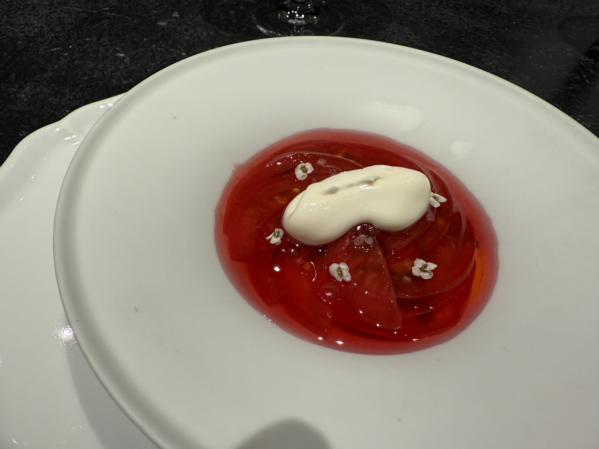
- 
- 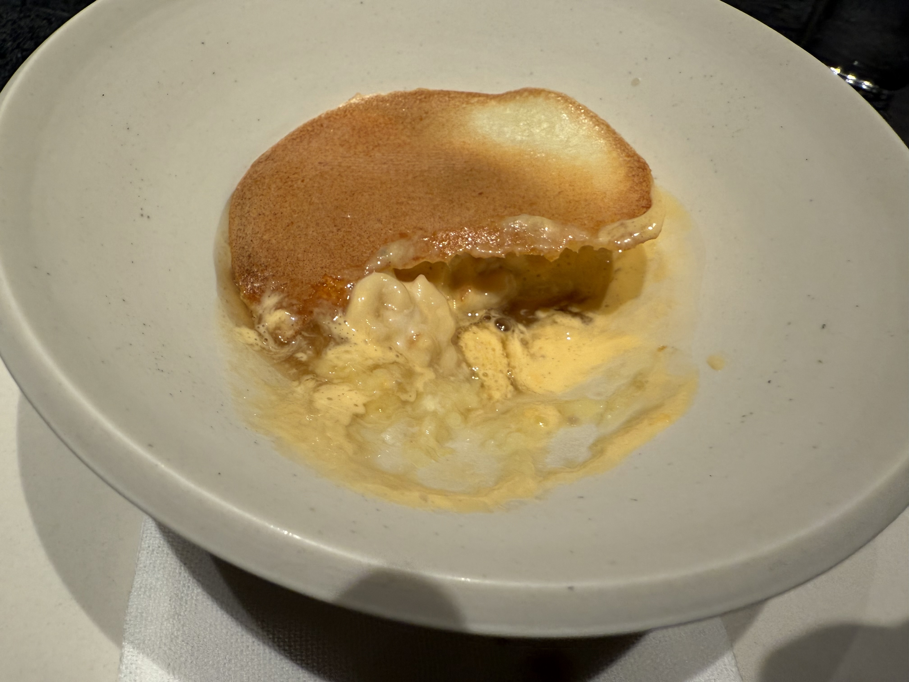
- 
- 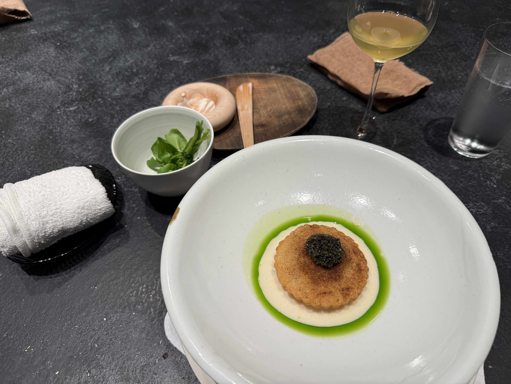
- 
- 
- 
- 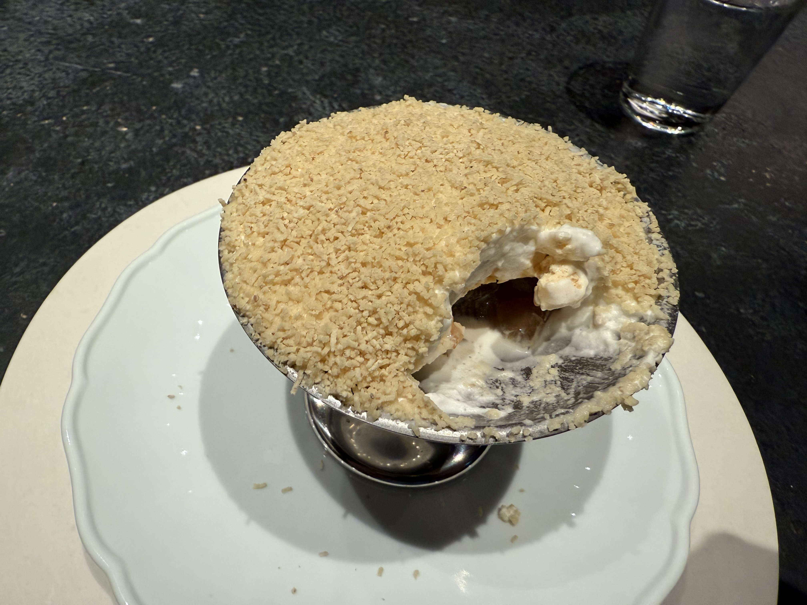
- 
- 

</photo-set>

## Laundry Day

Monday is primarily a Shinjuku Day. In the morning, I...

- use a laundromat near the hotel
- buy a suitcase
- shopped for gifts at a couple department stores
- ask for shiokara at those department stores, but am out of luck
- have konbini lunch

In the evening, I meet up with Charlie for Chinese food at
[Kōya](https://maps.app.goo.gl/oAnzrPQzFwx5oJNy9). We eat eggplant, fried rice,
and dumplings. The dumplings are especially good.

<photo-set>

- 
- 

</photo-set>

Then, we go to [OOTONG Rum Hall](https://maps.app.goo.gl/xhDZKN9BvHFT8M6h8),
which is nicely-decorated along an island theme. The proprietor wears a straw hat,
makes rum drinks, and gives us dried banana slices and pistachios.

We end the night at [Owl 2nd Floor](https://maps.app.goo.gl/cbTH6UmjnZBUXsmM6).
It's supposed to be a very good omurice restaurant during the day, but at night
it's a cheap bar. It has the most delightfully weird energy. Kind of a Twin
Peaks Black Lodge vibe. The art on the walls is unusually naïve. We drink
awamori and eat "drug egg" and listen to such classic American folk songs as
"jingle bell rock", "there’s a new kid down in Bethlehem" and "little drummer
boy (dub remix)".

<photo-set>

- 
- 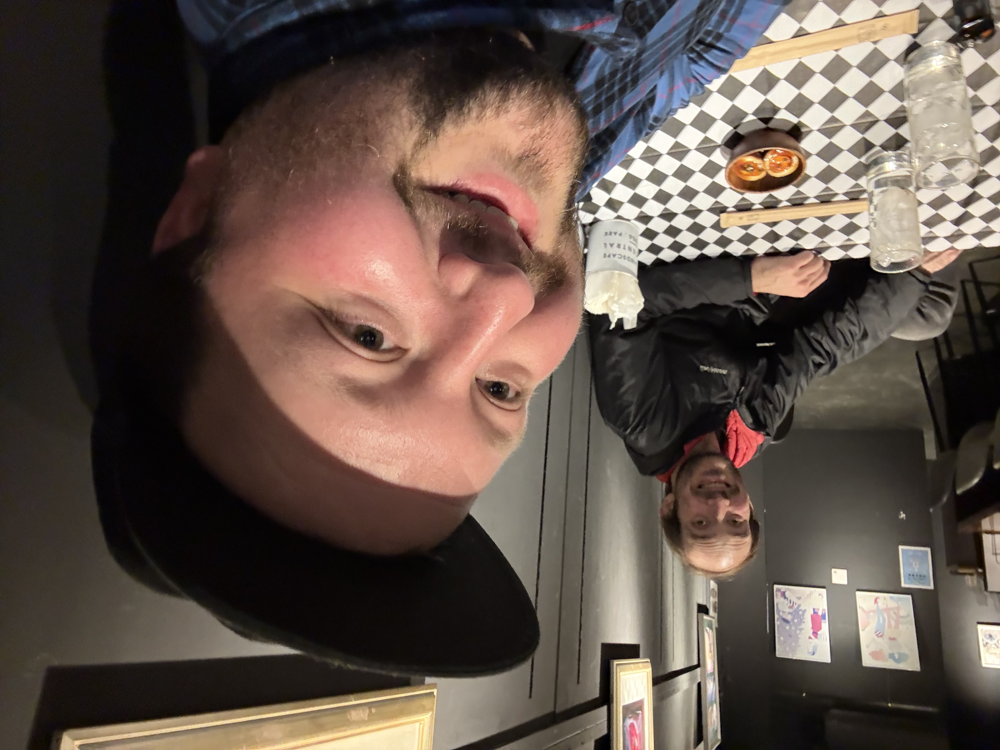

</photo-set>

## Nakano & Koenji Day

Tuesday's itinerary takes me to Nakano, Koenji, and Shin-Koenji. I start with
Nakano Broadway, reportedly "the true heart of character culture", but I must do
it wrong, because to me it just seems like a mall where all the goods are a bit
shoddy. I do pick up a little plastic coin purse at the Daiso there, which is
GAME CHANGING. I ought to have done this sooner.

Japan is a very cash-oriented culture, and the coins go up to the equivalent of
five dollars, so most transactions can be done with coins only. There's no
tipping, and paying the exact change is convenient and appreciated.

After walking around Nakano for a while, I get a goth latte (with charcoal for
blackness) and a _transcendent_ canelé at
[Butter](https://maps.app.goo.gl/XNi4WqmtdGi8Ka5T8). While I'm in there, a guy
passes by on a very cool bicycle, but I'm too slow to get a picture.

I walked through the Meiji University campus, people-watch, and admire some
construction. I end up in Koenji, and loiter for a while by the station. Walking
around, it seems like a great place to eat: lots of fun little restaurants, but
I'm not hungry yet. I'd like to go back and explore more some day. I spend a
long time shopping at [cotogoto](https://maps.app.goo.gl/EmXEZWKHDpwGNu8Z6), a
home goods store with some beautiful ceramics.

Charlie recommended a [falafel place](https://maps.app.goo.gl/VGyVcLhuZtvEtvEv5)
in Shin-Koenji--he said they have bad falafel, but that it's made with
exceptional care. It's gotten him through many a rough night. I get a sandwich
there. The recommendation is correct: the man running the place is very kind.

I complete the excursion at [Kohitsoji
Coffee](https://maps.app.goo.gl/ZrTVAy4pADYLSzaJ7) (photo by Google Maps user
Horatio Caine). They're reportedly known for their espresso, but I forget this
and get drip coffee. It's still pretty good. My bag from cotogoto is starting to
feel pretty heavy, so I get on the train back to Shinjuku.

<photo-set>

- 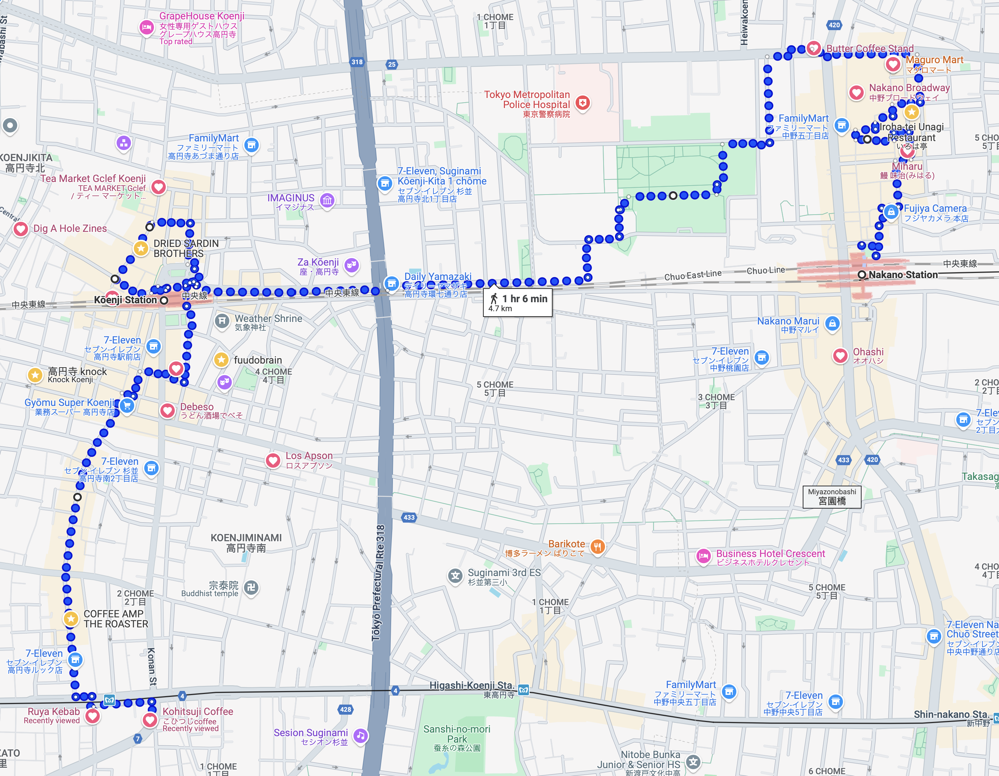
- 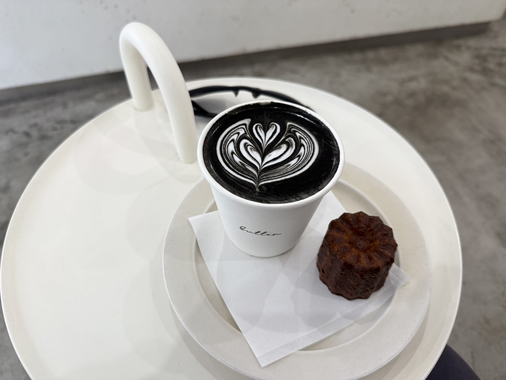
- 
- 
- 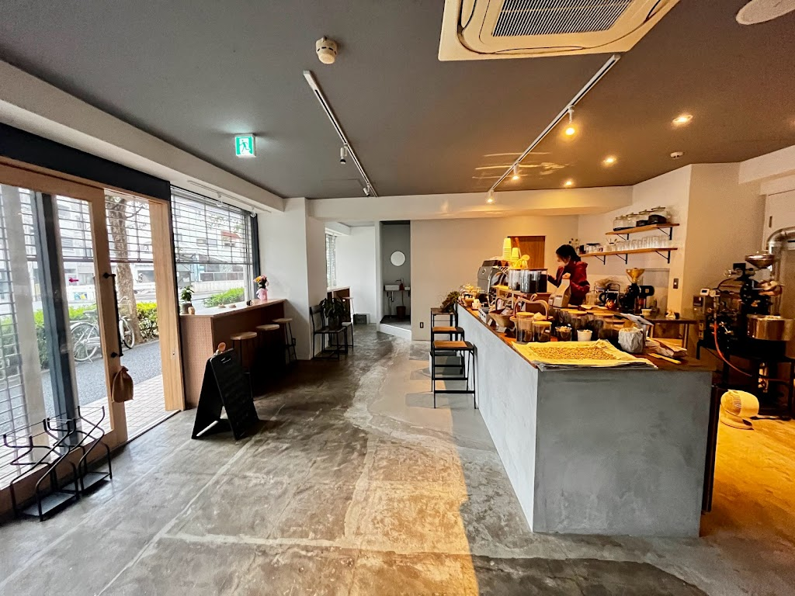

</photo-set>

---

For dinner, Charlie and I go to the country-style restaurant
[こたつ](https://maps.app.goo.gl/GULcEt8E7pYS6nqs5), which reminds him of his
years in Aomori. We eat oden, cod sperm, rice with natto, and a big bowl of
fried chicken cartilage. This is my first natto in Japan. Everyone makes such a
big deal about how gross non-Japanese find it, but it just tastes beany and
fermenty and sticky, not scary at all. I drink a coffee-and-milk highball, which
is made with shitty bottled coffee and excellent milk.

<photo-set>

- 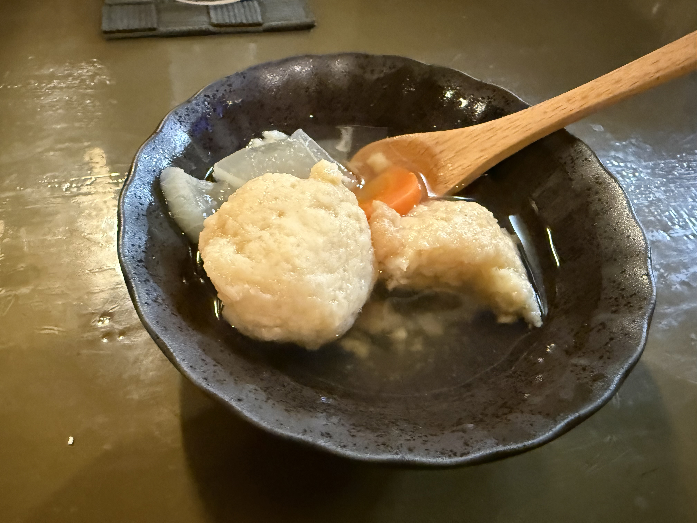
- 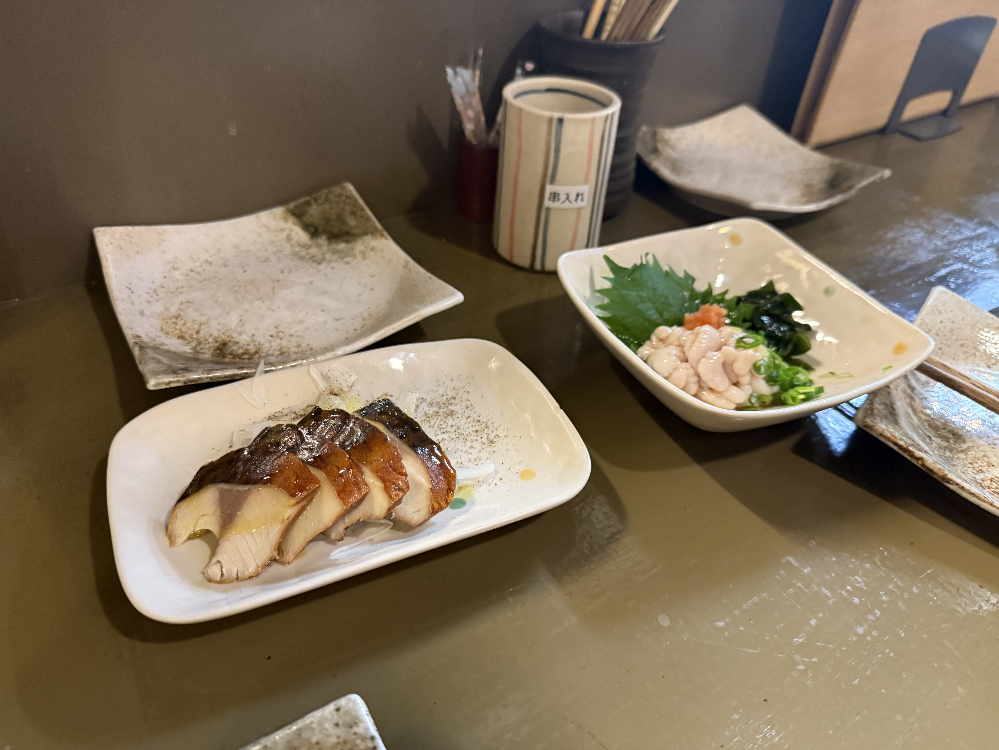
- 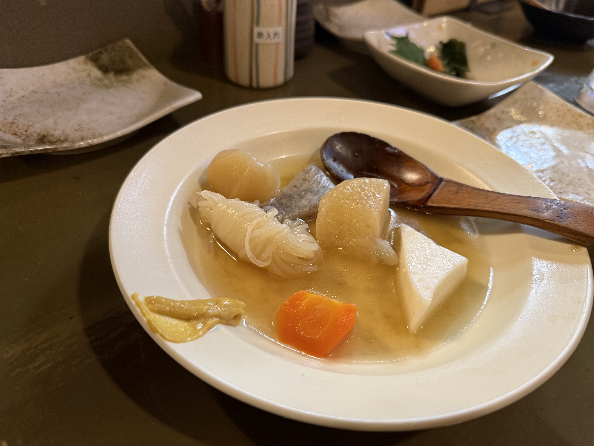
- 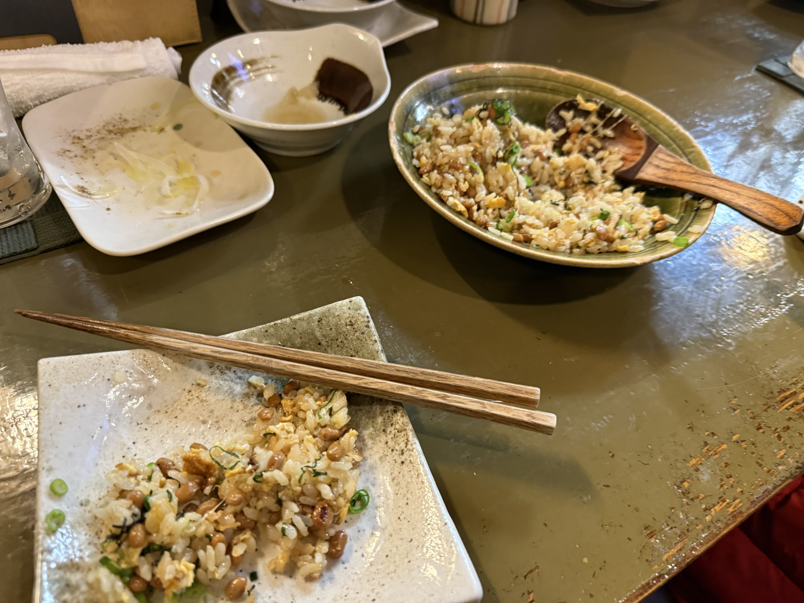
- 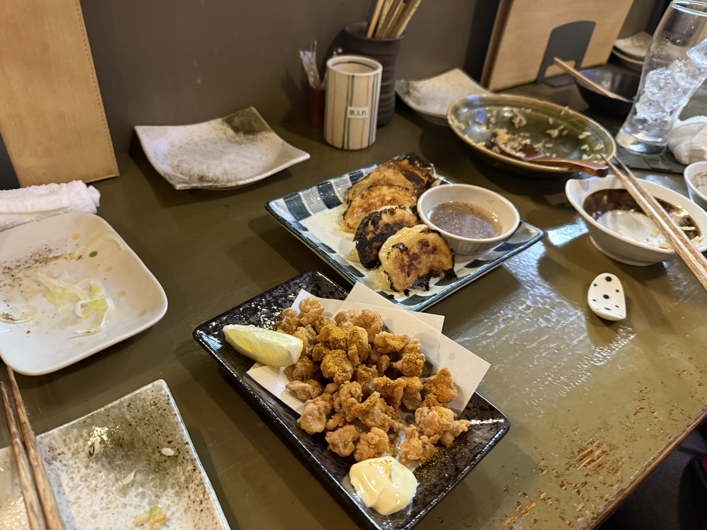
- 

</photo-set>

We get an umeboshi highball at the whiskey bar [Sasazuka
753](https://maps.app.goo.gl/YRNwnRTqcD7akbBc7). A salarymen down the bar just
got back from Osaka, and he shares packaged pieces of Osakan snack food.

We end the night at Charlie's apartment. He plays some music he's been working
on. We drink beer.

<photo-set>

- 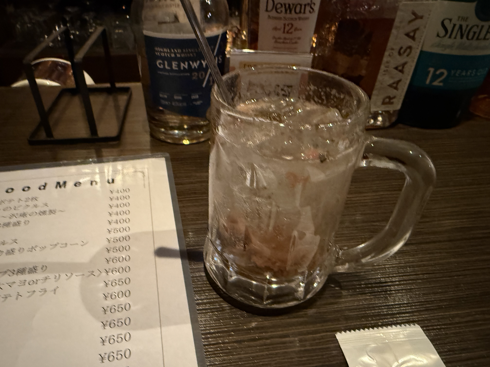

</photo-set>

## Ginza Day

Charlie has work stuff to do on Wednesday, and for my part I'm pretty exhausted
from a busy week, so I take the day to myself.

I start with sushi at the fancy sushi restaurant in my hotel. I'm the only
person in there at lunch time, but they still pull out all the stops. The chef
tells me he specializes in monkfish liver, which is probably not good for you,
but tastes delicious.

When I made the reservation, I opted for a Nihonshu-and-wine pairing. When I sit
down, I realize this is probably unwise (pairings always get me a bit hammered),
but I power through it.

<photo-set>

- 
- 
- 
- 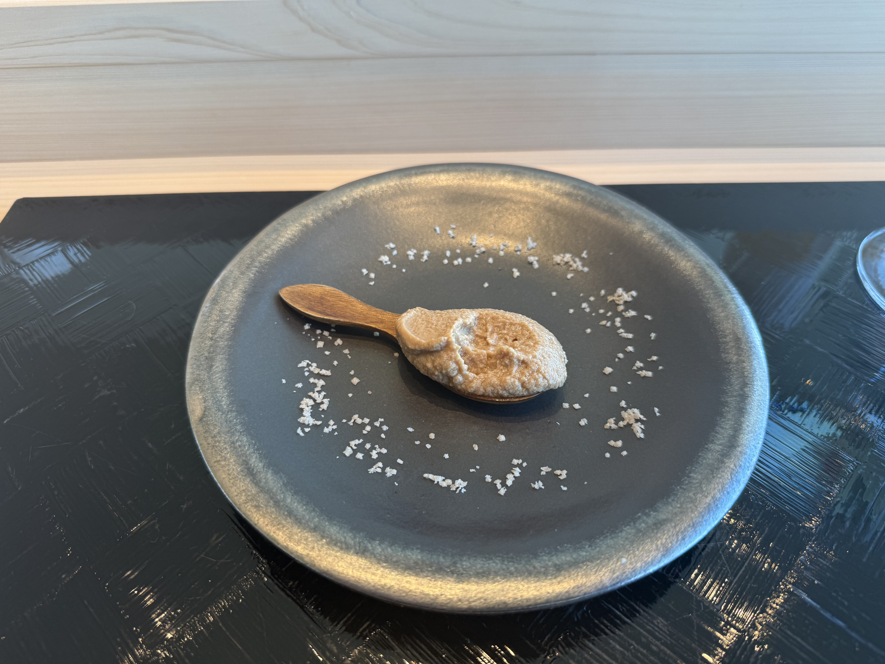
- 
- 
- 
- 
- 

</photo-set>

---

To be honest, I haven't been especially looking forward to Ginza--that kind of
neighborhood is the same everywhere--but it's a Thing One Must Do, and so I do
it. I _do_ want to go to the flagship MUJI store, and I _do_ need to buy some
more gifts.

I start at an [incense store](https://maps.app.goo.gl/FuqCKr71Sv4nyHZj8), which
is a great place for gifts. Japan has a big "you must bring everyone something
back from your travels" tradition, so a lot of stores have gift options ready to
go at a range of price points. The incense store is no exception: they have gift
kits where I can choose a tray, a holder, and a box of incense, and they wrap
them beautifully.

I walk into an [art and craft supply
store](https://maps.app.goo.gl/jbYdPNXvVmq5M4Xw5). 12 stories of goods. I take
the elevator to 12 and walk down. Look at all these paints! The upper levels had
a bit of _serious art stuff_, so I was disappointed when the lower levels had
mostly trinkets and notebook covers. It's no Pearl Paint, I tell you what.
Still, I get a few bottles of fountain pen ink, which writes very nicely. Next
time I'm in Japan, I'd like to do some more research and find some
art/craft/woodworking shops that are more practitioner-oriented.

My last stop in Ginza is the [5-story flagship MUJI
store](https://maps.app.goo.gl/QJjUs396QFcmSjx57). It's really something. I get
a ton of things here: beautifully marbled ceramic mugs, nail clippers, a pen
case, chocolate, toothbrush holders, rolls of tape.

I'm surprised how much space is devoted to freeze-dried meals, which I don't
find especially appealing (I mean, how good can they be, they're
freeze-dried...). But they do seem very popular.

<photo-set>

- 

</photo-set>

I return to Shinjuku. I stop at a couple more stores on the way and ask about
hotaruika no shiokara. No luck.

For dinner, I cross another item off the checklist: a Real Unagi Place. This is
delicious, but to be honest, I don't think I have the palate to appreciate this
meal commensurate with the price: it isn't _that much_ better than the frozen
unagi you can get in the States, and it's one of the most expensive meals of the
trip. What redeems it for me are the skewers: I get an eel belly with lemon, and
an eel liver, and they are excellent, and you certainly can not get them in
America. The guy next to me gets a bowl of fried eel-spines, which I'm a bit
envious of. I watch the eels wriggle slowly in their ice bucket.

<photo-set>

- 
- 
- 
- 
- 

</photo-set>

## Kichijōji & Ogikubo Day

Thursday's journey takes me from Kichijōji to Ogikubo.

<photo-set>

- 

</photo-set>

I start, around lunchtime, at Daps Original Hood Joint, which is _incredible_.
It's a Harlem-themed restaurant(!) specializing in American classics like
Chicken Over Rice, Authentic Chopped Cheese ("It's New Drug From Harlem USA"),
Brooklyn-Style Lobster Roll, and Piña Colada.

The decor is impeccable. The proprietor is a big hip-hop head—he had Purple Haze
on vinyl—and he sells a variety of American import products (Old Spice stick
deodorant, blunt wrap, authentic glass rose). While I was waiting for my chopped
cheese and piña colada, I peruse a manga zine in Japanese drawn by a friend of
his about the history of hip hop.

In hindsight, I wish I'd bought it: at the time, I couldn't think of who in my
life would appreciate it enough as a gift, but, duh, _I'm_ that person. Oops.
Next time.

The chopped cheese is legitimately the best I've ever had. I think the trick is
twofold:

1. unlike in the US, they use ingredients that shouldn't be in the trash, and,
2. unlike in the US, the only person working owns the place and gives a shit.

<photo-set>

- 
- 
- 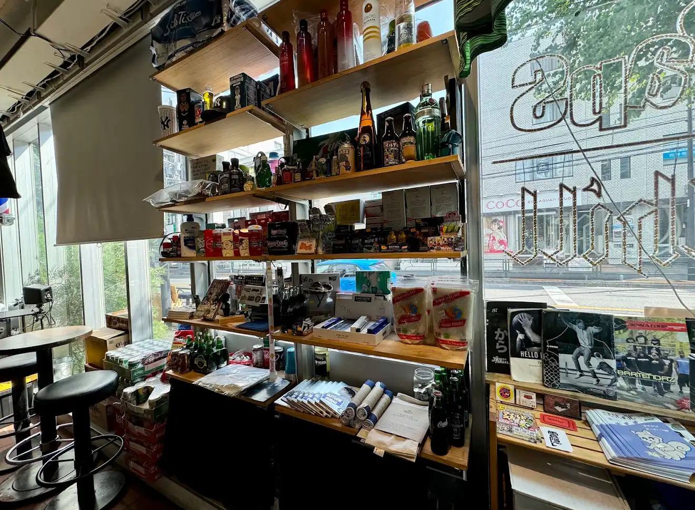

</photo-set>

I stroll through [Inokashira Park](https://maps.app.goo.gl/nr4xszft12iYty3M9) to
the picturesque coffee shop
[Thomnecogo](https://maps.app.goo.gl/zjvUFr9obFwQF46U6). I poke my head in,
and—this is embarrassing—honestly: I am too intimidated by the perfect vibe to
go in; I feel I would spoil it. I've never had that feeling before.

Days like this make me _so happy_ to have a sherpa in Charlie. I can easily
imagine a different trip to Japan, where I'd have stayed in Shinjuku, spent my
time in, like, Harajuku or something, and mostly found myself in places with
English menus. In that parallel world, I'd feel I was exploring! Seeing Japan!
Having an enriching experience! But it would be so bereft in comparison to this
trip.

(last 5 photos by Google Maps users みっちー, Yoichi IKEDA, yusuke yahagi, T
TMBC, & スナイデル)

<photo-set>

- 
- 
- 
- 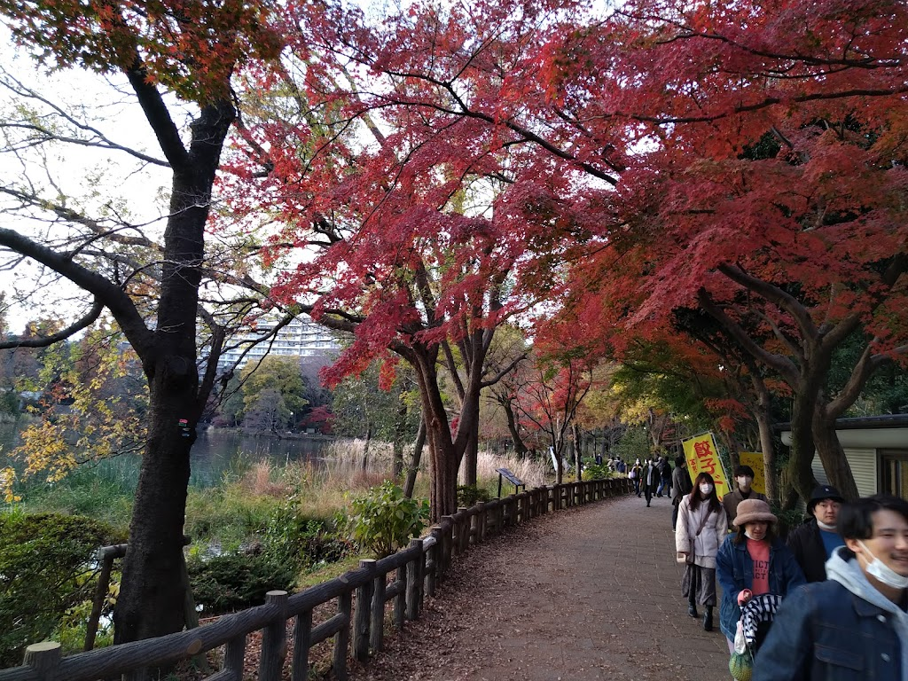
- 
- 

</photo-set>

A bit hungry, I meander up from the park to [Tony's New York Pizza Since
1968](https://maps.app.goo.gl/KfbtLF1h3QAkfPVo6). Tony was inspired by Kennedy's
election to get on a ship to New York in 1962, and became, briefly, a
journalist. Devastated by the assassination a year later, he returned to Japan
and opened a pizza shop.

The pizza is, let's say, not exemplary of New York style as I am familiar with
it. But while it might not be successful as New York pizza, it is _delicious_ as
food. One must cater to one's clientele, I suppose. A very old man with a very
small wife, Tony is very happy when I tell him his pizza is oishii.

I eat my cheesy pizza with a glass of loquat-and-vinegar juice, and proceed east
towards Ogikubo, where I stop at a bakery for a delicious pastry, and then
Nishi-Ogikubo, where I get the train back to Shinjuku.

<photo-set>

- 
- 
- 
- 
- 

</photo-set>

At dinner time, I meet Charlie at Koenji station and we go to a [Fukuoka-style
Izakaya](https://maps.app.goo.gl/JEqxUF7Czs1URfM7A) to meet up with his friend
Yagi. We have natto, and fried chicken, and beni shoga, and milk highballs. When
Yagi arrives, we have oden.

We go with Yagi to [Knock](https://maps.app.goo.gl/McBSjEkyYZyZCpLV7), where
Charlie runs a monthly event, to watch some jazz DJs. We talk to Yagi about
work. He's moving to Vancouver soon.

<photo-set>

- 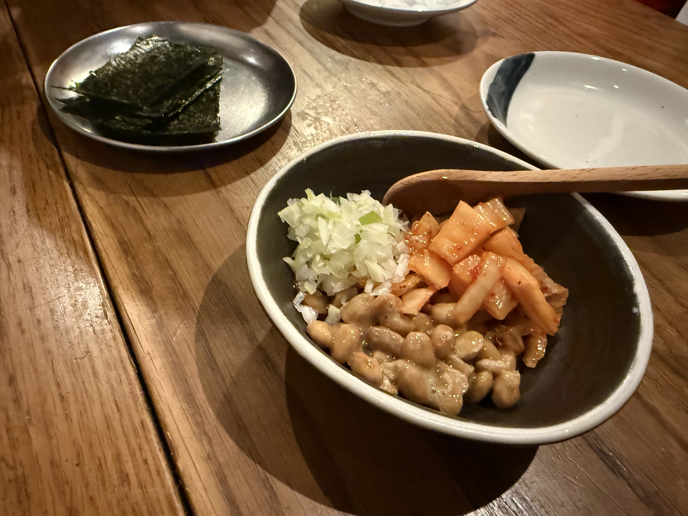
- 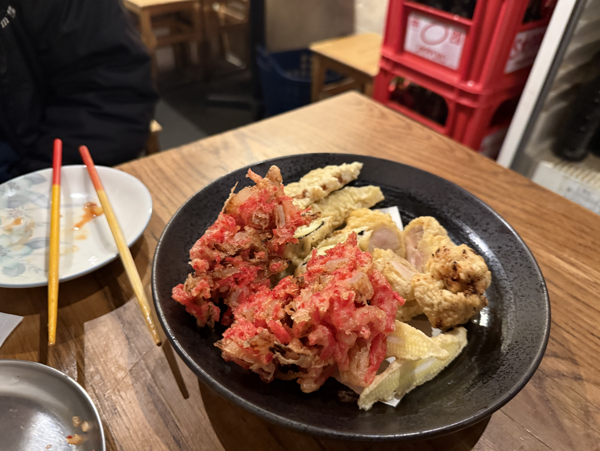
- 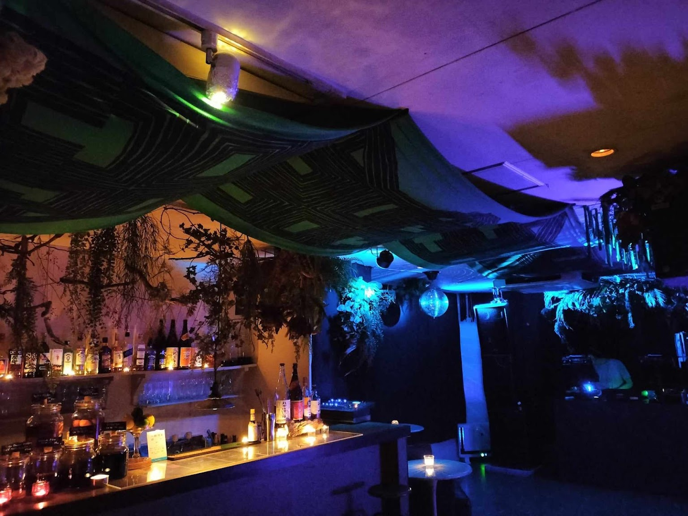

</photo-set>

## Ramen Day

The time has come. Remember "The List" from the end of [Meguro & Nakameguro
Day](#meguro--nakameguro-day)? The ramen appointment has arrived.

I take the train, got to the [ramen
place](https://maps.app.goo.gl/m7DPt5T3QpLW8cek8) at the appointed hour, operate
the ticket machine, and take my seat at the counter. I order the shoyu ramen
with all the fixins, although some people say the salt ramen is better. That's
hard to believe. This pork! 6 different cuts of slow-cooked pork in this dish,
lovingly assembled. I can see why people wait all morning for this. I'm glad I
don't have to.

I walk from there back to Hatagaya, along a scenic greenway. I love these
greenways! A very nice urban feature. When I get there, I make my pilgrimage to
the aforementioned greatest bike shop in the world: [The Blue
Lug](https://maps.app.goo.gl/T8A3vFZwtgFwKyep9). The staff are very nice to me,
despite my broken Japanese. They have a frame pump I've been looking for. I buy a
lot of things.

I get a ham croissant at [Bakery
SASA](https://maps.app.goo.gl/i4LrMiduzRYssnUr7). The proprietor recognizes that
my hat is from Sailosaibin (I got it on [Food Tour Day](#food-tour-day)). We
discuss the artist.

I make my way to Yoyogi station and take the train back to Shinjuku.

(bakery photo by Google Maps user つじなか, Blue Lug photos by user 嶋津兵庫頭)

<photo-set>

- 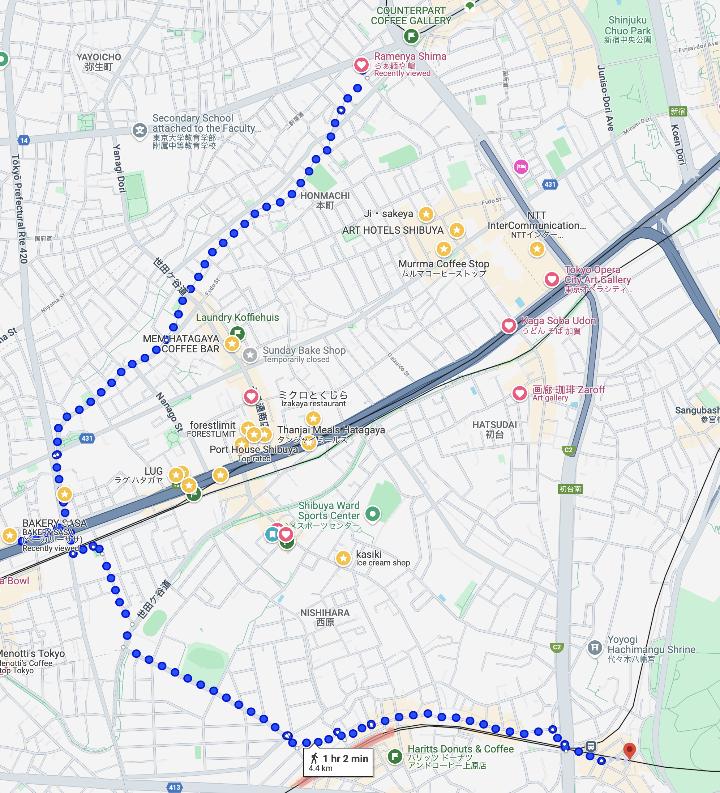
- 
- 
- 
- 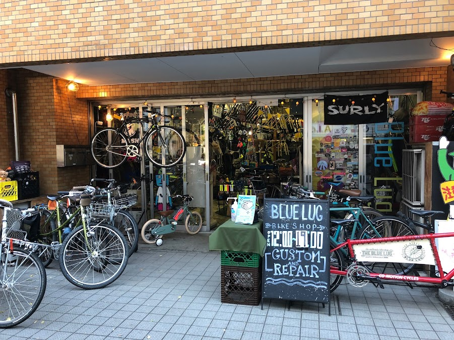
- 
- 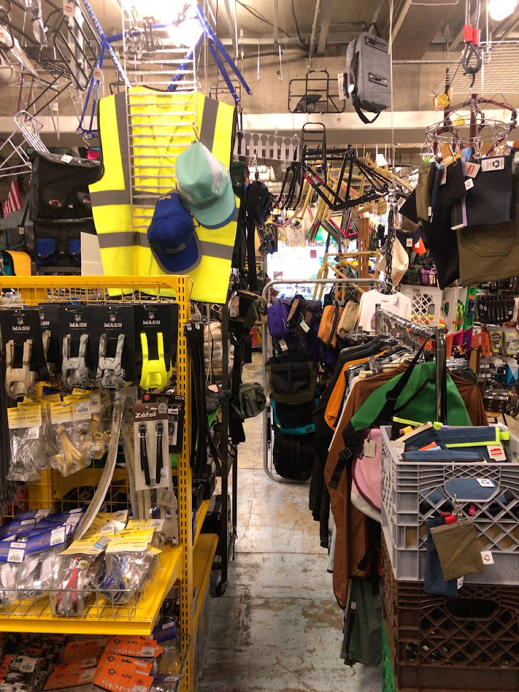
- 

</photo-set>

---

We meet for dinner in Hatagaya and go to
[LaLaChai](https://maps.app.goo.gl/gCWWLiaDGU8egKwEA) for "the best pad Thai in
the world", as we _almost_ had on [the first
day](#first-day-in-japan-tourism-day). It _is_ pretty good pad Thai, but it's
not the best in the world: I've made better.

It's Thursday, and (you'll recall) Charlie always goes to ideala at forestlimit
on Thursdays, but this particular Thursday we decide not to go to ideala:
they're doing something weird. (Well, more like: not weird enough, which is
weird for them).

We go back to MEM and meet a [rakugo](https://en.wikipedia.org/wiki/Rakugo)
performer who was born in California but moved to Japan as a child. MEM is
playing The Books on the stereo. We all get to talking about art, about rakugo,
about culture. I learn that rakugo is sort of like a traditional form of
stand-up comedy, except you do it sitting down, and you tell stories from a
repertoire of standards. The language used is so archaic that most people in the
audience don't understand what's being said, but still: the performance is
dynamic enough that they laugh anyway. I can relate.

We end the night back at Pintology and drink absinthe cocktails.

(photo of rakugo performer by Flickr user vera46).

<photo-set>

- 
- 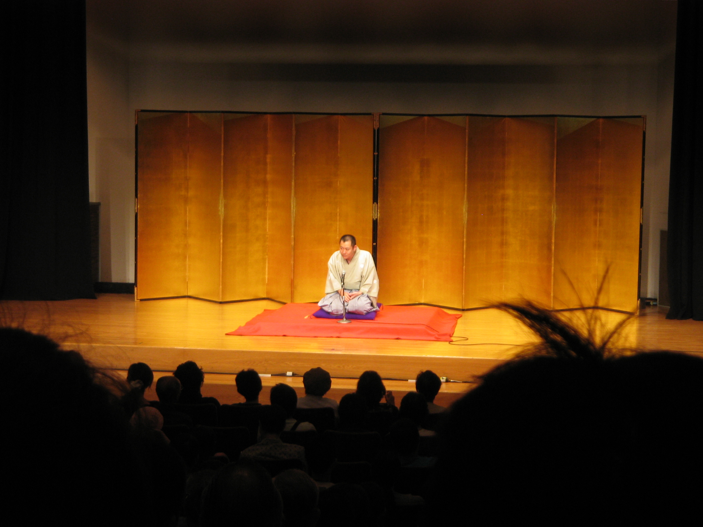

</photo-set>

## DJ Bowling Day

It's gonna be a big Friday: [loom](https://maps.app.goo.gl/T3q7xdzf39mgWRnt5) is
having an all-day DJ event at [Sasazuka
Bowl](https://maps.app.goo.gl/Qrtk5Mqn9LbQuEWCA) to celebrate the launch of
their new beer. Charlie has some friends playing there.

We'll make our way over there eventually, but first: it's lunch time. Charlie's
been talking up Freeman Shokudo for a while: it's a place run by a friend of his
who moved from New York. We'd tried to go there for breakfast the day we went to
LUG. When I was talking to the guy at Daps Original Hood Joint about American
food in Tokyo, he said I _have to_ go to Freeman. Among Japanese restaurateurs,
the vibe seems to be "Of course I know Jeremy, but I don't think he knows me."
It's a Thing.

There's reggae music playing. "Jeremy used to run a reggae record store in New
York City". The server is a notable Japanese rapper. We order the pastrami. "Do
you guys have a few minutes? I want you to have a fresh pastrami. Let me put on
a fresh pastrami," Jeremy says. We oblige, and get a shepherd's pie and a
cucumber salad for the meanwhile.

Let me tell you: this is a fucking delicious pastrami sandwich. The best I've
ever had, and I'm a pastrami person. I've had it in Chicago, in Los Angeles,
Boston, San Francisco, New York. This is better. I tell Jeremy. "There hasn't
been good pastrami in New York City since Gitlitz's closed in '78," he explains.
"When I started making pastrami here, I wanted to make _good_ pastrami. I hadn't
had any good pastrami in a long time."

**This** is good pastrami.

<photo-set>

- 
- 

</photo-set>

We have some more time to kill, and we go to
[Harrits](https://maps.app.goo.gl/2c9SgezyrPdUcX9u9) for a doughnut. There's a
long line. We bring it to [Yoyogi Ōyama
Park](https://maps.app.goo.gl/ZAjL7sbWunWwQjXFA) and eat it by the baseball
diamond. It isn't a very good doughnut.

I feel myself getting a bit grumpy: I could use some coffee. Charlie takes me to
[Laundry Koffiehuis](https://maps.app.goo.gl/vAnBQKKQL3nNNqX66), which is in a
former laundromat, and also sells hypebeast clothes and deadstock basketball
shoes. The coffee is very good.

<photo-set>

- 

</photo-set>

It's time for the [DJ thing](https://www.instagram.com/p/DDv58quSK80/). We've
missed Charlie's friend Mai ("PLASTICMAI") but catch several other DJs. A few
are excellent, a few are not.

For dinner, we cross the street to [Mampuku
Shokudo](https://maps.app.goo.gl/BsjfYHTwNcsohgG17). I get tuna Hamburg steak,
which also has beef and pork. It's good! Real fill-you-up food, and for cheap.
We drink two of their very strong tea highballs, which is almost too many. We go
back to Sasazuka Bowl for some more DJs. It's getting pretty packed in there. A
house DJ is incredibly skilled. We leave after her set.

<photo-set>

- 
- 

</photo-set>

We end the night at Pintology, and who do we find? Jeremy from Freeman! It's his
birthday! We get to talking: he lived in Chicago for a while in the 90s while
his then-girlfriend went to SAIC. He started a reggae night at the Empty Bottle.
I go there often! He knows a lot of people. We drink Malört.

We meet Satotsu, who is the bassist of the thrash band Endall. He's been to
Chicago, too. He played at Reggie's. They even had Sapporo! No rock club in
Japan has a big selection of beer.

## Shiokara Day

It's my last day in Tokyo, and it's laundry day again. The machine I'm using at
the laundromat breaks--throws an error code--so I finish the load in the other
machine.

Before meeting up with Charlie, I have one last checklist item I'd like to
complete: picking up some nicer go stones. I rush to [Aoyama
Goban-ten](https://maps.app.goo.gl/JQhuCLdqRBWLg84TA), which is not in Aoyama.
It seems like a lot of things that aren't in Aoyama still have Aoyama in the
name. How odd. Maybe it's prestigious.

<photo-set>

- 
- 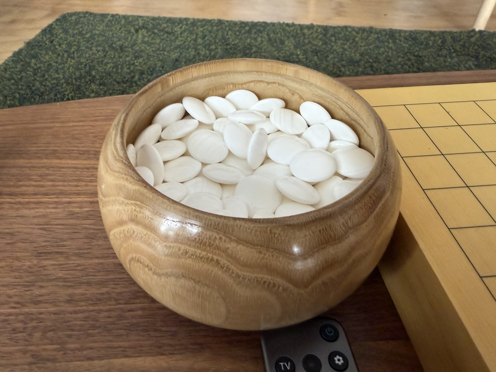

</photo-set>

I meet Charlie back at the hotel, and we go up to the fancy hotel bar. I get a
whiskey drink and he gets a mushroom soup cocktail. He gets a fruity gin drink
and I get a dashi martini. It's all very ambitious. There's an excellent view of
the sunset; we can see Mount Fuji.

<photo-set>

- 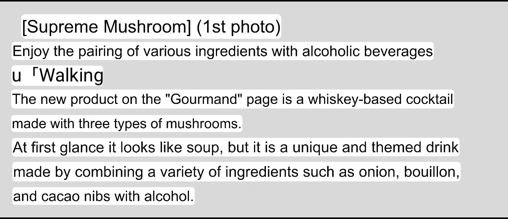
- 
- 
- 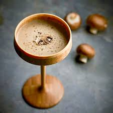

</photo-set>

Charlie's put together a real treat for me. I loved the hotaruika no shiokara at
Raccos last week, and I haven't found any to take home yet, so here's the plan:

- We'll go to a [gourmet specialty food
  store](https://maps.app.goo.gl/AuTvp73HsnFy8bVN6), which is certain to have
  shiokara
- We have a reservation at a [shiokara-specific restaurant and
  bar](https://maps.app.goo.gl/yifjmCkKVd4pBLFN9) afterwards. They have 64
  different shiokaras.

I find a lot of good stuff at the food store, but all the shiokara is fresh and
needs refridgeration. My suitcase is getting full anyway. We make it to our
reservation.

We order an assortment of 20 different shiokaras, working our way down the menu,
with no bread, no rice, nothin'. Just shiokara. The people working think we're
crazy. They look at us funny. Normally you just has a bit of shiokara with some
rice, but that's not what we're doing: we're going for it. All shiokara.

"So salty it's spicy" is right. We're less than halfway through and my face is
tingling. I run out of beer. A few minutes later I'm tripping. I feel crazy. We
both feel crazy. This is insane. You shouldn't eat like this. We lose our sense
of taste. It's delicious. Transcendent. Otherworldly.

We stumble out and get a beer at the Hitachino brewery next door.

<photo-set>

- 
- 

</photo-set>

We get Black Thunder ice cream bars and some beer at a 7-eleven. There are two
worthy ice cream bars, Charlie tells me. When you're looking for quantity, to be
sated, you get Choko Monaka Jumbo. When you're looking for quality, you get
Black Thunder.

We go back to the hotel and listen to Japanese music.

I pack.

I go home.

That's Japan.
