In December, I went to Tokyo for two weeks to eat food, walk around, and visit
my ol' pal Charlie. Here's a report on everything I did.

## Travel Day

I had enough points saved up for a business class seat on a JAL nonstop flight
from Chicago to Haneda. Pretty swank!

I ate "the Japanese meal" (pictured), put my seat into lie-flat position, and
got 8 hours of shut-eye.

When I woke up, I had a beer and a "pastrami sandwich" (not pictured) on the
theory that one must always try the weirdest thing on the menu. The sandwich was
no good at all, but fortunately it was actually just half a sandwich.

<photo-set>

- 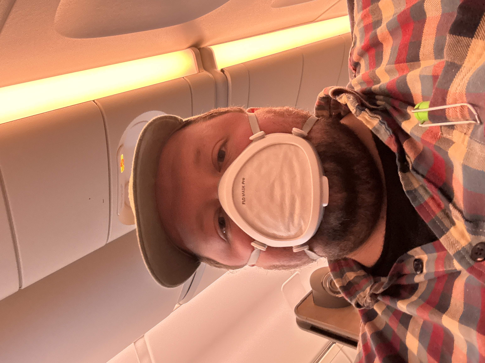
- 
- 
- 
- 

</photo-set>

The plane landed, I went through customs (not that confusing!), and made my way
out of the airport.

Google Maps said there was a bus from Haneda to my hotel every hour, and from
Haneda to Shinjuku station every 20 minutes. I'd have to wait nearly an hour for
the next direct-to-hotel bus, so I used the bus ticket machine and got on the
next bus to Shinjuku.

Charlie had previously walked me through setting up a Suica card on my phone,
which was _very helpful_--I used it to pay for the bus ticket, and subsequently
all other transportation on the trip.

I stayed at the Bellustar in Kabukicho. It was very fancy! I ended up getting
into the room around 6pm, and despite sleeping on the plane, I was pretty
exhausted, so I took a melatonin and went to bed.

<photo-set>

- 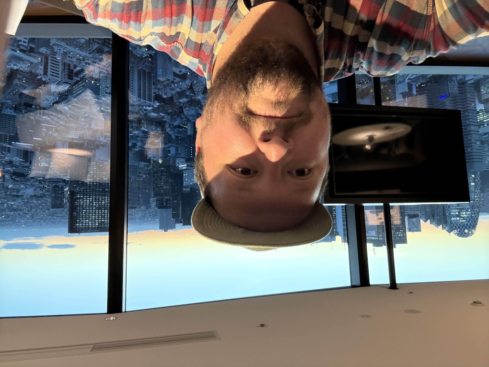
- 
- 

</photo-set>

## Shinjuku Day

In the morning, I set out to explore Shinjuku! What an overwhelming
neighborhood. My gosh!

I basically spent the whole day just walking increasingly large concentric
circles around the hotel, trying to get my bearings.

(Shinjuku Station map by Tomoyuki Tanaka).

<photo-set>

- 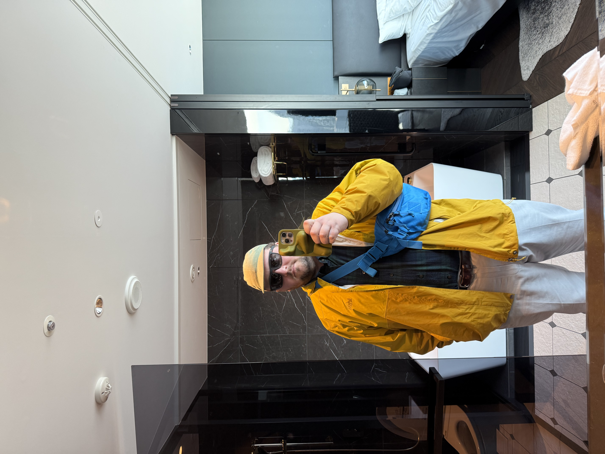
- 
- 
- 
- 
- 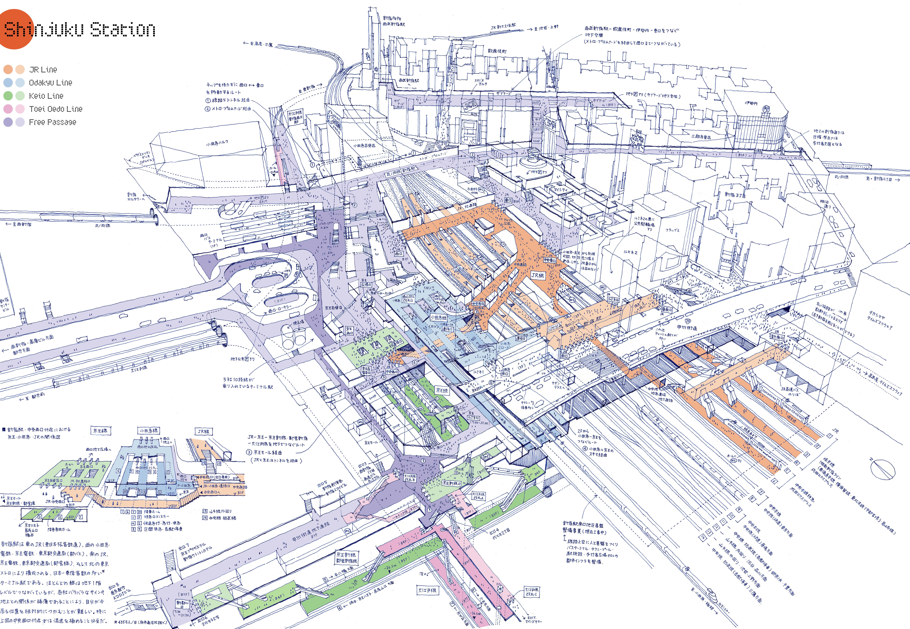

</photo-set>

I'm not sure who recommended it, but I saw that I had a [gyukatsu
place](https://maps.app.goo.gl/knuk9jZV6LK38dUn7) in the neighborhood in my
Google Maps Saved Places, so I went there for lunch. You cook the little fried
beef strips on the slab grill in the back. Tasty!

It was in a basement, which took me a few minutes to find successfully. The most
striking thing about Shinjuku for me was the z-axis of it all: Google Maps
displays an extra widget for selecting what floor level to look at, and much of
the neighborhood has business from B2 up to 4 or higher.

<photo-set>

- 

</photo-set>

When Charlie finally got off work, we met up at his office and went to [an
izakaya](https://maps.app.goo.gl/hbJBcN9FY82B4skr9) he'd heard about for dinner.
We first tried to go to a different place (up some stairs, in an alley, above
what I'm told is called a "ripe women" bar), but they said they were closing
early and didn't let us in. There's no way in a million years I would have found
this place: it was up a flight of stairs, and not obviously marked from the
street. We ate,

- corn highballs (weird as hell; extremely corn)
- oden (radish, hard-boiled egg, fishcake, konnyaku, all simmered in broth)
- pickled ginger tempura
- agedashi tofu
- a bowl of fried garlic cloves
- gizzards on a stick
- quail eggs on a stick
- cheese bacon on a stick
- chicken skin on a stick
- chicken nugget on a stick
- chicken livers on a stick

I loved the konnyaku in particular: it had a very unfamiliar texture. Normally
when you chew food, it gradually softens and breaks down. Not so with konnyaku!
Each mastication just slices the dense block into two same-textured pieces.
Apparently for a while there was a snack where you sucked konnyaku through a
kind of straw, and a lot of people choked on it.

<photo-set>

- 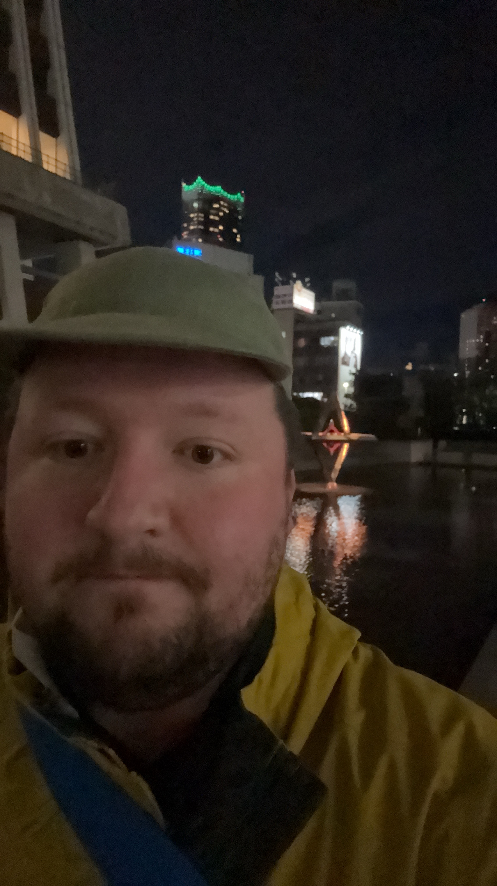
- 

</photo-set>

## "First Day In Japan" Tourism Day

Charlie had some recent experience guiding visitors through Tokyo, and he was
kind enough to give me an itinerary for my first _real_ day of exploration,
which would take me from Nogizaka Station through Minamiaoyama, Kita-Aoyama, and
culminate in Harajuku.

<photo-set>

- 

</photo-set>

I started by walking from the station through [Aoyama
Cemetery](https://maps.app.goo.gl/KREB4VCaPU4kCxNTA), which was nice: I dressed
too warm on this day, and the meandering walk was a good way to cool off.
Temperature regulation was a pretty big issue on the trip: walking outside was
chilly, but each day also involved a lot of speedwalking through very hot train
stations. I eventually settled on ditching the coat entirely.

<photo-set>

- 
- 
- 
- 
- 

</photo-set>

From the cemetery, I went to [Cres.
Coffee](https://maps.app.goo.gl/y9W2Lnfo3puidUs17), on Omotesandō avenue, which
Charlie had recommended. What a lovely place! It's a specialty coffee and wine
bar. I tried an anaerobic-fermented Ethiopian bean, which tasted like
passionfruit, and had a very nice conversation with the proprietor, who had
studied film in Los Angeles. Wonderful.

<photo-set>

- 

</photo-set>

I walked around the design district, browsing some fancy home goods. The
highlight was a gallery of fine woodworking, [箸製造 マルナオ青山 |
渋谷区神宮前](https://maps.app.goo.gl/wXBJfcqhJm9N22Jf6), where I got my folks a
set of handmade wooden cups.

<photo-set>

- 
- 
- 
- 
- 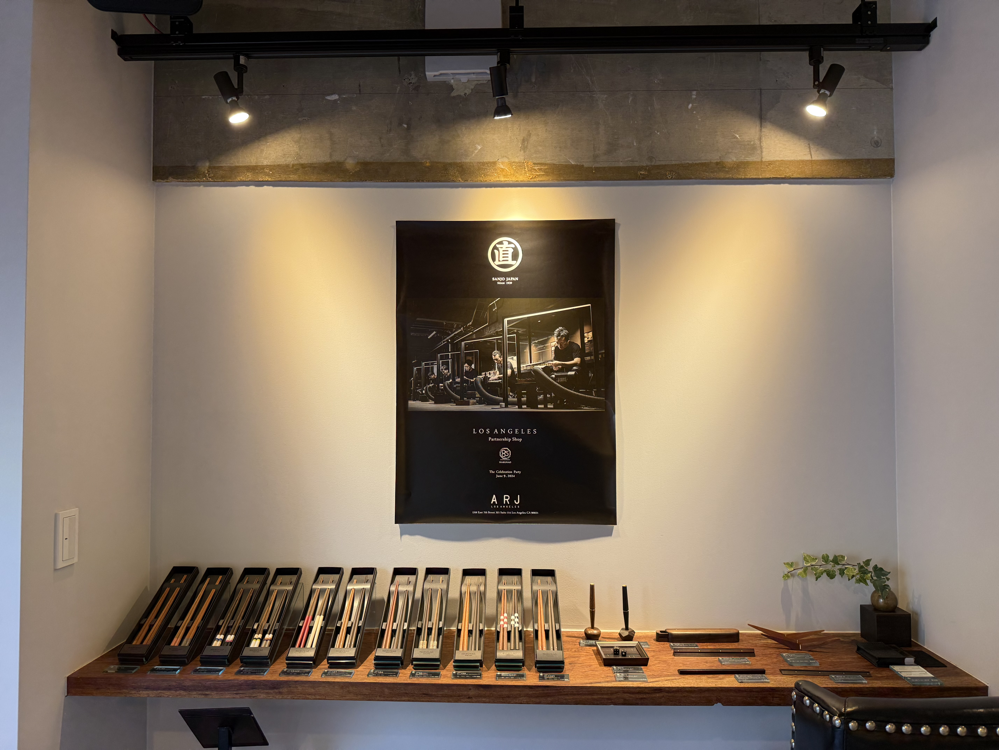

</photo-set>

For lunch, Charlie had recommended [Tonkatsu Maisen
Aoyama](https://maps.app.goo.gl/HmRd9e9iCenA7XFw8), which was located in a
converted old bathhouse. It's well-known to tourists, so I had to wait in a bit
of a line. But the pork was excellent. I got the Kagoshima Berkshire pork, which
came with a special apple sauce.

After lunch, I saw a line outside a very nondescript business on a residential
street. Lines can either mean a place is touristy _or_ it's very good, or both.
I got the sense this one might be good and queued up. It was a [coffee
roaster](https://maps.app.goo.gl/dtTSMCWT7HjaTtAg9)! They had a wide variety of
beans, and took a great deal of pride in talking through each customer's palate
to establish a recommendation. The man I spoke to asked where I get my coffee in
Chicago, and when I said [4LW](https://maps.app.goo.gl/MKxi9hCxZXFr9GJ68), he
spoke very highly of Kevin, the proprietor, who apparently always pops in when
he's in Tokyo. Small world!

<photo-set>

- 
- 
- 

</photo-set>

From there, I walked through a hilly sort of hypebeast neighborhood and popped
into the Roland store. I don't know what I was expecting, but it was... a Roland
store. They had the Roland gear. Not much else to say about it.

I made my way back to Shinjuku via to Harajuku station, walking through a
horrible disneyland-style tourist hellstreet to get there.

---

In the evening, I took the Keio New Line to Hatagaya station to meet up with
Charlie. Charlie has a Thursday routine: he gets pad Thai at
[LaLaChai](https://maps.app.goo.gl/wX1za4jdr3QPLah3A), then attends
[ideala](https://x.com/ideala_jpn?lang=en) at
[forestlimit](https://maps.app.goo.gl/GZay7RZDjdMWuweV8).

On our way to LaLaChai, we saw across the street that there wasn't a line to get
into [特麺コツ一丁ラーメン](https://maps.app.goo.gl/hgW6fS3PHqWi6oZf7), which is
apparently unusual. The reason: on Thursdays, the only thing they offer is a
dish they call 交響麺, aka "symphony noodles", aka kyu kyu men. It's a dry ramen
topped with a pork fat sauce. I wasn't ready for the ramen machine, so Charlie
ordered for both of us: 交響麺, plus quail egg, plus several cloves each of
garlic-pressed garlic to put on top (not pictured).

Holy cow! Now this is some ramen. I don't think I've ever had noodles with this
texture. And the garlic! It's so... strong! Not like anything I've had before.

<photo-set>

- 

</photo-set>

We had some time to kill before ideala, so we walked back to the train station
to visit [Gremlin](https://maps.app.goo.gl/L27zMkah2edRRFum9), a craft beer bar
in the basement of the station. I love these liminal spaces! I wish Chicago's
train stations had room for small businesses: it'd be nice in the winter.

On the way was an (apparently very good) amusing cheesesteak place.

<photo-set>

- 
- 

</photo-set>

We ended the night at ideala. A blast.

<photo-set>

- 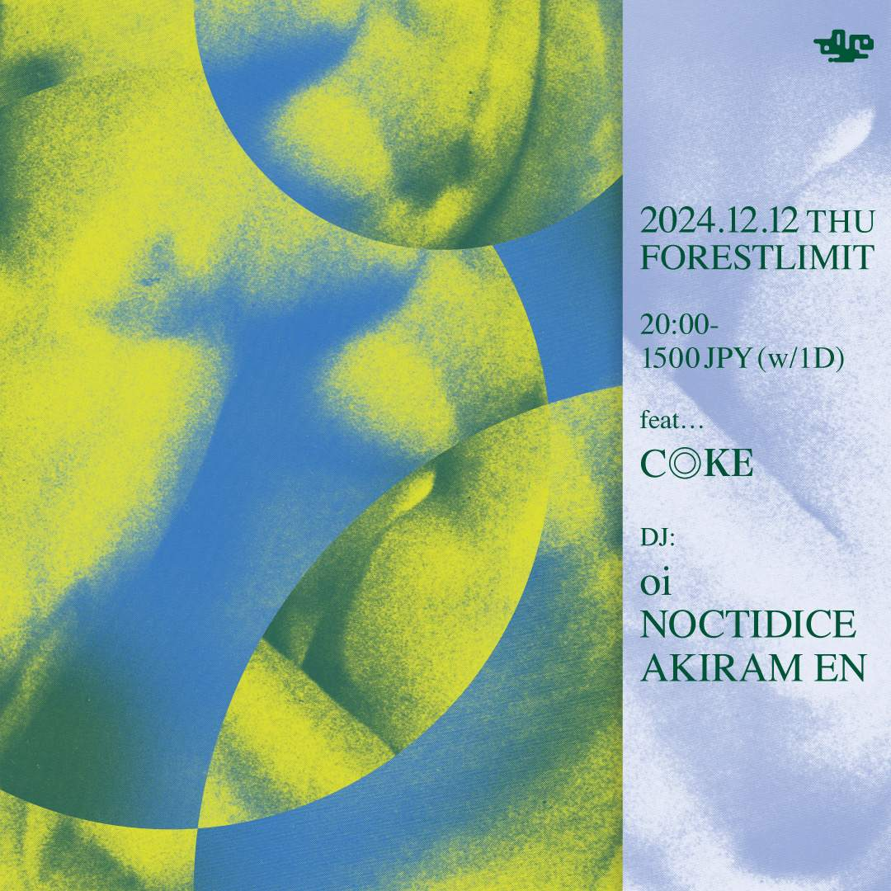
- 

</photo-set>

## Meguro & Nakameguro day

On Friday, I woke up early to meet Charlie at Freeman Shokudo for breakfast, but
their Instagram said they were closed, so we went to LUG instead. It had been on
my list: it's a restaurant operated by the best bike shop in the world (the Blue
Lug).

<photo-set>

- 

</photo-set>

Charlie gave me an itinerary for the day--we'd gotten through the tourist
"must-do"s, and he suggested I walk around Nakameguro for a taste of something a
bit more residential.

<photo-set>

- 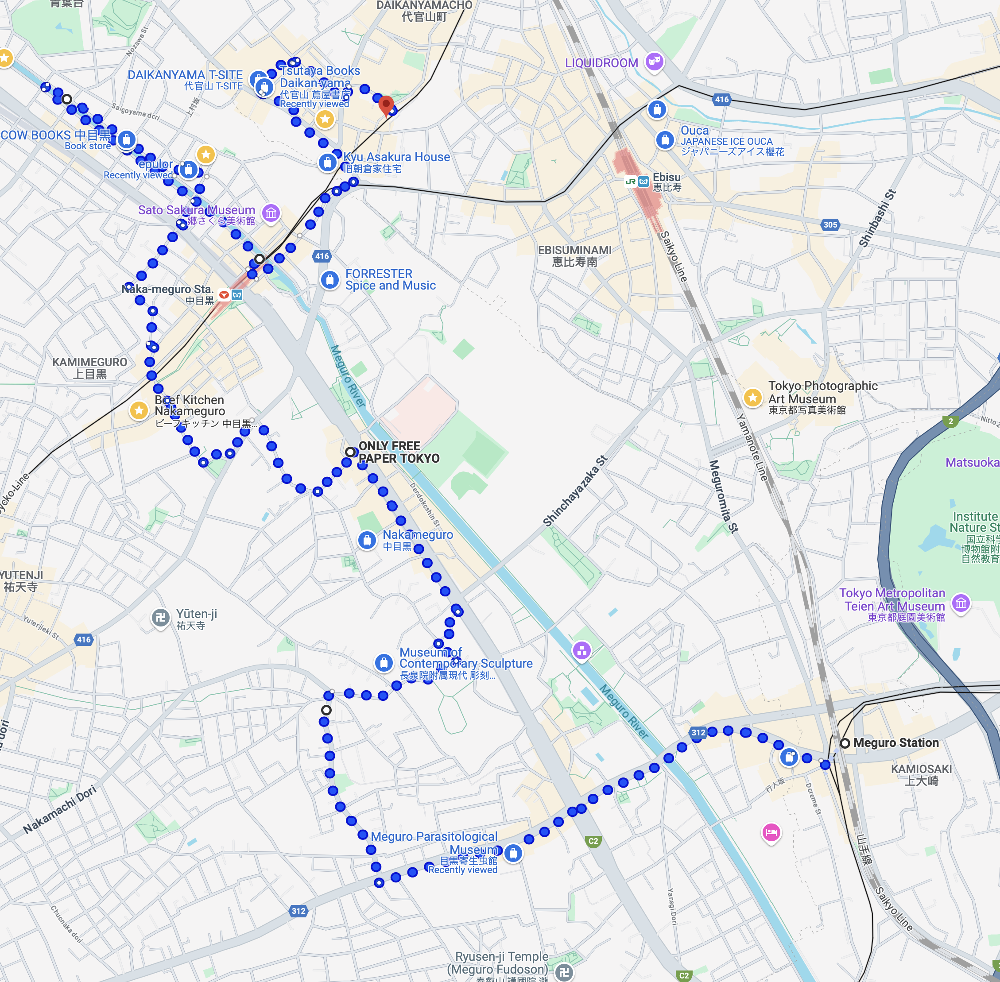
- 
- 

</photo-set>

He had me start at a [Picasso](https://maps.app.goo.gl/7NzJyXBtpLGpJfET9) (Don
Quijote spinoff) at Meguro Station, but I didn't really see the draw: it's just
a store.

Next stop was the [Meguro Parasitological
Museum](https://maps.app.goo.gl/EbmbgjENGsvCb3nw6); a 50-year-old local museum
dedicated to the study of parasites. Apparently it started as one guy's
collection of samples and drawings, and grew from there.

<photo-set>

- 
- 
- 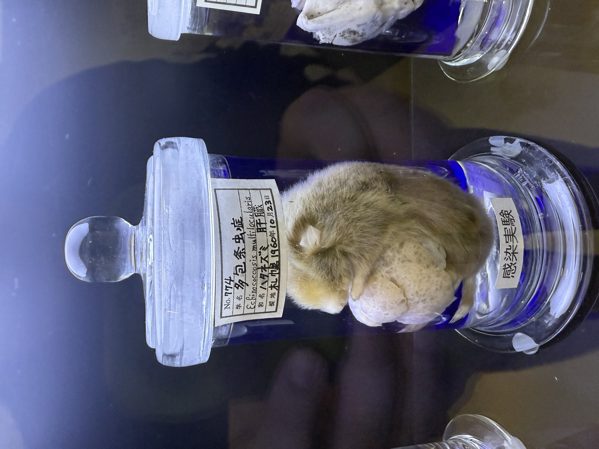
- 
- 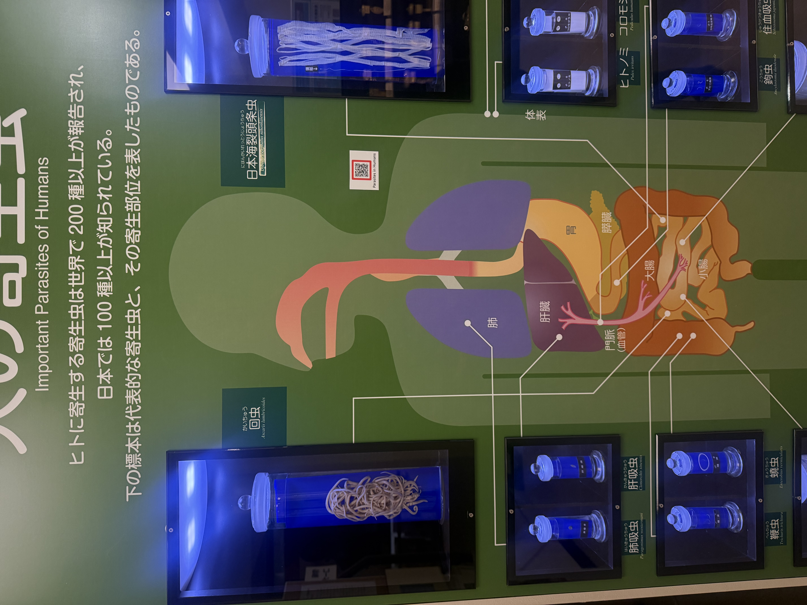
- 
- 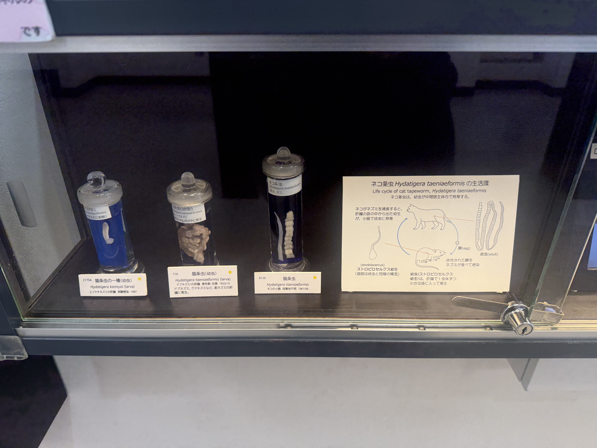
- 

</photo-set>

On the way to Nakameguro, I spent a few hours at the zine shop [ONLY FREE
PAPER](https://maps.app.goo.gl/fWi6k7ounQquCABeA) looking at posters and artist
books.

Then I spent an hour at [epulor](https://maps.app.goo.gl/3iBm1xRhPpL1dxar8)
(photo by Google Maps user ニックネーム) drinking coffee and listening to
records. Very vibey store: the proprietor was DJing old records, playing a song
or two from each: Rosemary Clooney, Wilton Crawley, Leon Redbone, the Japanese
group Shogun. You got the impression that he would have been doing the same
thing even if there was nobody in the store.

<photo-set>

- 

</photo-set>

From there to [GENERAL STORE](https://maps.app.goo.gl/KJAcheGu5hDzaWw39), a
Henry David Thoreau themed anarchist-mountaineering fashion-and-camping brand
(!). Surreal to see that in Japan, having grown up down the street from Walden
Pond.

Finally [COW BOOKS 中目黒](https://maps.app.goo.gl/9iQ7ErMpuRiwQoyQA), a store
specializing in art and culture books from the Shōwa period, curated by the
author [Yataro Matsuura](https://www.muji.com/us/compactlife/column001.html).

---

For dinner, I met up with Charlie in Hatagaya. We went to the trendy restaurant
[ミクロとくじら](https://maps.app.goo.gl/jJbaKyUXXZHmmAVD6). A cool place with
subway tile, very low stools, edgy-looking staff, and stuffed animals in rope
bondage hanging from the ceiling. We had,

- Spice Highballs (mostly tasted like ginger ale)
- Jiro-style ramen (no broth. Also, no noodles? Kind of a salad)
- Fried eggplant
- Chicken of the Southern Barbarians (topped with "tartar sauce", which was more
  like egg salad)

Apparently, "Southern Barbarians" is a Japanese term for Europeans, since the
Portuguese set up port in the southern part of Japan)

<photo-set>

- 
- 
- 
- 

</photo-set>

Then we walked to Sasazuka's Jugo Dori Shopping Street to visit [Sasazuka Source
Stand](https://maps.app.goo.gl/2ViXzxZSjH5vZzjy8), a stand bar (tiny bar where
you eat standing up at the counter) specializing in Osaka-style squid pancakes.

<photo-set>

- 
- 
- 

</photo-set>

We ended the night at [Pintology](https://maps.app.goo.gl/P3T4ruPRnUNS62xb6),
where a few things happened:

- I met several of Charlie's friends, all captains of creative industries
- One invited us to a Sofubi show at his art store the next day (see below)
- I gave one of those friends some advice
- He said, "Bring out the list!", and Kyle-the-proprietor pulled out a piece of
  paper from behind the counter with 9 names listed on it, and instructed me to
  add my name.

Apparently, the friend to whom I gave advice is _best friends_ with the
proprietor of a _very well-liked ramen place_ where one normally has to line up
at 7am for lunch. Every month, it opens on an off-day, and the advised can bring
in a group of folks to walk right in with no line. Scroll 7 days later to see
the ramen.

## Food Tour Day

This was a _big day_.

Ever since moving to the neighborhood, Charlie had been conceptualizing the
_perfect food day_. The most places. The best places. The route. How to pack
it all in. My visit was an opportunity: we'd do it.

We started near Sasazuka Station with some Michelin-noted (Bib Gourmand)
_extremely inexpensive_ sushi at the stand bar [立食い鮨
鮨川](https://maps.app.goo.gl/cUvxXpMvxfYsYAe26). The gentlemen standing next to
us were doing an all-you-can-drink thing, which was... entertaining. Wonderful
uni. Google Translate had an amusingly difficult time translating the fish
kanji.

<photo-set>

- 

</photo-set>

From there, we went to [Sailosaibin](https://maps.app.goo.gl/Ka5pHaL8Nh6A8qzP9),
where some friends of Charlie's sell design books and _objets d'art_, and on this
day was having a Sofubi show. I got a hat!

Then we went across the street to
[Menotti's](https://maps.app.goo.gl/obsPsrw1V5fX3wcB8) for coffee. I got a
Spanish latte (since I'd never heard of that). Turns out it just means "with
cinnamon". Not bad!

<photo-set>

- 
- 
- 
- 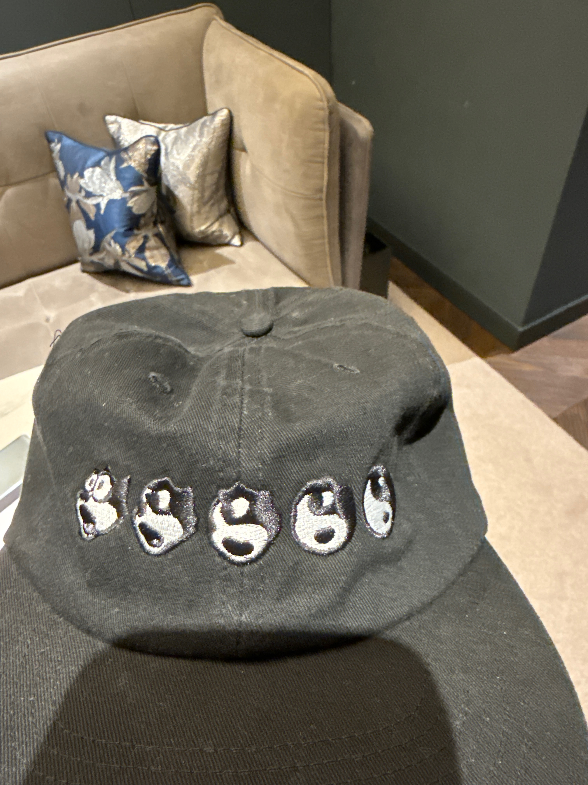

</photo-set>

Next stop: [串かつ 名代 (なしろ)](https://maps.app.goo.gl/xUF7jpM8Ha4ZaWa97)
back at Hatagaya station for their Happy Set: $2.69 gets you four sticks with
fried things on them, plus a reasonably strong drink. We did two each, and I
drank beni-shoga highballs. We finished out the meal with "Chicken Salad Of The
Proprietor Here, Who Ordinarily Hates Chicken Salad", which was wonderfully
studded with pork and cucumber.

<photo-set>

- 
- 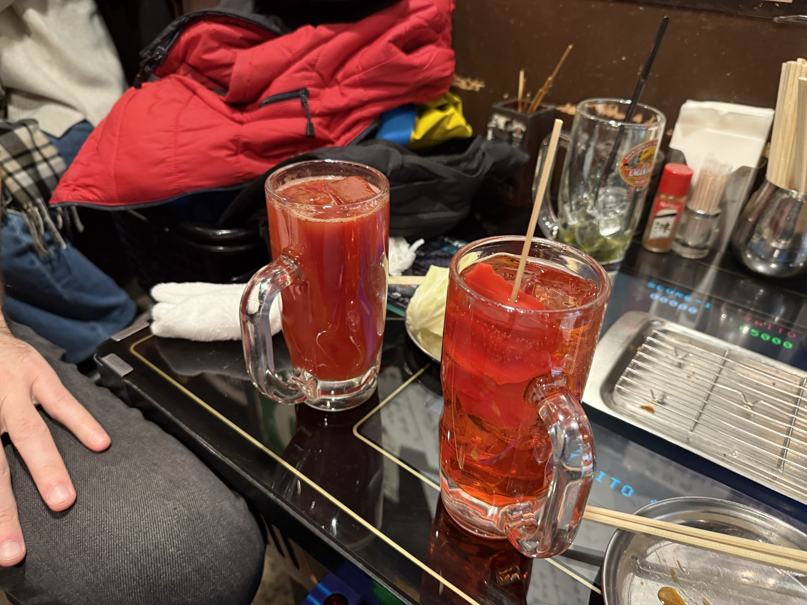
- 
- 

</photo-set>

Following a pit-stop at a Tokyo Toilet (like in [Perfect
Days](https://letterboxd.com/film/perfect-days-2023/)!), we went to
[Kasiki](https://maps.app.goo.gl/GZ2XmEKR7cd6hF1Q9), a trendy ice-cream-and-wine
bar. I tired the pear-and-tea and the persimmon-and-tea ice cream flavors.
Personally I would have gone for a wetter texture, and I would have balanced a
bit less tea and a bit more fruit, but it wasn't entirely bad.

<photo-set>

- 
- 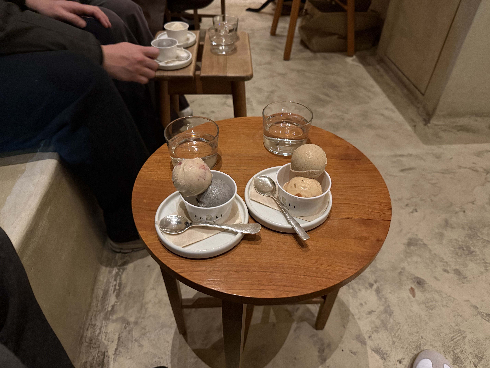
- 

</photo-set>

We went into [Commune Press](https://maps.app.goo.gl/Ehe3Y6CvS63SHmqz7) to look
at some art, and I got a nice tenugui and a photo zine.

Then: [Ji Sakeya](https://maps.app.goo.gl/AVsjNN9CzWZiNiZT8) for a big Nihonshu
tasting. We talked about work stuff. It was just us, the owner, and two older
ladies in the store. When Charlie was in the bathroom, one of the ladies _(1)_
asked me, "how are you liking Japan?". Her companion _(2)_ said, "I'm too drunk
and embarrassed to speak English right now, but please talk to my friend", and so
we started a conversation. Turns out _1_ used to be a COBOL mainframe programmer
for banks! She quit because it was too much work, and now _1_ and _2_ work
together at a music school.

<photo-set>

- 
- 

</photo-set>

After all that drinking we needed to eat something, and the next stop was,
accordingly, [Raccos Bar](https://maps.app.goo.gl/ntcDN8wbTr4cZqSo7) (first
photo by Google Maps user Maria Armellin).

What an endearing place! Apparently Racco is a bassist in a significant punk
band, and he runs this little 5-seat bar on the side. He made us,

- salad,
- dashi tamago maki,
- huge sardine,
- hotaruika no shioakara,
- smoked turnip, and,
- shiso leaf tempura.

The hotaru ike no shiokara was particularly fascinating: apparently shiokara
("salty-spicy", meaning something more like "so salty that it's spicy") is a
style of salted-fermented seafood, and hotaruika-no is a particularly choice
variety made from the guts of firefly squid. This right here was the most
unfamiliar flavor of the trip. Delicious. I pledged to bring some home, which
became my white whale.

<photo-set>

- 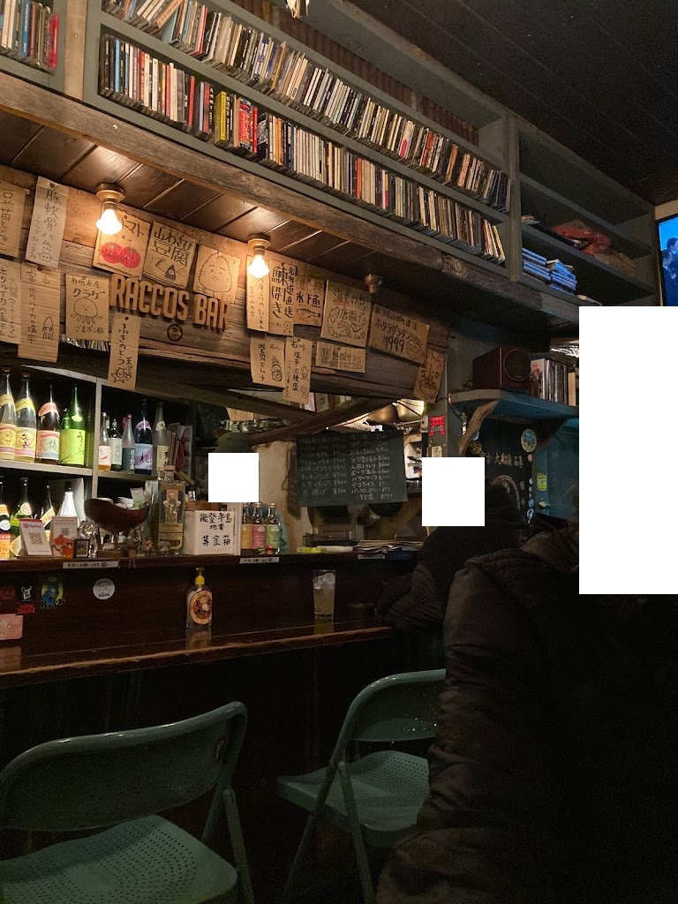
- 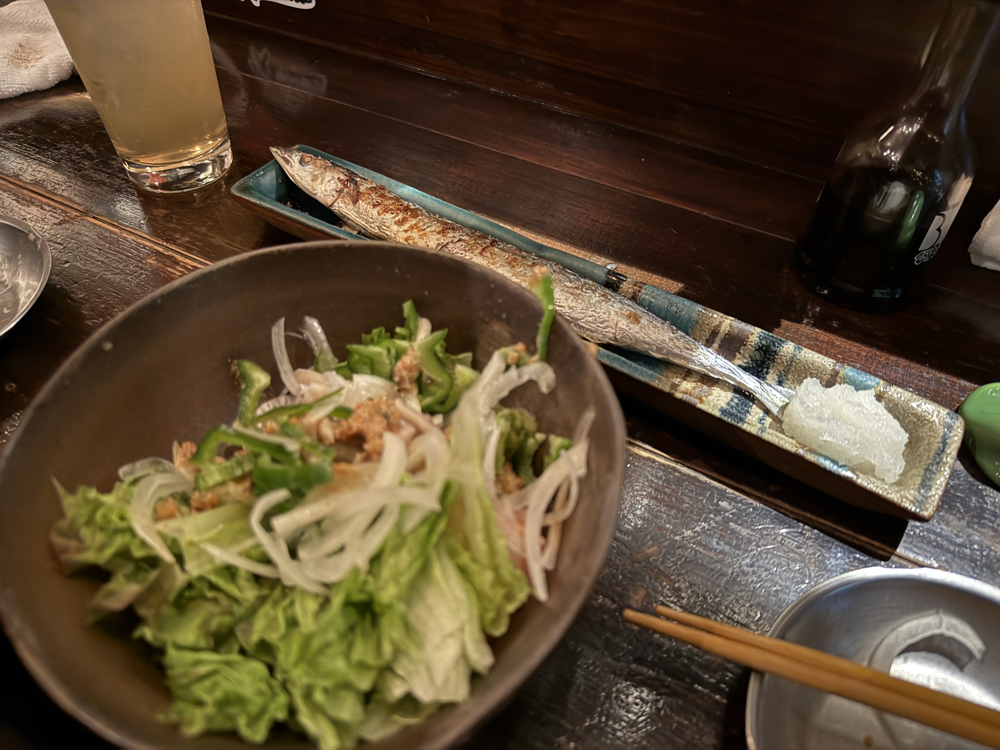
- 

</photo-set>

Done eating, and a bit tired, the next stop was [MEM Coffee
Bar](https://maps.app.goo.gl/5pEQDW3ikEcY3PPS6) (first two photos by Google Maps
users Amir Dholakia and りょーたんまん). My favorite business of the trip. The
proprietor does his own custom metalwork for the coffee brewing apparatus, had a
number of infusions in the works, played music only through his modular
synthesizer, and offered a menu of his own coffee-based cocktails. I don't even
like coffee cocktails, but these were somehow excellent.

We finished the night at Gremlin, where I had a tasty (and _extremely_-sour peach
kölsch.

<photo-set>

- 
- 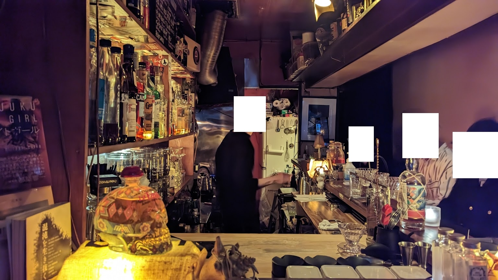

</photo-set>

## Violetta and Florilege Day

We got a pretty late start on Sunday. We met up in Hatagaya to go to a [curry
place](https://maps.app.goo.gl/9uSkU4Dng3mcL3rw5) that Charlie goes to every
week. He got me the chicken-and-beef combo, and the chicken was pretty spicy. I
think it was my first time seeing a fork! The proprietress was very friendly.

Then, we made our way to [Violetta](https://maps.app.goo.gl/h8WkVMhqTFEiFwJS9),
where some friends of Charlie's were DJing. One particularly interesting DJ was
doing both IDM sort of stuff _and_ koto-oriented Japanese traditional music.

<photo-set>

- 
- 
- 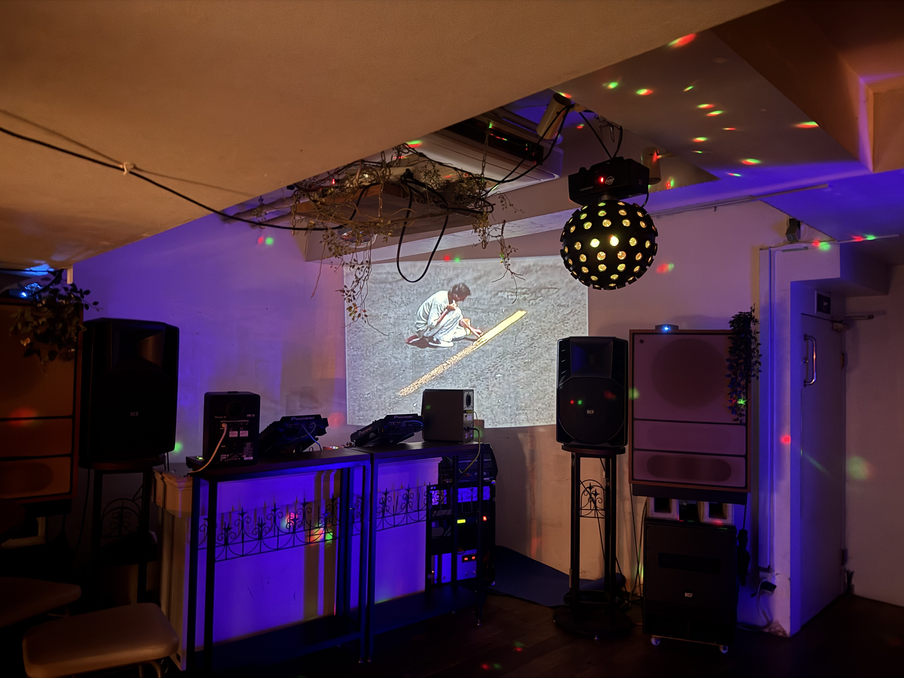

</photo-set>

Before visiting a new city, I like to check the [World's 50 Best Restaurants
List](https://www.theworlds50best.com/list/1-50) (which ought to be called "50
theatrical tasting menus in neighborhoods with Aesop stores", but that's a fun
vibe once in a while) and, if any of those restaurants are in the city, see if I
can get a reservation at one.

I got a seat at Florilège in Roppongi. As one might expect, the clientele was a
primarily tourists: many from China, and a few from the US, Korea, and England.
Plus one older Japanese couple.

The meal was quite produce-oriented, which was nice.

The most remarkable thing about the meal was the drinks: I went for a
non-alcoholic cocktail pairing option. Non-alcoholic ("spiritfree") pairings are
exciting because they're extremely difficult to execute well, so I'll always
order one when it's available.

The first hard part is that you want the drinks to _drink like_ alcohol: drinks
that want to be sipped rather than chugged. Cheap tricks are making the drinks
spicy or serving them very hot. A better move is to lean on tannic and
astringent ingredients, often teas, but you can't serve 12 cups of tea.

That's the second hard part: you want the drinks to all taste different. Diners
expect each of their wine pairings to taste primarily of grapes, but to be
served a string of teas is disappointing.

Florilège's pairing was very dynamic. Some drinks used herbal flavors, one was
very acidic, a couple used tea, and one was spicy,

Here's the full menu, as I recorded it

- Turnip soup
  - Lactobacillus
  - Cheese
  - Vanilla
  - Three Japanese sweet potatoes
    - Smoked tea leaf
- Red vegetables
  - Red bell pepper mousse
  - Radicchio
  - Tomato
  - Hibiscus soup
  - Cream cheese
  - Drink: Cream cocktail
- Onion
  - Lily bulb
  - Gnocchi (more of a raviolo imo)
  - Custard
  - Thing made from rice powder in leaf
    - Lemon
    - Sweet
    - Fall-apart dough
    - Powdery interior
  - Onion soup
  - Kelp oil
  - Drink: Potato, hojicha, honey cocktail
- Drink: Tomato, rice malt, n/a Nihonshu w umeboshi
  - Potato
  - Cod roe
  - Hollandaise
  - Shirako
  - Tuille
    - Mac and cheeee flavors; from the roe! Very clever.
- Bread course
  - White and rye steamed breads
  - Soy butter w soy powder (tastes like regular butter)
- Drink: Green tea pear water
  - Japanese white Radish pie
  - Radish seed caviar
  - Sake plum sauce
  - “Hand salad”: watercress, dill, chervil
- Drink: Kiwi, rosemary, cacao, fig leaf
  - Kizu fry
  - Yuzu sauce with millet roe
  - Japanese kale, potato, bean sprouts, genovese of Japanese kale
- Drink: Red wine simulation: black and pink pepper, burdock root, grape juice
  - Venison
  - Hachi miso
  - Japanese spinach
  - Eggplant puree
  - Mushroom sandwich thingy with black truffle
- Chestnuts
  - Ice cream and chestnut skin hojicha jelly
  - Meringue with cream of honey and milk
  - Chestnut powder
- Apple
  - Pie
  - Caramelized apple sauce
  - Japanese tea
  - Slices
- Gooseberry with jam
  - Canelé of roasted tea
  - Red bean paste and persimmon
  - Evaporated sugar candy

<photo-set>

- 
- 
- 
- 
- 
- 
- 
- 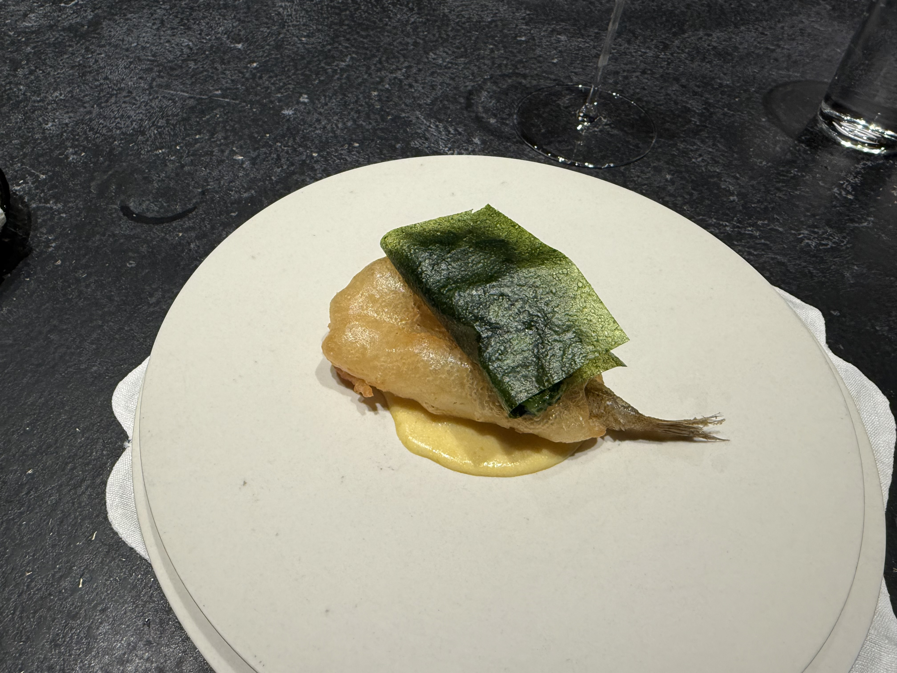
- 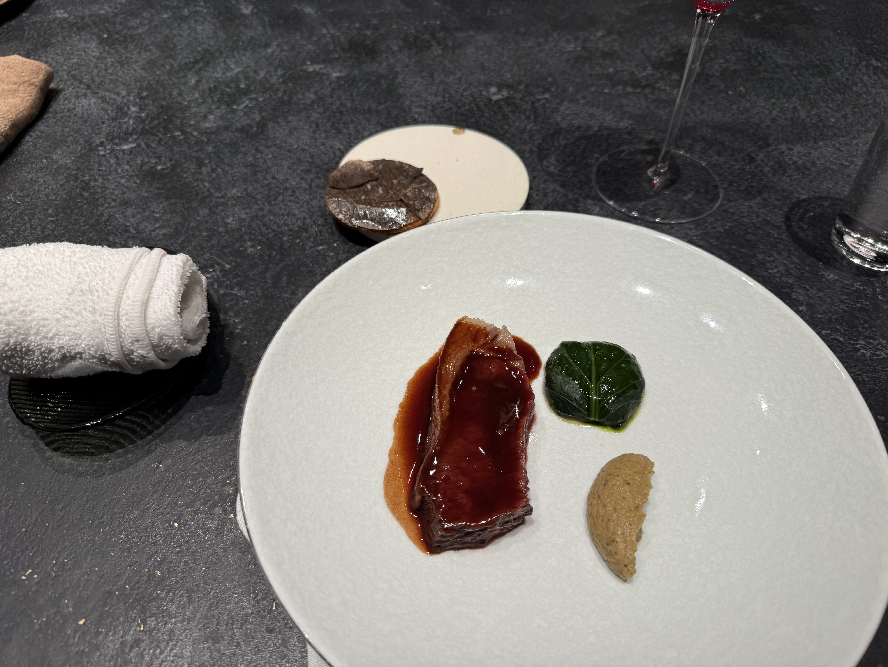
- 
- 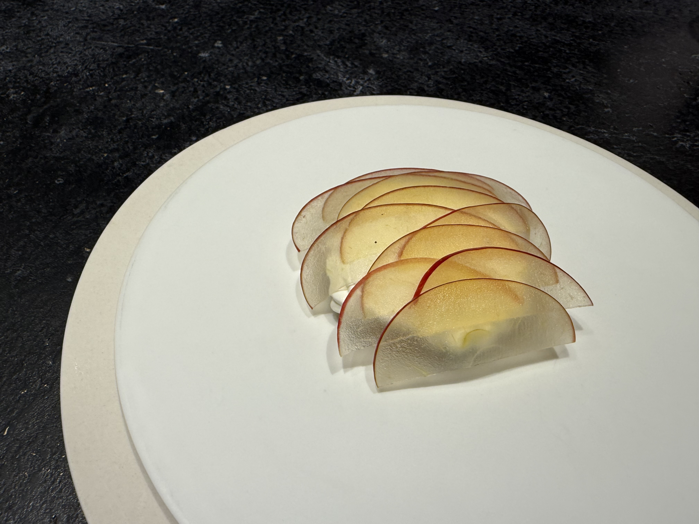
- 

</photo-set>

## Laundry Day

Monday was primarily a Shinjuku Day. In the morning, I...

- used a laundromat near the hotel
- bought a suitcase
- shopped for gifts at a couple department stores
- had konbini lunch

In the evening, I met up with Charlie for Chinese food at
[Kōya](https://maps.app.goo.gl/oAnzrPQzFwx5oJNy9). We had eggplant, fried rice,
and dumplings. The dumplings were especially good.

<photo-set>

- 
- 

</photo-set>

Then, we went to [OOTONG Rum Hall](https://maps.app.goo.gl/xhDZKN9BvHFT8M6h8); a
nicely decorated place with an island theme. The proprietor wore a straw hat and
made rum drinks and gave us dried banana slices.

We ended the night at [Owl 2nd
Floor](https://maps.app.goo.gl/cbTH6UmjnZBUXsmM6), which has such incredibly
weird energy. Kind of a Twin Peaks Black Lodge vibe. We drank awamori and ate
“drug egg” and listened to such classic American folk songs as “jingle bell
rock” and “there’s a new kid down in Bethlehem” and “little drummer boy (dub
remix)”.

<photo-set>

- 
- 

</photo-set>

## Nakano and Koenji Day

Tuesday's itinerary took me to Nakano, Koenji, and Shin-Koenji. I started with
Nakano Broadway, reportedly "the true heart of character culture", but I must
have done it wrong because to me it just seemed like a mall where all the goods
were a bit shoddy. I did stop at the Daiso there and get a little coin purse,
which was GAME CHANGING. I really ought to have done so sooner.

After walking around Nakano for a while, I got a goth latte (with charcoal for
blackness) and a transcendent canelé at
[Butter](https://maps.app.goo.gl/XNi4WqmtdGi8Ka5T8). While I was in there, a guy
passed by on a very cool bicycle, but I didn't get a picture.

Next I walked through the Meiji University campus to Koenji, and loitered for a
while by the station. Walking around Koenji, it seemed like a great place for
restaurants: lots of fun little places, but I wasn't hungry. I'd like to go back
and explore more. I spent a long time shopping at
[cotogoto](https://maps.app.goo.gl/EmXEZWKHDpwGNu8Z6): they had a really wide
variety of housewares, including some beautiful ceramics.

Charlie had recommended a [falafel
place](https://maps.app.goo.gl/VGyVcLhuZtvEtvEv5) in Shin-Koenji--he said they
had bad falafel, made with exceptional care. The man running the place was very
kind.

I finished the excursion at [Kohitsoji
Coffee](https://maps.app.goo.gl/ZrTVAy4pADYLSzaJ7). They're reportedly known for
their espresso, but I got drip coffee. My bag from cotogoto was pretty heavy, so
at this point I got on the train back to Shinjuku.

<photo-set>

- 
- 
- 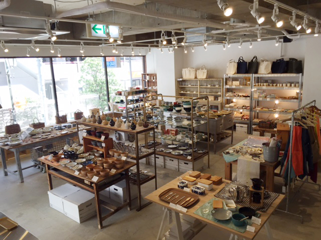
- 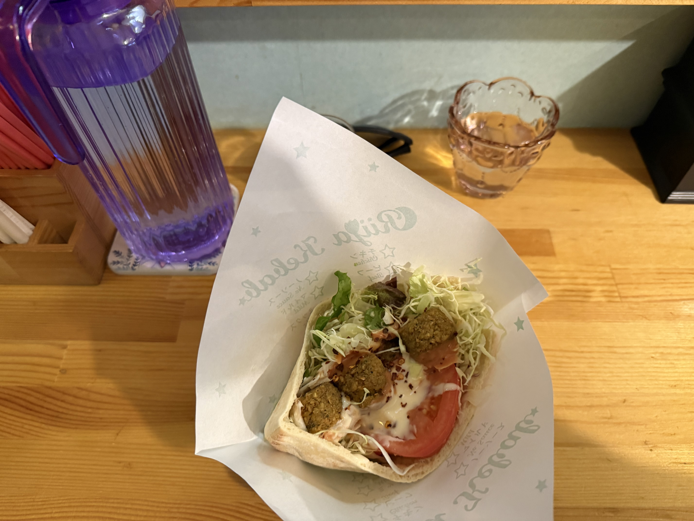
- 

</photo-set>

---

For dinner, Charlie and I went to the country-style restaurant
[こたつ](https://maps.app.goo.gl/GULcEt8E7pYS6nqs5), which reminded him of his
years in Aomori. We had oden, cod sperm, rice with natto, and a big bowl of
fried chicken cartilage. I drank a coffee-and-milk highball, which used shitty
bottled coffee and excellent milk.

<photo-set>

- 
- 
- 
- 
- 
- 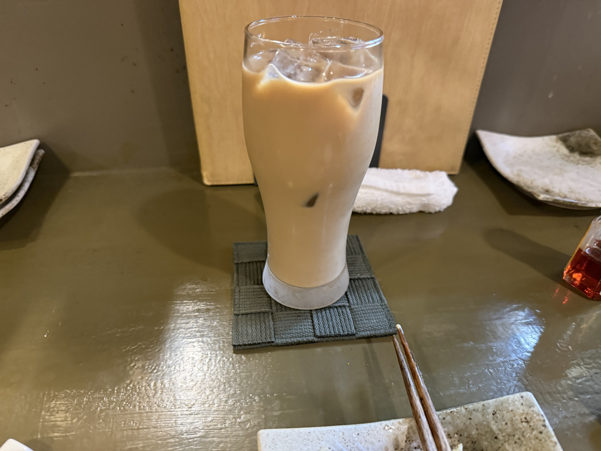

</photo-set>

We finished the night with an umeboshi highball at the whiskey bar [Sasazuka
753](https://maps.app.goo.gl/YRNwnRTqcD7akbBc7).

<photo-set>

- 

</photo-set>

## Ginza Day

Charlie had work stuff to do on Wednesday, and I was pretty exhausted from a
busy week, so I took the day to myself.

I started with sushi at the fancy sushi restaurant in my hotel. I was the only
person in there at lunch time, but they still pulled out all the stops. The chef
specialized in monkfish liver, which is probably not good for you, but tasted
delicious.

When I made the reservation, I opted for a Nihonshu-and-wine pairing. When I sat
down, I realized this was probably unwise (pairings have a way of getting one a
bit hammered), but I toughed it out.

<photo-set>

- 
- 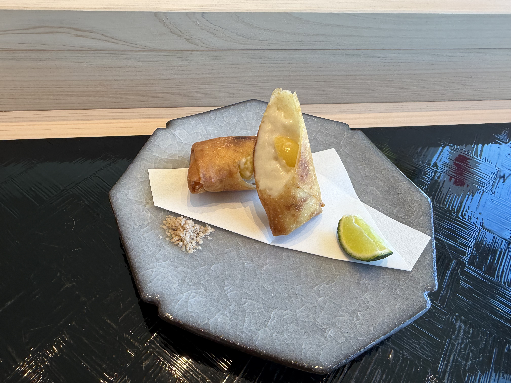
- 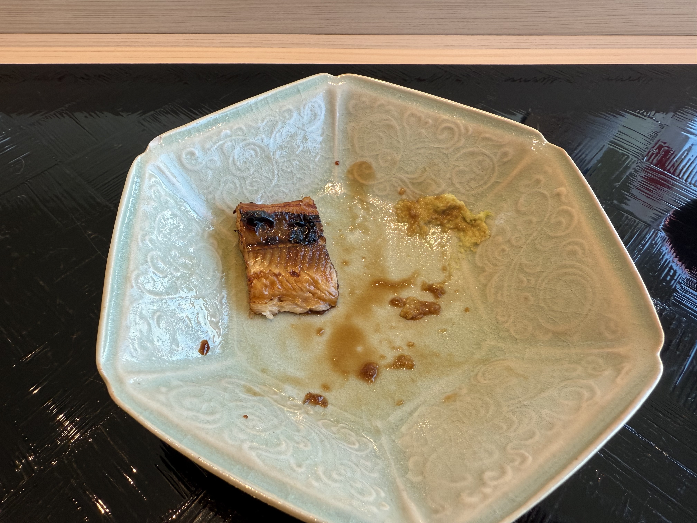
- 
- 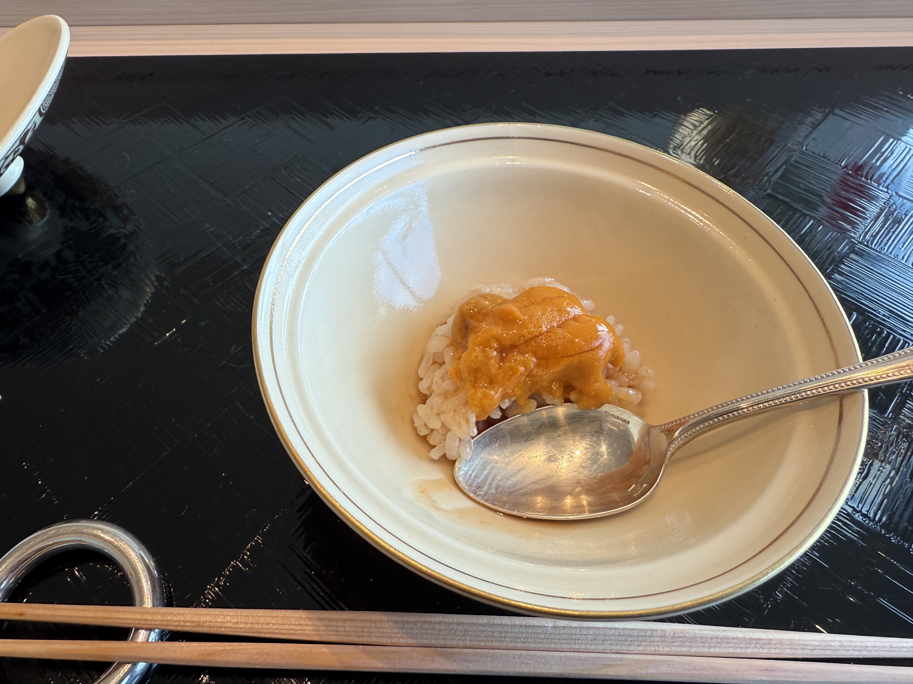
- 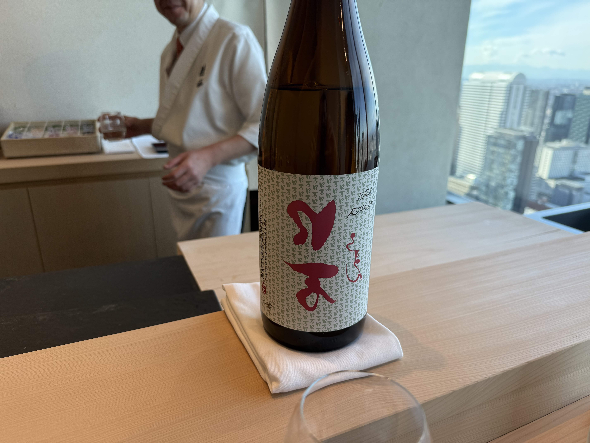
- 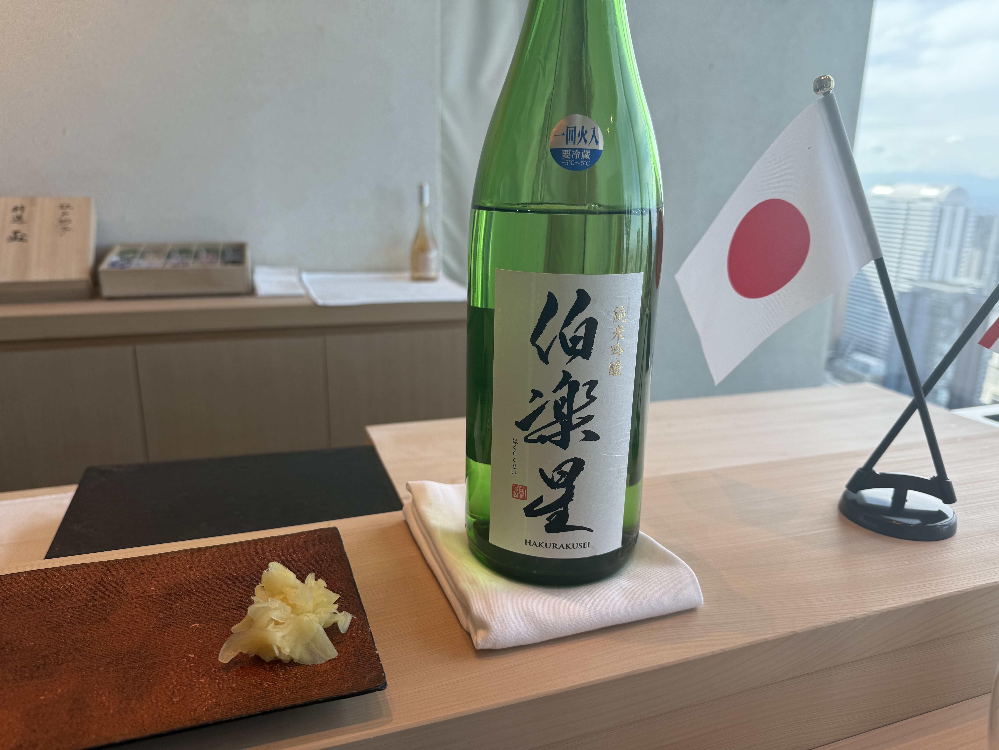
- 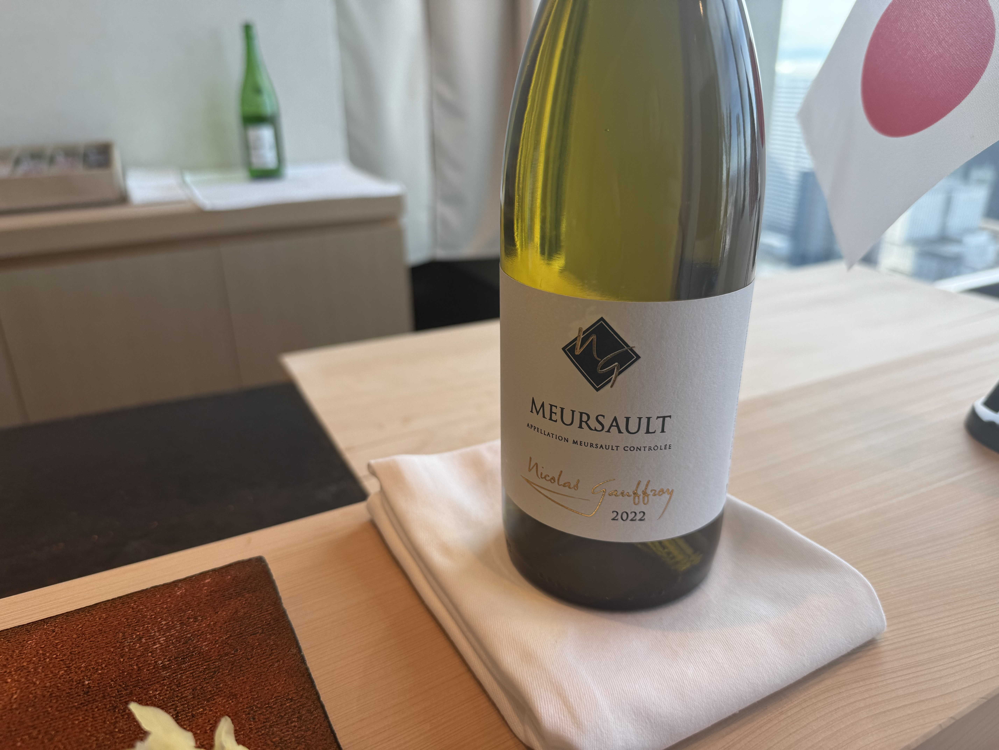
- 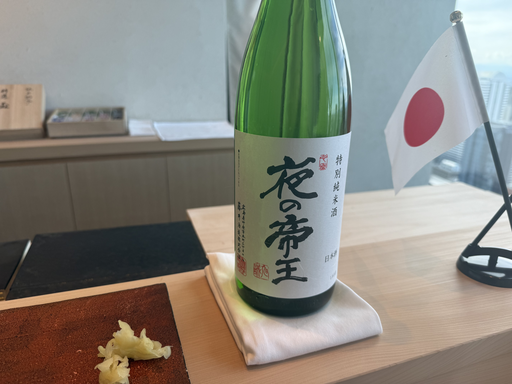

</photo-set>

I wasn't especially looking forward to Ginza--that kind of neighborhood is the
same everywhere--but it's a Thing One Must Do, so I did. I _did_ want to go to
the flagship MUJI store, and I _did_ need to do some more gift shopping.

I started at an [incense store](https://maps.app.goo.gl/FuqCKr71Sv4nyHZj8),
which was a great place for gifts: Japan has a big "you must bring everyone
something back from your travels" culture, so a lot of stores had gift options
ready to go at a range of price points.

Next was an [art and craft supply
store](https://maps.app.goo.gl/jbYdPNXvVmq5M4Xw5). 12 stories of stuff. I took
the elevator to 12 and walked down. Look at all these paints! I got a few
bottles of fountain pen ink. The upper levels had a bit of _serious art stuff_,
so I was disappointed when the lower levels had mostly trinkets and notebook
covers. It's no Pearl Paint, I tell you what. Next time I'm in Japan, I'd like
to do some more research and find some art/craft/woodworking shops that are more
practicioner-oriented.

My last stop in Ginza was the [5-story flagship MUJI
store](https://maps.app.goo.gl/QJjUs396QFcmSjx57). Incredible! I got a ton of
things here. I was surprised how much space they devoted to freeze-dried meals,
which I didn't find especially appealing (I mean, how good can they be...). I
did find some really beautiful ceramic mugs.

<photo-set>

- 

</photo-set>

For dinner, I returned to Shinjuku to cross another item off the checklist: a
Real Unagi Place. This was delicious, but to be honest, I don't think I have the
palate to appreciate this meal commensurate with the price: it wasn't _that
much_ better than the frozen unagi you can get in the states, and it was one of
the most expensive meals I had in Tokyo. What redeemed it for me was the
skewers: I got some belly and some liver, which you certainly can not get in the
states.

<photo-set>

- 
- 
- 
- 
- 

</photo-set>

## Kichijōji and Ogikubo day

Thursday's journey took me from Kichijōji to Ogikubo.

<photo-set>

- 

</photo-set>

I started, around lunchtime, at Daps Original Hood Joint, which was
_incredible_. It's a Harlem-themed restaurant(!) specializing in American
classics like Chicken Over Rice, Authentic Chopped Cheese ("It's New Drug From
Harlem USA"), Brooklyn-Style Lobster Roll, and Piña Colada.

The decor was impeccable. The proprietor was a big hip-hop head—he had Purple
Haze on vinyl—and he was selling a variety of American import products (Old
Spice stick deodorant, blunt wrap, authentic glass rose). While I was waiting
for my chopped cheese and piña colada, I perused a zine in Japanese that a
friend of his had written about the history of hip hop. I wish I bought it: at
the time, I couldn't think of who in my life would appreciate it enough as a
gift, but, duh, _I'm_ that person. Oops. Next time.

The chopped cheese was legitimately the best I've ever had. I think the trick is
twofold:

1. unlike in the US, they use ingredients that shouldn't be in the trash, and,
2. unlike in the US, the only person working owns the place and gives a shit.

<photo-set>

- 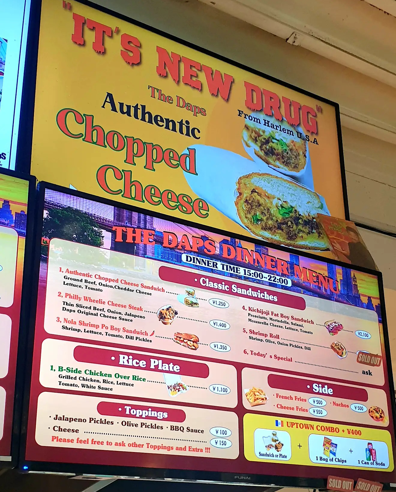
- 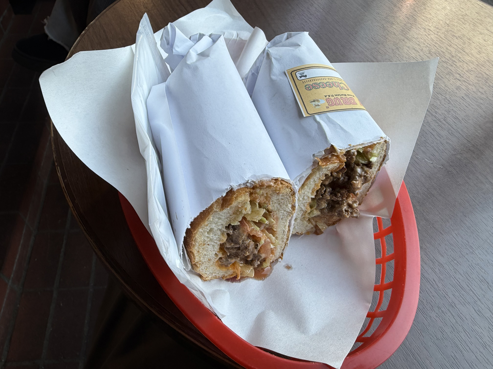
- 

</photo-set>

I strolled through [Inokashira Park](https://maps.app.goo.gl/nr4xszft12iYty3M9)
to the picturesque coffee shop
[Thomnecogo](https://maps.app.goo.gl/zjvUFr9obFwQF46U6). I poked my head in,
and—this is embarrassing— honestly: I was too intimidated by the perfect vibe to
go in; I felt I would spoil it. I've never had that feeling before.

Days like this made me _so happy_ to have a sherpa in Charlie. I can easily
imagine a different trip to Japan, where I'd have stayed in Shinjuku, spent my
time in, like, Harajuku or something, and mostly found myself in places with
English menus. In that parallel world, I'd feel I was exploring! Seeing Japan!
Having an enriching experience! But it would be so bereft in comparison to this
trip.

(last 5 photos by Google Maps users みっちー, Yoichi IKEDA, yusuke yahagi, T
TMBC, & スナイデル)

<photo-set>

- 
- 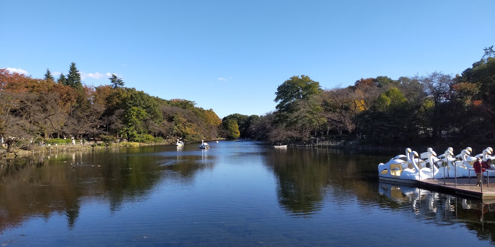
- 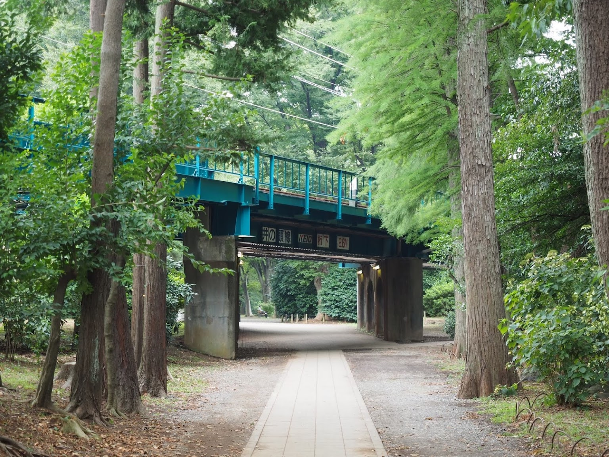
- 
- 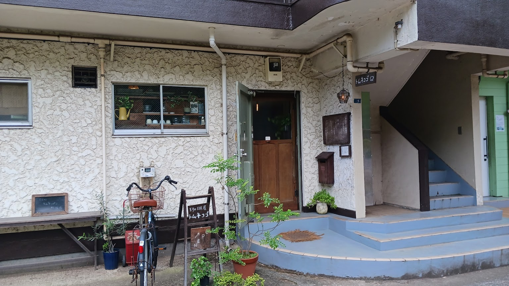
- 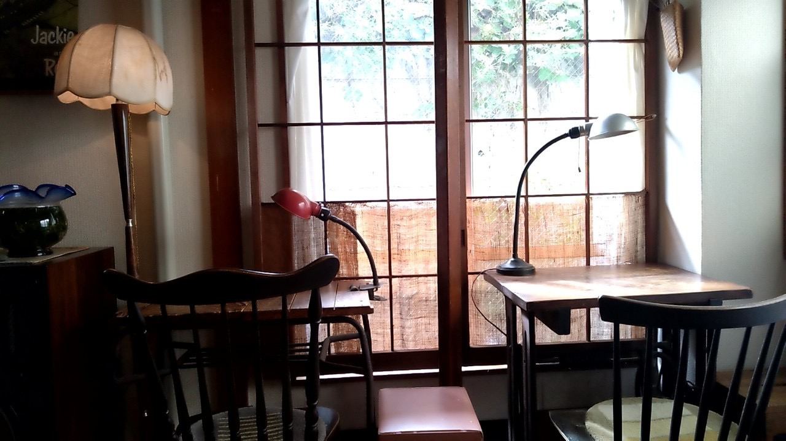

</photo-set>

A bit hungry, I meandered up from the park to [Tony's New York Pizza Since
1968](https://maps.app.goo.gl/KfbtLF1h3QAkfPVo6). Tony was inspired by Kennedy's
election to get on a ship to New York in 1962, and became, briefly, a
journalist. Devastated by the assassination, he returned to Japan and opened a
pizza shop.

The pizza was, let's say, not exemplary of New York style as I am familiar with
it. But while it might not have been successful as New York pizza, it was
delicious as food. One must cater to one's clientele, I suppose. A very old man
with a very small wife, Tony was very happy when I told him his pizza was
oishii.

I ate my cheesy pizza with a glass of loquat-and-vinegar juice, and proceeded
east towards Ogikubo, where I stopped at a bakery for a delicious pastry, and
then Nishi-Ogikubo, where I got the train back to Shinjuku.

<photo-set>

- 
- 
- 
- 
- 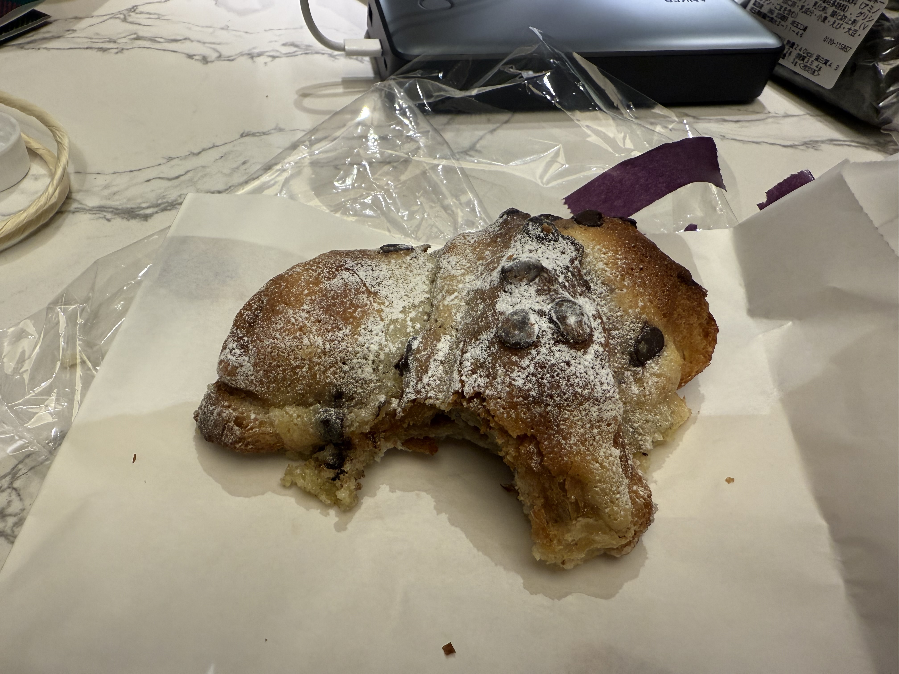

</photo-set>

At dinner time, I met Charlie at Koenji station and we went to a [Fukuoka-style
Izakaya](https://maps.app.goo.gl/JEqxUF7Czs1URfM7A) to meet up with his friend
Yagi. We had natto and fried chicken and beni-shoga and milk highballs. When
Yagi arrived we had oden.

We went with Yagi to [Knock](https://maps.app.goo.gl/McBSjEkyYZyZCpLV7), where
Charlie runs a monthly event, to watch some jazz DJs. We talked to Yagi about
work. He's moving to Vancouver soon.

<photo-set>

- 
- 
- 

</photo-set>

## Ramen Day

The time has come. Remember "The List" from the end of [Meguro & Nakameguro
Day](#meguro--nakameguro-day)? My ramen appointment has arrived.

I took the train, got to the [ramen
place](https://maps.app.goo.gl/m7DPt5T3QpLW8cek8) at the appointed hour,
operated the ticket machine, and took my seat at the counter. I ordered the
shoyu ramen with all the fixins, although some people said the salt ramen was
better. The pork! 6 different cuts of slow-cooked pork in this dish, lovingly
assembled. I can see why people wait all morning for this. I'm glad I don't have
to.

I walked from there back to Hatagaya, along a scenic greenway. I love these
greenways! A very nice urban feature. When I get there, I make my pilgrimage to
the aforementioned greatest bike shop in the world: [The Blue
Lug](https://maps.app.goo.gl/T8A3vFZwtgFwKyep9). The staff are very nice to me,
despite my broken Japanese. They have a frame pump I'd been looking for. I buy a
lot of things.

I get a ham thingy at [Bakery SASA](https://maps.app.goo.gl/i4LrMiduzRYssnUr7).
The proprietor recognizes my hat, which I got at Sailosaibin on [Food Tour
Day](#food-tour-day). We discuss the artist.

I make my way to Yoyogi station and take the train back to Shinjuku.

(bakery photo by Google Maps user つじなか, Blue Lug photos by user 嶋津兵庫頭)

<photo-set>

- 
- 
- 
- 
- 
- 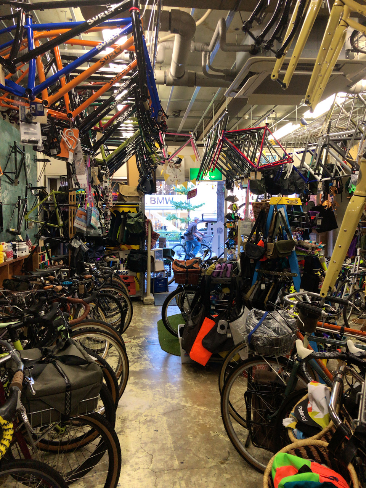
- 
- 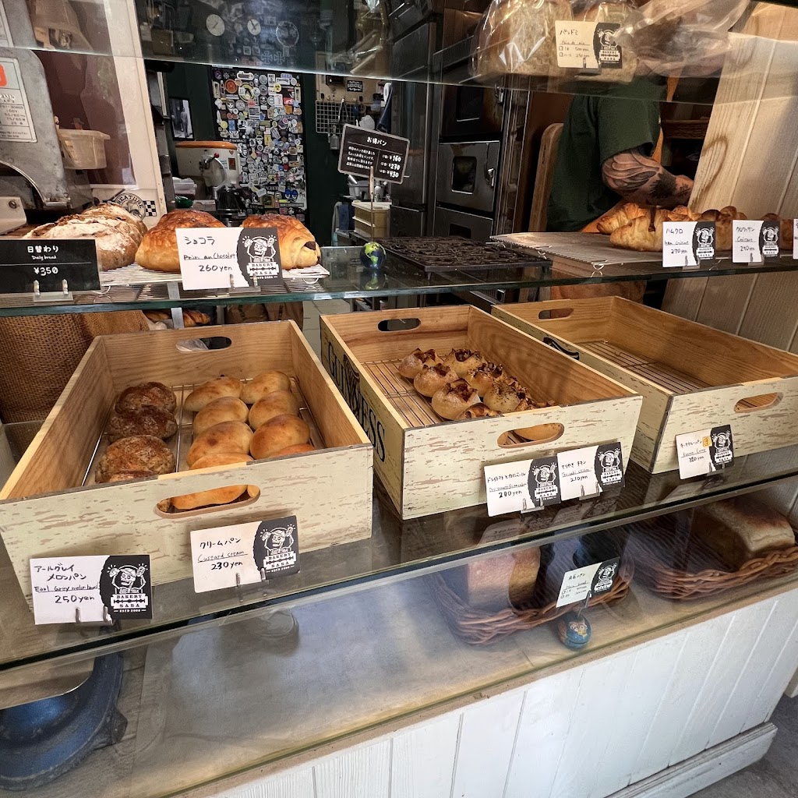

</photo-set>

---

We meet for dinner in Hatagaya and go to
[LaLaChai](https://maps.app.goo.gl/gCWWLiaDGU8egKwEA) for "the best pad Thai in
the world", as we _almost_ had on [the first
day](#first-day-in-japan-tourism-day). It _is_ pretty good pad Thai, but it's
not the best in the world: I've made better.

It's Thursday, and (you'll recall) Charlie always goes to ideala at forestlimit
on Thursdays, but this particular Thursday we decide not to go to ideala:
they're doing something weird. (Well, more like: not weird enough).

We go back to MEM and meet a [rakugo](https://en.wikipedia.org/wiki/Rakugo)
performer who was born in California but moved to Japan as a child. MEM is
playing The Books on the stereo. We all get to talking about art, about rakugo,
about culture. I learn that rakugo is sort of like a traditional form of
stand-up comedy, except you do it sitting down, and you tell stories from a
repertoire of standards. The language used is so archaic that most people in the
audience don't understand what's being said, but still: the performance is
dynamic enough that they laugh anyway. I can relate.

We end the night back at Pintology and drink absinthe cocktails.

(photo of rakugo performer by Flickr user vera46).

<photo-set>

- 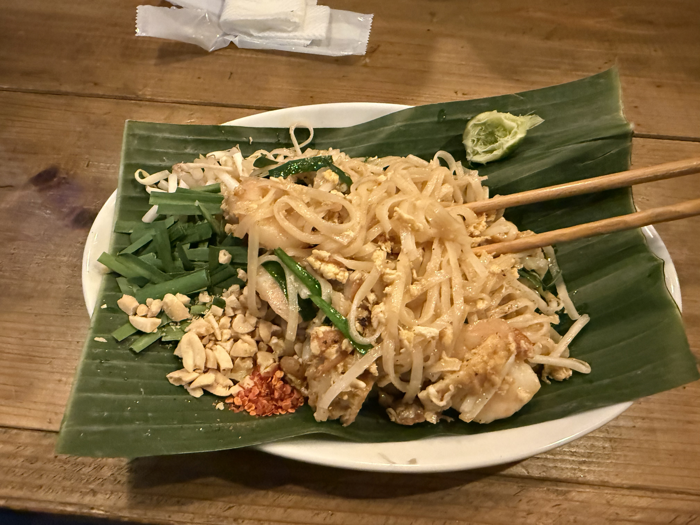
- 

</photo-set>

## DJ Bowling Day

It's gonna be a big Friday: [loom](https://maps.app.goo.gl/T3q7xdzf39mgWRnt5) is
having an all-day DJ event at [Sasazuka
Bowl](https://maps.app.goo.gl/Qrtk5Mqn9LbQuEWCA) to celebrate the launch of
their new beer. Charlie has some friends playing there.

We'll make our way over there eventually, but first: it's lunch time. Charlie's
been talking up Freeman Shokudo, a place run by a friend of his who moved from
New York, for a while: we tried to go there for breakfast _last_ Friday before
going to LUG. When I was talking to the guy at Daps Original Hood Joint about
American food in Tokyo, he said I _have to_ go to Freeman. Among Japanese
restaurateurs, the vibe seems to be "Of course I know Jeremy, but I don't think
he knows me." It's a Thing.

There's reggae music playing. "Jeremy used to run a reggae record store in New
York City". The server is a notable Japanese rapper. We order the pastrami. "Do
you guys have a few minutes? I want you to have a fresh pastrami. Let me put on
a fresh pastrami," Jeremy says. We oblige, and get a shepherd's pie and a
cucumber salad for the meanwhile.

Let me tell you: this is a fucking delicious pastrami sandwich. The best I've
ever had, and I seek out pastrami. I've had it in Chicago, in Los Angeles,
Boston, San Francisco, New York. This is better. I tell Jeremy. "There hasn't
been good pastrami in New York City since Gitlitz's closed in '78," he explains.
"When I started making pastrami here, I wanted to make good pastrami. I hadn't
had any good pastrami in a long time." **This** is good pastrami.

<photo-set>

- 
- 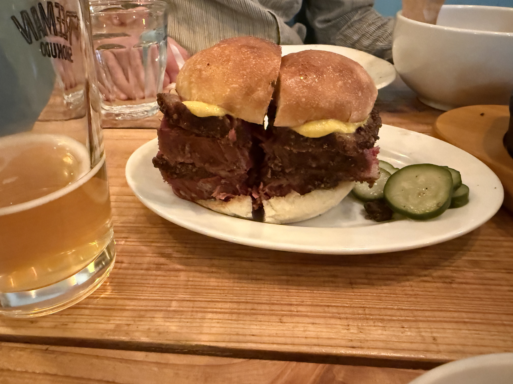

</photo-set>

We have some more time to kill, and we go to
[Harrits](https://maps.app.goo.gl/2c9SgezyrPdUcX9u9) for a doughnut. There's a
long line. We bring it to [Yoyogi Ōyama
Park](https://maps.app.goo.gl/ZAjL7sbWunWwQjXFA) and eat it by the baseball
diamond. It isn't a very good doughnut.

I feel myself getting a bit grumpy: I could use some coffee. Charlie takes me to
[Laundry Koffiehuis](https://maps.app.goo.gl/vAnBQKKQL3nNNqX66), which is in a
former laundromat, and also sells hypebeast clothes and deadstock basketball
shoes. The coffee is very good.

<photo-set>

- 

</photo-set>

It's time for the [DJ thing](https://www.instagram.com/p/DDv58quSK80/). We've
missed Charlie's friend Mai ("PLASTICMAI") but catch several other DJs. A few
are excellent, a few are not.

For dinner, we cross the street to [Mampuku
Shokudo](https://maps.app.goo.gl/BsjfYHTwNcsohgG17). I get tuna Hamburg steak,
which also has beef and pork. It's good! Real fill-you-up food, and for cheap.
We drink two of their very strong tea highballs, which is almost too many.

<photo-set>

- 
- 

</photo-set>

We end the night at Pintology, and who's there but Jeremy from Freeman! It's his
birthday! We get to talking: he lived in Chicago for a while in the 90s while
his then-girlfriend went to SAIC. He started a reggae night at the Empty Bottle.
I go there often! He knows a lot of people. We drink Malört.

We meet Satotsu, who is the bassist of the thrash band Endall. He's been to
Chicago, too! He played at Reggie's. They even had Sapporo! No rock club in
Japan has a big selection of beer.

## Shiokara Day

It's my last day in Tokyo, and it's laundry day again. The machine I'm using at
the laundromat breaks--throws an error code--so I finish the load in the other
machine.

Before meeting up with Charlie, I have one last checklist item I'd like to
complete: picking up some nicer go stones. I rush to [Aoyama
Goban-ten](https://maps.app.goo.gl/JQhuCLdqRBWLg84TA), which is not in Aoyama.
It seems like a lot of things that aren't in Aoyama still have Aoyama in the
name. How odd. Maybe it's prestigious.

<photo-set>

- 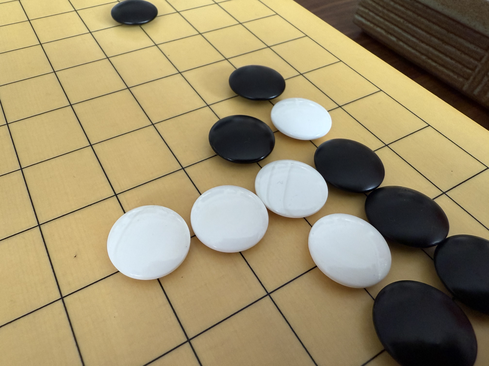
- 

</photo-set>

I meet Charlie back at my hotel, and we go up to the fancy hotel bar. I get a
whiskey drink and he gets a mushroom soup cocktail. He gets a fruity gin drink
and I get a dashi martini. It's all very ambitious. There's an excellent view of
the sunset; we can see Mount Fuji.

<photo-set>

- 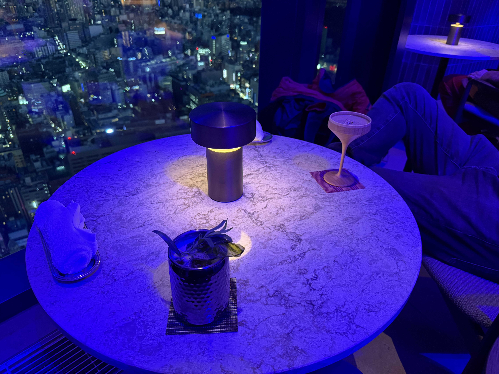
- 
- 
- 

</photo-set>

Charlie's put together a real treat for me. I loved the hotaruika no shiokara at
Raccos last week, and I haven't found any to take home yet, so here's the plan:

- We'll go to a [gourmet specialty food
  store](https://maps.app.goo.gl/AuTvp73HsnFy8bVN6), which is certain to have
  shiokara
- We have a reservation at a [shiokara-specific restaurant and
  bar](https://maps.app.goo.gl/yifjmCkKVd4pBLFN9) afterwards. They have 64
  different shiokaras.

I find a lot of good stuff at the food store, but all the shiokara is fresh and
needs refridgeration. My suitcase is getting full anyway. We make it to our
reservation.

We order an assortment of 20 different shiokaras, working our way down the menu,
with no bread, rice, or nothin'. Just shiokara. The people working think we're
crazy. They look at us funny. Normally one just has a bit of shiokara with some
rice, but that's not what we're doing: we're going for it.

"So salty it's spicy" is right. My face starts hurting less than halfway through
the meal. I run out of beer. A few minutes later I'm tripping. I feel crazy. We
both feel crazy. This is insane. You shouldn't eat like this. We lose our sense
of taste. It's delicious. Transcendent. Otherworldly.

We stumble out and get a beer at the Hitachino brewery next door.

<photo-set>

- 
- 

</photo-set>

We get Black Thunder ice cream bars and some beer at a 7-eleven. There are two
worthy ice cream bars, Charlie tells me. When you're looking for quantity, to be
sated, you get Choko Monaka Jumbo. When you're looking for quality, you get
Black Thunder.

We go back to the hotel and listen to Japanese music.

I pack.

I go home.

That's Japan.
